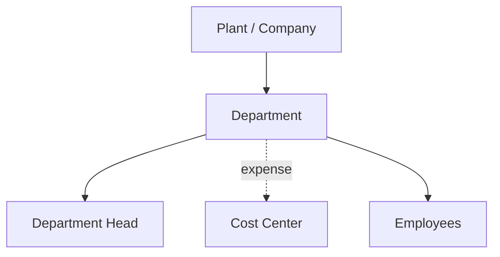

# Volume 05 - Departments

| Field | Value |
|---|---|
| Document ID | WORLD-VOL05-023 |
| Title | Departments |
| Version | 1.0 |
| Status | Approved |
| Classification | Internal |
| Founder | Mahesh Choudhary |

## Purpose

This chapter defines the Department as the functional organizational unit within a plant or company in the WORLD ERP framework. Departments group people and responsibilities by function, providing the structure for workforce organization, functional accountability, and operational cost tracking.

## Scope

This chapter specifies the department master-data object, its attributes, its relationship to plants and cost centers, and its role in organizing the workforce. It aligns directly with the departmental model defined in Volume 02 Section B and applies industry-independently.

## Definition and Attributes

A Department is a governed functional unit such as Finance, Procurement, Production, Sales, or Human Resources. It is associated with a plant or company, is typically mapped one-to-one to a cost center, and provides the organizational home for employees and functional processes.

| Attribute | Description |
|---|---|
| Department ID | Unique immutable identifier |
| Parent Unit | Owning plant or company |
| Function | Finance, Procurement, Production, Sales, HR, etc. |
| Department Head | Accountable leadership role |
| Cost Center | Mapped expense accountability dimension |
| Status | Active, Suspended, Archived |

## Business Value

Departments give the enterprise a functional structure for accountability, workforce management, and cost control. They enable clear ownership of processes, functional budgeting, and organizational reporting. Because each department maps to a cost center, functional spend is transparent and controllable.

## Relationship to the AI Business Partner

The department gives the AI Business Partner a functional lens. It can route tasks and approvals to the right function, compare departmental efficiency, monitor functional spend against budget, and identify workload imbalances. Delegated authority and workflows are frequently scoped to departments.

## Relationship to Business Foundation

Departments directly realize the departmental model in Volume 02 Section B, preserving the same functions, heads, and responsibilities. They translate the foundation's functional organization into an ERP object that carries accountability into daily operations and cost management.

## Relationship to Business Intelligence

Departments are the functional dimension in Volume 04 analytics. Headcount, functional cost, productivity, and process KPIs are measured per department and rolled up to plant, business unit, and company, enabling functional benchmarking across the enterprise.

## Enterprise Implementation Approach

WORLD provisions departments under plants or companies, each mapped to a cost center and led by an accountable role. Employees are assigned to departments, and functional workflows are scoped accordingly. Department records are effective-dated to preserve historical organizational reporting through restructures.

### Enterprise Example

A plant contains Production, Quality, and Maintenance departments, each mapped to its own cost center. When maintenance overtime rises, the AI Business Partner correlates the spend against equipment downtime and recommends a preventive-maintenance schedule change, presenting the impact per department and cost center.

## Cross-References

- [Plants](/docs/blueprint/volume-05-erp-foundation/section-c-erp-framework/21-plants.md)
- [Cost Centers](/docs/blueprint/volume-05-erp-foundation/section-c-erp-framework/24-cost-centers.md)
- [Users & Roles](/docs/blueprint/volume-05-erp-foundation/section-c-erp-framework/26-users-and-roles.md)
- [Volume 02 Section B - Departments](/docs/blueprint/volume-02-business-foundation/section-b-organization/README.md)

## References

- [Volume 01 - Vision and Philosophy](/docs/blueprint/volume-01-vision-and-philosophy/README.md)
- [Document Standards](/docs/governance/document-standards.md)

## Change Log

| Version | Date | Author | Notes |
|---|---|---|---|
| 1.0 | 2026-07-12 | Lead Software Engineer | Initial approved version. |
