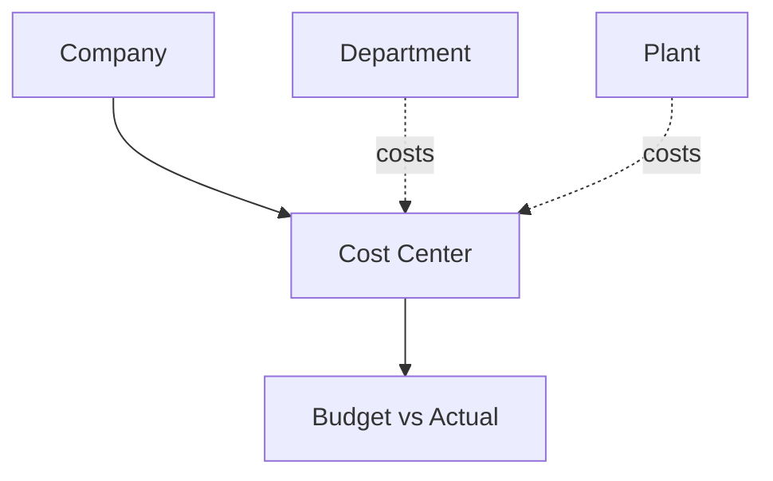

# Volume 05 - Cost Centers

| Field | Value |
|---|---|
| Document ID | WORLD-VOL05-024 |
| Title | Cost Centers |
| Version | 1.0 |
| Status | Approved |
| Classification | Internal |
| Founder | Mahesh Choudhary |

## Purpose

This chapter defines the Cost Center as the accounting dimension that captures where costs are incurred in the WORLD ERP framework. Cost centers are the primary control object for expense accountability, budgeting, and cost analysis across the organization structure.

## Scope

This chapter specifies the cost-center master-data object, its attributes, and its overlay relationship to organizational units, particularly departments and plants. It applies to all WORLD deployments performing managerial accounting and cost control.

## Definition and Attributes

A Cost Center is a governed accounting dimension representing a unit of cost responsibility. It does not sit in the operational containment hierarchy; instead, it overlays it, so that costs incurred by departments, plants, and functions are attributed to an accountable center. Cost centers hold budgets and accumulate actual expense.

| Attribute | Description |
|---|---|
| Cost Center ID | Unique immutable identifier |
| Company ID | Owning company |
| Linked Org Unit | Department or plant it primarily serves |
| Responsible Role | Manager accountable for the budget |
| Budget | Planned expense allocation |
| Status | Active, Suspended, Archived |

## Business Value

Cost centers make expense accountability precise and actionable. They enable budgeting at the responsibility level, variance analysis, and cost allocation, turning aggregate spend into a controllable, owned figure. They are indispensable for managerial accounting, cost control, and disciplined resource governance.

## Relationship to the AI Business Partner

The cost center gives the AI Business Partner a lens on spend and efficiency. It can monitor budget-versus-actual in real time, forecast overruns, recommend reallocations, and attribute the financial impact of operational decisions to accountable owners. Spend-related actions are grounded in cost-center context.

## Relationship to Business Foundation

Cost centers operationalize the accountability and governance model of Volume 02. They give the foundation's ownership structure a financial control surface, ensuring that every function and location has a clear cost owner.

## Relationship to Business Intelligence

Cost centers are a primary financial dimension in Volume 04. Cost analytics, budget adherence, and efficiency metrics are sliced by cost center and rolled up along the organization structure, giving leadership transparent, reconciled cost visibility.

## Enterprise Implementation Approach

WORLD provisions cost centers within companies and links them to departments and plants as an accounting overlay. Budgets are set and tracked per center, and every expense transaction is tagged with a cost center. Cost-center master records are effective-dated to keep historical financial reporting stable.

### Enterprise Example

Each department in a plant maps to a cost center with a monthly budget. When the Maintenance cost center trends toward a 15 percent overrun, the AI Business Partner alerts the responsible manager, explains the drivers, and proposes deferrable work orders to bring actuals back within budget.

## Cross-References

- [Departments](/docs/blueprint/volume-05-erp-foundation/section-c-erp-framework/23-departments.md)
- [Profit Centers](/docs/blueprint/volume-05-erp-foundation/section-c-erp-framework/25-profit-centers.md)
- [Organization Structure](/docs/blueprint/volume-05-erp-foundation/section-c-erp-framework/18-organization-structure.md)
- [Volume 04 - Business Intelligence](/docs/blueprint/volume-04-business-intelligence/README.md)

## References

- [Volume 01 - Vision and Philosophy](/docs/blueprint/volume-01-vision-and-philosophy/README.md)
- [Document Standards](/docs/governance/document-standards.md)

## Change Log

| Version | Date | Author | Notes |
|---|---|---|---|
| 1.0 | 2026-07-12 | Lead Software Engineer | Initial approved version. |
