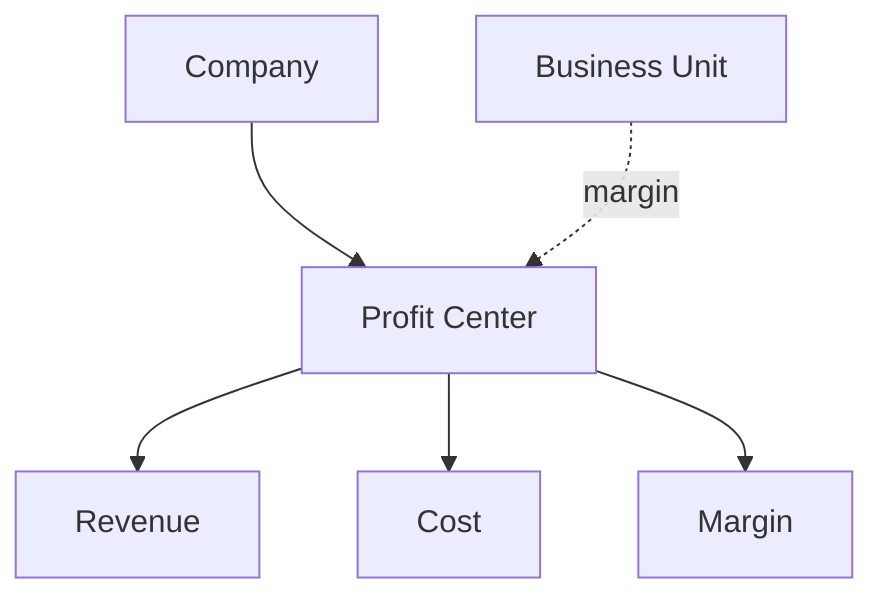

# Volume 05 - Profit Centers

| Field | Value |
|---|---|
| Document ID | WORLD-VOL05-025 |
| Title | Profit Centers |
| Version | 1.0 |
| Status | Approved |
| Classification | Internal |
| Founder | Mahesh Choudhary |

## Purpose

This chapter defines the Profit Center as the accounting dimension that captures where profit is generated in the WORLD ERP framework. Profit centers measure revenue, cost, and resulting margin for a defined segment, enabling profitability accountability across the enterprise.

## Scope

This chapter specifies the profit-center master-data object, its attributes, and its overlay relationship to organizational units, particularly business units and companies. It applies to all WORLD deployments performing profitability and segment reporting.

## Definition and Attributes

A Profit Center is a governed accounting dimension representing a unit of profit responsibility. Like the cost center, it overlays rather than contains the operational hierarchy. It accumulates both revenue and cost so that margin can be measured for a business unit, product line, region, or other segment.

| Attribute | Description |
|---|---|
| Profit Center ID | Unique immutable identifier |
| Company ID | Owning company |
| Linked Org Unit | Business unit or segment it represents |
| Responsible Role | Manager accountable for margin |
| Revenue & Cost | Accumulated income and expense |
| Status | Active, Suspended, Archived |

## Business Value

Profit centers make profitability transparent and accountable below the company level. They enable segment margin analysis, informed pricing and portfolio decisions, and clear ownership of financial results. They turn the enterprise from a single profit-and-loss statement into a set of measurable, manageable value-creating units.

## Relationship to the AI Business Partner

The profit center gives the AI Business Partner a profitability lens. It can compare margins across segments, detect erosion, model pricing and mix scenarios, and recommend actions that improve profit for an accountable owner. Value-oriented recommendations are grounded in profit-center context.

## Relationship to Business Foundation

Profit centers operationalize the value-creation and accountability intent of Volume 02. They give the foundation's business model a financial results surface, ensuring each segment's contribution to enterprise value is explicitly owned and measured.

## Relationship to Business Intelligence

Profit centers are a primary profitability dimension in Volume 04. Margin analytics, segment performance, and portfolio insights are sliced by profit center and rolled up to company, giving leadership reconciled visibility into where value is created and lost.

## Enterprise Implementation Approach

WORLD provisions profit centers within companies and links them to business units and segments as an accounting overlay. Revenue and cost transactions are tagged with a profit center so margin is continuously current. Profit-center master records are effective-dated for stable historical profitability reporting.

### Enterprise Example

Each business unit maps to a profit center. When the Consumer Products profit center shows margin compression driven by rising input costs, the AI Business Partner quantifies the erosion, models a targeted price adjustment, and presents the projected margin recovery to the accountable business-unit leader.

## Cross-References

- [Business Units](/docs/blueprint/volume-05-erp-foundation/section-c-erp-framework/20-business-units.md)
- [Cost Centers](/docs/blueprint/volume-05-erp-foundation/section-c-erp-framework/24-cost-centers.md)
- [Companies](/docs/blueprint/volume-05-erp-foundation/section-c-erp-framework/19-companies.md)
- [Volume 04 - Business Intelligence](/docs/blueprint/volume-04-business-intelligence/README.md)

## References

- [Volume 01 - Vision and Philosophy](/docs/blueprint/volume-01-vision-and-philosophy/README.md)
- [Document Standards](/docs/governance/document-standards.md)

## Change Log

| Version | Date | Author | Notes |
|---|---|---|---|
| 1.0 | 2026-07-12 | Lead Software Engineer | Initial approved version. |
