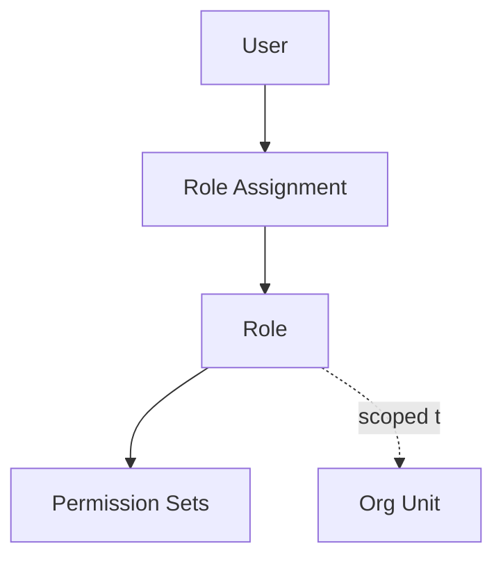

# Volume 05 - Users & Roles

| Field | Value |
|---|---|
| Document ID | WORLD-VOL05-026 |
| Title | Users & Roles |
| Version | 1.0 |
| Status | Approved |
| Classification | Internal |
| Founder | Mahesh Choudhary |

## Purpose

This chapter defines Users and Roles as the identity and access-structuring master data of the WORLD ERP framework. Users represent the people and system identities that interact with WORLD, and roles group the responsibilities and access those identities need, forming the basis of secure, governed operation.

## Scope

This chapter specifies the user and role master-data objects, their attributes, their assignment to organizational units, and their relationship to permissions. It applies to all WORLD deployments and underpins the multi-tenant, multi-company security model. Fine-grained permission definition is covered in the following chapter.

## Definition and Attributes

A User is a governed identity, human or service, authenticated into WORLD and scoped to a tenant. A Role is a named bundle of responsibilities and permission sets aligned to a job function. Users are assigned one or more roles, and roles are scoped to organizational units, so access follows the organization structure.

| Attribute | Description |
|---|---|
| User ID | Unique immutable identity |
| Tenant ID | Owning tenant boundary |
| Identity Type | Human or Service Account |
| Assigned Roles | Roles granted to the user |
| Org Scope | Company, business unit, plant, or department scope |
| Status | Active, Suspended, Archived |

## Business Value

Role-based identity turns access management from an unmanageable list of individual grants into a governed, auditable structure. It accelerates onboarding, enforces least privilege, simplifies audits, and ensures that access changes as people move roles. Scoping roles to the organization structure keeps access aligned with responsibility.

## Relationship to the AI Business Partner

Users and roles define who the AI Business Partner works with and on whose behalf it may act. The AI respects role scope when routing tasks, requesting approvals, and executing delegated actions. Roles also govern the boundaries of AI autonomy, ensuring automated actions never exceed the authority of their sponsoring role.

## Relationship to Business Foundation

Roles map to the responsibilities and positions defined in Volume 02 Section B. They translate the foundation's organizational roles into governed access structures, keeping who-does-what consistent between the business model and the operational system.

## Relationship to Business Intelligence

User and role data drive access-aware analytics in Volume 04, ensuring intelligence is visible only to authorized identities. Role and usage data also feed adoption, workload, and segregation-of-duties analytics that help govern the enterprise.

## Enterprise Implementation Approach

WORLD provisions users through federated identity, assigns them roles scoped to organizational units, and governs role definitions through maker-checker workflows. Segregation-of-duties rules prevent conflicting role combinations. User and role changes are fully audited and effective-dated.

### Enterprise Example

A plant controller is assigned a Controller role scoped to a single company and its cost centers. The role grants approval authority up to a threshold. When the AI Business Partner drafts a budget reallocation, it routes the approval to this role, and the action executes only within the controller's scoped authority.

## Cross-References

- [Permissions](/docs/blueprint/volume-05-erp-foundation/section-c-erp-framework/27-permissions.md)
- [Departments](/docs/blueprint/volume-05-erp-foundation/section-c-erp-framework/23-departments.md)
- [Volume 03 - AI Business Partner](/docs/blueprint/volume-03-ai-business-partner/README.md)
- [Volume 02 Section B - Organization Structure](/docs/blueprint/volume-02-business-foundation/section-b-organization/README.md)

## References

- [Volume 01 - Vision and Philosophy](/docs/blueprint/volume-01-vision-and-philosophy/README.md)
- [Document Standards](/docs/governance/document-standards.md)

## Change Log

| Version | Date | Author | Notes |
|---|---|---|---|
| 1.0 | 2026-07-12 | Lead Software Engineer | Initial approved version. |
