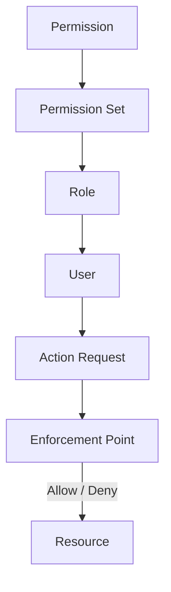

# Volume 05 - Permissions

| Field | Value |
|---|---|
| Document ID | WORLD-VOL05-027 |
| Title | Permissions |
| Version | 1.0 |
| Status | Approved |
| Classification | Internal |
| Founder | Mahesh Choudhary |

## Purpose

This chapter defines Permissions as the fine-grained authorization master data of the WORLD ERP framework. Permissions specify exactly what actions may be performed on which objects, under what conditions, forming the enforcement layer that makes WORLD secure, compliant, and trustworthy for autonomous operation.

## Scope

This chapter specifies the permission model, its attributes, its composition into roles, and its enforcement across the organization structure and the AI Business Partner. It applies to all WORLD deployments and completes the security backbone established with Users and Roles.

## Definition and Attributes

A Permission is a governed grant that couples an action (such as create, read, update, approve, or execute) to a resource type and an optional condition and scope. Permissions are composed into permission sets, which are bound to roles. Enforcement evaluates the acting identity, the target resource, and the organizational scope at the point of every operation.

| Attribute | Description |
|---|---|
| Permission ID | Unique immutable identifier |
| Action | Create, Read, Update, Delete, Approve, Execute |
| Resource Type | Master-data or transaction object governed |
| Scope | Org unit boundary the grant applies within |
| Condition | Attribute or threshold constraint |
| Effect | Allow or Deny |

## Business Value

Fine-grained permissions deliver least-privilege security, regulatory compliance, and audit-grade accountability. They allow precise control over sensitive actions, support segregation of duties, and make it safe to grant autonomy because every action is checked against an explicit grant. This precision is what allows an AI-native platform to act on behalf of the enterprise without unacceptable risk.

## Relationship to the AI Business Partner

Permissions are the guardrails of AI autonomy. Every action the AI Business Partner takes passes through the same enforcement point as human actions, constrained by the permissions of its sponsoring role. Conditional permissions, such as value thresholds, let the enterprise calibrate how much the AI may do autonomously versus what it must route for human approval.

## Relationship to Business Foundation

Permissions enforce the governance, delegation, and control principles defined in Volume 02. They render the foundation's authority model as executable, checkable rules, ensuring the enterprise operates exactly as its governance intends.

## Relationship to Business Intelligence

Permission evaluations produce a rich audit trail that feeds security, compliance, and segregation-of-duties analytics in Volume 04. Access analytics identify over-privileged roles, anomalous actions, and control gaps, closing the loop between authorization and intelligence.

## Enterprise Implementation Approach

WORLD implements permissions as attribute-and-role-based grants evaluated at a central enforcement point for every request, human or AI. Permission sets are versioned and governed through maker-checker approval, conditions support value and attribute constraints, and every decision is logged for audit. Deny effects always override allow.

### Enterprise Example

A purchasing role holds an Execute permission on purchase orders conditioned on a value threshold. When the AI Business Partner drafts an order below the threshold, the enforcement point allows autonomous execution; when an order exceeds it, the same permission model denies autonomous execution and routes the order to a human approver, with the full decision logged.

## Cross-References

- [Users & Roles](/docs/blueprint/volume-05-erp-foundation/section-c-erp-framework/26-users-and-roles.md)
- [Enterprise Master Data](/docs/blueprint/volume-05-erp-foundation/section-c-erp-framework/17-enterprise-master-data.md)
- [Volume 03 - AI Business Partner](/docs/blueprint/volume-03-ai-business-partner/README.md)
- [Volume 04 - Business Intelligence](/docs/blueprint/volume-04-business-intelligence/README.md)

## References

- [Volume 01 - Vision and Philosophy](/docs/blueprint/volume-01-vision-and-philosophy/README.md)
- [Document Standards](/docs/governance/document-standards.md)

## Change Log

| Version | Date | Author | Notes |
|---|---|---|---|
| 1.0 | 2026-07-12 | Lead Software Engineer | Initial approved version. |
