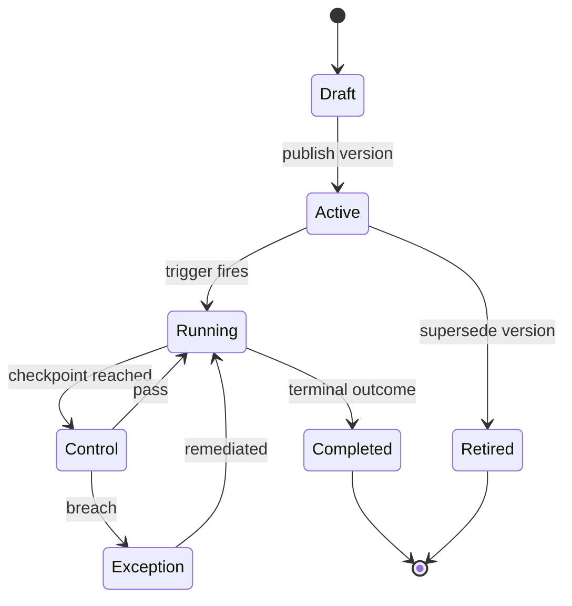

# Volume 05 - Business Process Framework

| Field | Value |
|---|---|
| Document ID | WORLD-VOL05-028 |
| Title | Business Process Framework |
| Version | 1.0 |
| Status | Approved |
| Classification | Internal |
| Founder | Mahesh Choudhary |

## Purpose

The Business Process Framework defines how WORLD represents, executes, and governs enterprise business processes across the ERP operational layer. It establishes the canonical model that every process engine in Section D depends upon: a shared vocabulary of processes, stages, activities, roles, controls, and outcomes. The framework exists so that the AI Business Partner can reason about, initiate, and supervise real operational work using a consistent structure rather than ad hoc, per-module logic.

## Scope

This chapter covers the process meta-model, the process lifecycle, process classification, and the runtime contract shared by the Approval, Workflow, Notification, Document, Audit, and Business Rules engines. It does not define the internal mechanics of those engines (covered in chapters 29-35) nor domain-specific processes owned by functional modules. It applies to all WORLD ERP processes classified as governed operational work.

## The Framework as Designed for WORLD

In WORLD a business process is a first-class, declarative object. Each process is defined once as a versioned specification comprising trigger conditions, ordered stages, activities within stages, responsible and accountable roles, embedded controls, service-level targets, and terminal outcomes. Because processes are declarative, the AI Business Partner can inspect a definition before acting, predict downstream steps, and explain to a human what will happen next. Process instances carry state, context data, and a complete provenance chain, allowing any engine to attach to a running instance without owning it.

The framework distinguishes four process classes: transactional (high-volume, rule-driven), managerial (approval- and judgment-heavy), exception (triggered by control breaches), and strategic (long-running, cross-functional). Every process definition inherits standardized instrumentation so that the Business Intelligence layer receives cycle-time, throughput, and control-outcome telemetry without bespoke wiring.

## Business Value

A single process framework removes the fragmentation that plagues conventional ERP deployments, where each module encodes its own workflow assumptions. Standardization compresses implementation time, lowers change-management cost, and makes process performance directly comparable across functions.

| Capability | Conventional ERP | WORLD Framework |
|---|---|---|
| Process definition | Embedded in module code | Declarative, versioned object |
| Cross-engine reuse | Duplicated per module | Shared runtime contract |
| AI supervision | Not possible | Native inspection and control |
| Performance telemetry | Custom reports | Standard instrumentation |

## Relationship to the AI Business Partner

The framework is the substrate through which the AI Business Partner operates the enterprise. Because every process is declarative and instrumented, the Partner can propose a process, initiate an instance, monitor progress against service-level targets, and surface exceptions for human decision. In line with Volume 03 Section G, the Partner never bypasses embedded controls: it acts within the process definition and routes judgment points to accountable humans through the Approval Engine.

## Relationship to Business Foundation

Process definitions are the executable form of the SOPs, workflows, approvals, controls, and escalation paths documented in Volume 02 Section C. The framework binds each process object to its governing Business Foundation policy, so a change to an SOP produces a new, traceable process version rather than undocumented drift.

## Relationship to Business Intelligence

Standard instrumentation emits process events to Volume 04 as they occur. Cycle time, first-pass yield, control-breach frequency, and outcome distribution become dimensions the Intelligence layer models, enabling the AI Business Partner to recommend process improvements grounded in measured performance.

## Enterprise Implementation Approach

Adoption proceeds in three waves: catalog existing SOPs from Business Foundation into declarative definitions; onboard transactional processes first to validate instrumentation; then migrate managerial and strategic processes with human-in-the-loop review. A process governance council owns the definition registry and version approvals.

### Example

A distribution enterprise defines its Order-to-Cash process as a single WORLD object with stages for credit check, fulfilment, invoicing, and collection. When an order exceeds the credit control threshold, the embedded control raises an exception; the AI Business Partner pauses fulfilment and routes a credit override to the finance controller, who approves within the same instance. Every step is captured for audit and streamed to Business Intelligence.

## Cross-References

- [Cross-Module Integration](/docs/blueprint/volume-05-erp-foundation/section-d-process-foundation/29-cross-module-integration.md)
- [Workflow Engine](/docs/blueprint/volume-05-erp-foundation/section-d-process-foundation/31-workflow-engine.md)
- [Business Rules Engine](/docs/blueprint/volume-05-erp-foundation/section-d-process-foundation/35-business-rules-engine.md)
- [Volume 02 - Business Foundation](/docs/blueprint/volume-02-business-foundation/README.md)

## References

- [Volume 01 - Vision and Philosophy](/docs/blueprint/volume-01-vision-and-philosophy/README.md)
- [Document Standards](/docs/governance/document-standards.md)

## Change Log

| Version | Date | Author | Notes |
|---|---|---|---|
| 1.0 | 2026-07-12 | Lead Software Engineer | Initial approved version. |
