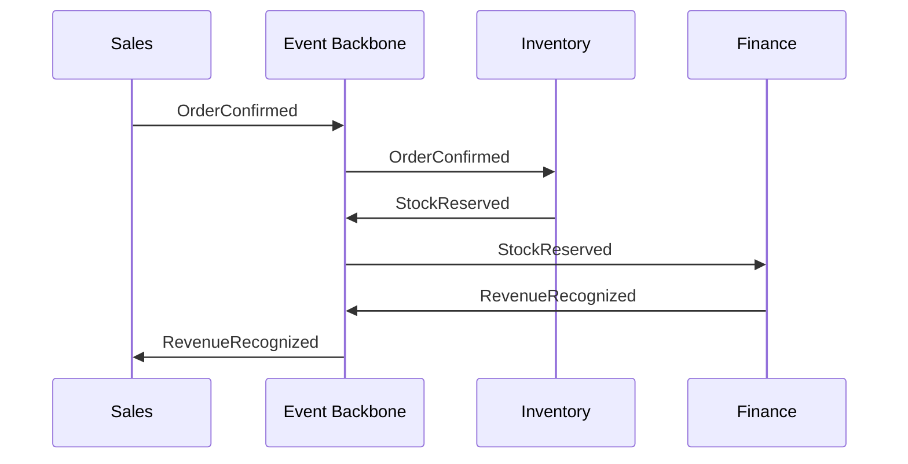

# Volume 05 - Cross-Module Integration

| Field | Value |
|---|---|
| Document ID | WORLD-VOL05-029 |
| Title | Cross-Module Integration |
| Version | 1.0 |
| Status | Approved |
| Classification | Internal |
| Founder | Mahesh Choudhary |

## Purpose

Cross-Module Integration defines how the functional modules of WORLD's ERP exchange data and coordinate work without direct coupling. It establishes the integration contract that lets a process defined in one module trigger, inform, or await activity in another while preserving each module's autonomy and the enterprise's single source of truth.

## Scope

This chapter covers the integration model, the event and command contracts, data consistency guarantees, and the orchestration patterns that span modules such as Finance, Supply Chain, Human Capital, and Sales. It excludes intra-module logic and external third-party integration, which are addressed elsewhere in Volume 05. It applies wherever a WORLD business process crosses a module boundary.

## The Framework as Designed for WORLD

WORLD treats modules as bounded domains that communicate through a shared, versioned event backbone rather than point-to-point calls. When a business event occurs, the originating module publishes a canonical event; interested modules subscribe and react through their own processes. Commands, by contrast, are explicit requests for another module to perform work and return an outcome. This event-and-command duality lets the AI Business Partner orchestrate end-to-end value chains while each module remains independently governable.

Every cross-module exchange carries the process instance identity from the Business Process Framework, so a purchase requisition in Supply Chain and its resulting journal entry in Finance are provably part of the same operational thread. Integration is idempotent and eventually consistent: modules reconcile against published state rather than assuming synchronous availability.

## Business Value

Decoupled integration eliminates the brittle interfaces that make conventional ERP upgrades risky. Modules evolve independently, new modules subscribe to existing events without changing publishers, and end-to-end processes are assembled from reusable exchanges.

| Integration Concern | Point-to-Point | WORLD Backbone |
|---|---|---|
| Coupling | Tight, bidirectional | Loose, event-driven |
| Adding a consumer | Modify publisher | Subscribe only |
| Consistency | Manual reconciliation | Idempotent, eventual |
| Traceability | Fragmented | Shared instance identity |

## Relationship to the AI Business Partner

The integration backbone gives the AI Business Partner an enterprise-wide view of activity as it unfolds. The Partner can follow a value chain across modules, detect where an event failed to produce its expected downstream reaction, and intervene. Consistent with Volume 03 Section G, when a cross-module action carries material risk, the Partner requests human approval before issuing the command that commits the enterprise.

## Relationship to Business Foundation

Cross-module flows implement the end-to-end workflows and handoffs documented in Volume 02 Section C. The Business Foundation specifies which function owns each step and the controls at each boundary; the integration contract makes those handoffs explicit, ordered, and auditable.

## Relationship to Business Intelligence

The event backbone is a natural feed for Volume 04. Because every cross-module event is canonical and timestamped, the Intelligence layer reconstructs complete value-chain journeys, measures inter-module latency, and identifies bottlenecks at handoff points for the Partner to act upon.

## Enterprise Implementation Approach

Implementation begins by cataloging canonical events for the highest-value value chains, then establishing the backbone with schema governance and versioning. Modules are onboarded as publishers and subscribers incrementally, with contract tests guarding compatibility. A shared event registry documents every event, its owner, and its consumers.

### Example

A manufacturer confirms a customer order in Sales. The OrderConfirmed event reserves stock in Inventory, which publishes StockReserved; Finance recognizes revenue and publishes RevenueRecognized, closing the loop back to Sales. If Inventory cannot reserve stock, it publishes a StockShortfall event; the AI Business Partner detects the broken chain and routes a backorder decision to the fulfilment manager.

## Cross-References

- [Business Process Framework](/docs/blueprint/volume-05-erp-foundation/section-d-process-foundation/28-business-process-framework.md)
- [Workflow Engine](/docs/blueprint/volume-05-erp-foundation/section-d-process-foundation/31-workflow-engine.md)
- [Audit Trail](/docs/blueprint/volume-05-erp-foundation/section-d-process-foundation/34-audit-trail.md)
- [Volume 04 - Business Intelligence](/docs/blueprint/volume-04-business-intelligence/README.md)

## References

- [Volume 01 - Vision and Philosophy](/docs/blueprint/volume-01-vision-and-philosophy/README.md)
- [Document Standards](/docs/governance/document-standards.md)

## Change Log

| Version | Date | Author | Notes |
|---|---|---|---|
| 1.0 | 2026-07-12 | Lead Software Engineer | Initial approved version. |
