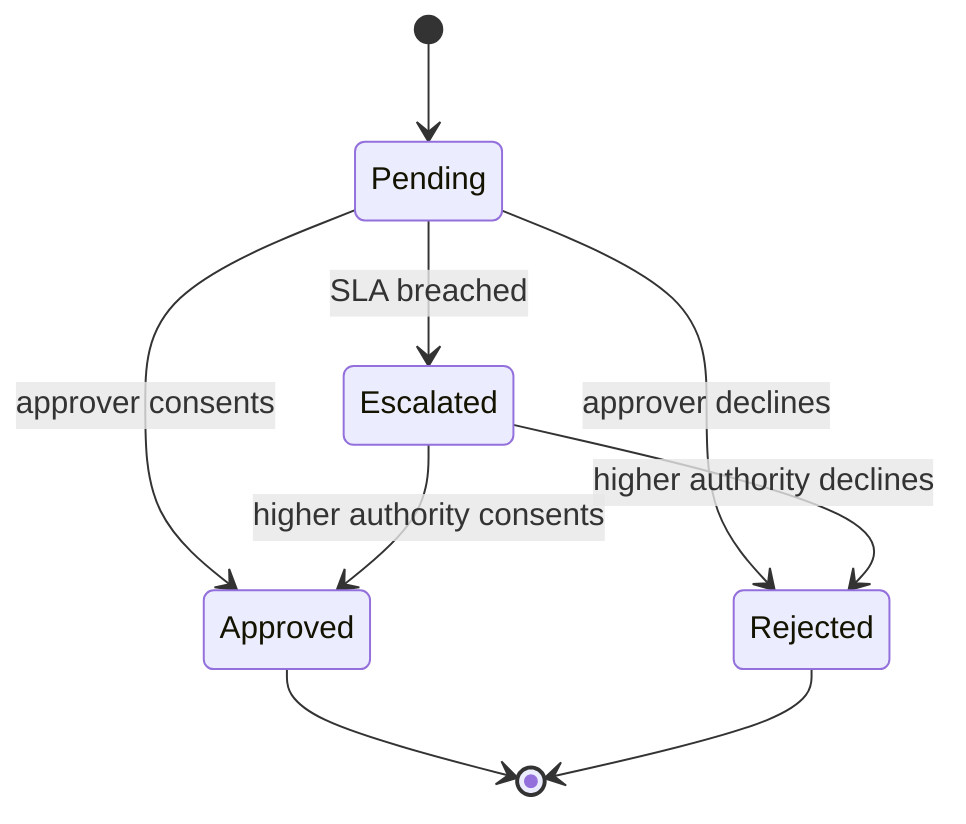

# Volume 05 - Approval Engine

| Field | Value |
|---|---|
| Document ID | WORLD-VOL05-030 |
| Title | Approval Engine |
| Version | 1.0 |
| Status | Approved |
| Classification | Internal |
| Founder | Mahesh Choudhary |

## Purpose

The Approval Engine is WORLD's authoritative mechanism for obtaining, recording, and enforcing human authorization within enterprise processes. It exists to guarantee that consequential decisions carry accountable human consent, and to give the AI Business Partner a trusted, auditable channel for escalating judgment to the right person at the right time.

## Scope

This chapter covers approval policies, routing and delegation, multi-level and parallel approvals, escalation, and the approval record. It does not define the business logic that determines whether an approval is required (owned by the Business Rules Engine) nor the notification delivery mechanics (owned by the Notification Framework). It applies to every WORLD process step requiring authorization.

## The Framework as Designed for WORLD

An approval in WORLD is a governed request for a decision, bound to a process instance and a policy. The engine resolves the required approvers from the enterprise's authority model, considering amount thresholds, role, delegation of authority, and segregation-of-duties constraints. Approvals may be sequential, parallel, or quorum-based. Each decision is captured as an immutable record: who decided, what they saw, when, and on what authority.

Crucially, the Approval Engine is the human-in-the-loop control point for the AI Business Partner. When the Partner reaches a decision beyond its delegated autonomy, it raises an approval rather than acting. The approver sees the Partner's recommendation and rationale but retains the decision. Escalation timers ensure no request stalls indefinitely.

## Business Value

Centralizing approvals turns authorization from scattered, inconsistent practice into an enforced enterprise control. Authority limits are applied uniformly, segregation of duties is guaranteed, and every decision is defensible under audit.

| Approval Attribute | Manual Practice | WORLD Engine |
|---|---|---|
| Authority enforcement | Inconsistent | Policy-driven |
| Segregation of duties | Often overlooked | Structurally enforced |
| Escalation | Depends on chasing | Automatic on SLA breach |
| Audit evidence | Email trails | Immutable record |

## Relationship to the AI Business Partner

The engine operationalizes the governance mandate of Volume 03 Section G: the AI Business Partner may recommend but must obtain human approval for actions exceeding its authority. The Partner submits a structured request with context and rationale; the approver decides. This preserves human accountability while letting the Partner accelerate the routine path to a decision.

## Relationship to Business Foundation

Approval policies encode the delegation-of-authority matrix and control points defined in Volume 02 Section C. The Business Foundation states who may authorize what and under which conditions; the Approval Engine enforces exactly that, including the escalation paths documented there.

## Relationship to Business Intelligence

Approval outcomes, cycle times, escalation rates, and rejection reasons flow to Volume 04. The Intelligence layer reveals bottlenecks, chronically escalated approvers, and policy thresholds that generate friction, enabling the Partner to recommend authority-model adjustments.

## Enterprise Implementation Approach

Implementation starts by importing the delegation-of-authority matrix from Business Foundation, configuring segregation-of-duties rules, and defining escalation ladders. High-value financial approvals are onboarded first, then operational approvals. Delegation-during-absence is configured to prevent stalls, and every policy version is approved through governance.

### Example

A capital expenditure of USD 250,000 exceeds a department head's USD 100,000 limit. The Approval Engine routes the request first to the divisional director and, on approval, to the CFO for the second tier, applying segregation of duties so the requester cannot approve. The AI Business Partner attaches its cost-benefit analysis; if the director does not respond within 48 hours, the request escalates automatically. The final immutable record evidences both consents for audit.

## Cross-References

- [Workflow Engine](/docs/blueprint/volume-05-erp-foundation/section-d-process-foundation/31-workflow-engine.md)
- [Notification Framework](/docs/blueprint/volume-05-erp-foundation/section-d-process-foundation/32-notification-framework.md)
- [Business Rules Engine](/docs/blueprint/volume-05-erp-foundation/section-d-process-foundation/35-business-rules-engine.md)
- [Volume 03 - AI Business Partner](/docs/blueprint/volume-03-ai-business-partner/README.md)

## References

- [Volume 01 - Vision and Philosophy](/docs/blueprint/volume-01-vision-and-philosophy/README.md)
- [Document Standards](/docs/governance/document-standards.md)

## Change Log

| Version | Date | Author | Notes |
|---|---|---|---|
| 1.0 | 2026-07-12 | Lead Software Engineer | Initial approved version. |
