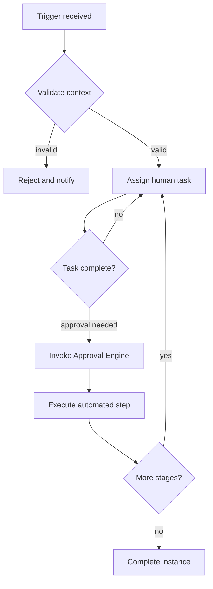

# Volume 05 - Workflow Engine

| Field | Value |
|---|---|
| Document ID | WORLD-VOL05-031 |
| Title | Workflow Engine |
| Version | 1.0 |
| Status | Approved |
| Classification | Internal |
| Founder | Mahesh Choudhary |

## Purpose

The Workflow Engine executes the ordered activities of a business process, coordinating human tasks, automated steps, and engine callouts to drive each process instance from trigger to outcome. It is the runtime that turns the declarative process definitions of the Business Process Framework into live, supervised execution.

## Scope

This chapter covers workflow execution semantics, task assignment, branching and parallelism, timers and deadlines, error handling, and compensation. It does not cover process definition (chapter 28), authorization (chapter 30), or business logic evaluation (chapter 35). It applies to every executing WORLD ERP process instance.

## The Framework as Designed for WORLD

The Workflow Engine interprets a process definition and instantiates it as a stateful execution graph. Nodes represent activities; edges represent transitions gated by conditions. The engine assigns human tasks to roles or individuals, invokes automated steps, and calls the Approval, Notification, Document, and Rules engines as the definition prescribes. It maintains durable state so an instance can pause for days awaiting a human task and resume without loss.

Execution is transparent to the AI Business Partner: at any point the Partner can query where an instance stands, which tasks are outstanding, and what will happen next. The engine supports parallel branches, event-based waits, deadlines with escalation, and compensating actions that safely unwind partially completed work when an instance must be reversed.

## Business Value

A durable, observable workflow runtime replaces the manual coordination and status-chasing that consume management time in conventional operations. Work is routed automatically, deadlines are enforced, and no instance is silently dropped.

| Execution Concern | Manual Coordination | WORLD Workflow Engine |
|---|---|---|
| Task routing | Email and meetings | Automatic to role |
| Long-running waits | Fragile, forgotten | Durable state |
| Deadline enforcement | Reactive | Timer-driven |
| Failure recovery | Ad hoc | Compensation logic |

## Relationship to the AI Business Partner

The Workflow Engine is where the AI Business Partner does supervised work. The Partner can complete automated tasks within its authority, monitor human tasks for delay, and recommend the next action. Per Volume 03 Section G, any step that commits the enterprise beyond the Partner's autonomy is delegated to the Approval Engine rather than executed unilaterally.

## Relationship to Business Foundation

Workflow definitions realize the step-by-step SOPs and handoffs of Volume 02 Section C. Roles, sequence, deadlines, and escalation ladders in the workflow map directly to the operating procedures documented in the Business Foundation.

## Relationship to Business Intelligence

The engine emits a task-level event stream to Volume 04: start and end times, assignees, wait durations, and outcomes. This lets the Intelligence layer compute cycle time, identify bottleneck activities, and measure workload distribution for the Partner to optimize.

## Enterprise Implementation Approach

Implementation prioritizes high-volume operational workflows, configuring task assignment against the enterprise role model and setting deadlines from Business Foundation service targets. Compensation logic is defined for reversible financial and inventory steps. Workflows are versioned so in-flight instances complete on the definition under which they started.

### Example

An employee onboarding workflow runs in parallel: IT provisions accounts, Facilities assigns a workspace, and HR completes compliance paperwork. The engine waits for all three branches, enforces a five-day deadline, and escalates any branch that stalls. If onboarding is cancelled, compensation steps revoke provisioned accounts. The AI Business Partner tracks progress and flags the delayed branch to the hiring manager.

## Cross-References

- [Business Process Framework](/docs/blueprint/volume-05-erp-foundation/section-d-process-foundation/28-business-process-framework.md)
- [Approval Engine](/docs/blueprint/volume-05-erp-foundation/section-d-process-foundation/30-approval-engine.md)
- [Notification Framework](/docs/blueprint/volume-05-erp-foundation/section-d-process-foundation/32-notification-framework.md)
- [Volume 02 - Business Foundation](/docs/blueprint/volume-02-business-foundation/README.md)

## References

- [Volume 01 - Vision and Philosophy](/docs/blueprint/volume-01-vision-and-philosophy/README.md)
- [Document Standards](/docs/governance/document-standards.md)

## Change Log

| Version | Date | Author | Notes |
|---|---|---|---|
| 1.0 | 2026-07-12 | Lead Software Engineer | Initial approved version. |
