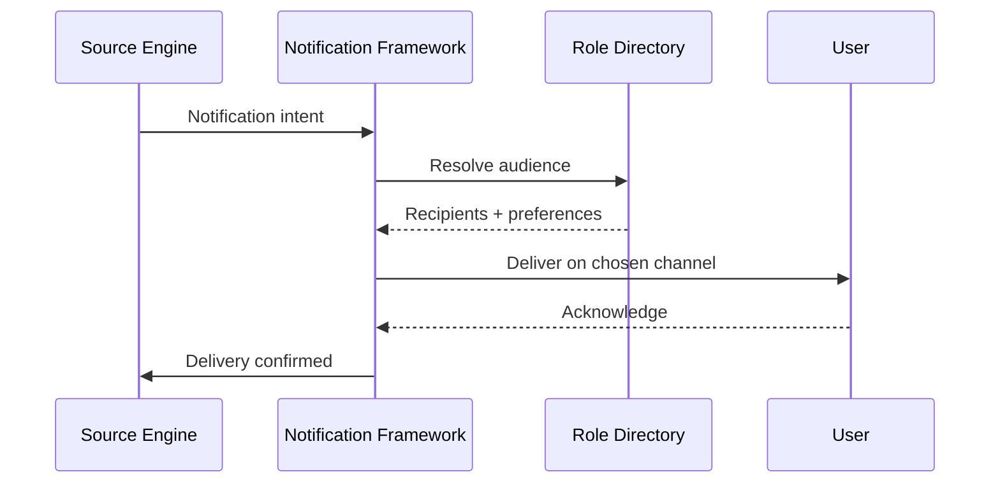

# Volume 05 - Notification Framework

| Field | Value |
|---|---|
| Document ID | WORLD-VOL05-032 |
| Title | Notification Framework |
| Version | 1.0 |
| Status | Approved |
| Classification | Internal |
| Founder | Mahesh Choudhary |

## Purpose

The Notification Framework is WORLD's unified mechanism for delivering the right information to the right person or system at the right moment. It ensures that process events, approvals, exceptions, and escalations reach their audience reliably and consistently, so that human attention is directed where it matters without overwhelming people with noise.

## Scope

This chapter covers notification triggers, audience resolution, channel selection, templating, delivery guarantees, escalation notifications, and preference management. It does not decide when an approval is required or execute the underlying workflow; it delivers the communication those engines request. It applies to all process-generated communication within WORLD.

## The Framework as Designed for WORLD

Notifications in WORLD are declarative and event-driven. Any engine can raise a notification intent bound to a process instance; the framework resolves the audience from the enterprise role model, selects channels according to urgency and recipient preference, renders a governed template, and delivers with retry and acknowledgement tracking. Digest and throttling rules prevent alert fatigue by consolidating low-priority messages.

The framework is aware of the AI Business Partner as both a producer and a consumer of notifications. The Partner raises human-facing alerts when it needs attention or approval, and it receives system notifications that inform its situational awareness. Escalation notifications are tied to the same SLA timers used by the Approval and Workflow engines, ensuring communication and enforcement stay synchronized.

## Business Value

A single notification framework replaces the inconsistent, per-module alerting that either floods users or leaves them uninformed. Governed templates ensure clarity and compliance, delivery guarantees ensure nothing critical is missed, and preference management preserves attention.

| Notification Concern | Fragmented Alerts | WORLD Framework |
|---|---|---|
| Consistency | Varies by module | Governed templates |
| Reliability | Best-effort | Retry and acknowledgement |
| Attention management | Alert fatigue | Digest and throttling |
| Escalation timing | Disconnected | SLA-synchronized |

## Relationship to the AI Business Partner

The framework is the Partner's voice to the workforce. Consistent with Volume 03 Section G, when the Partner needs human judgment it does not act silently; it notifies the accountable person with clear context and a requested decision. The framework guarantees that these requests are delivered, acknowledged, and escalated if ignored, keeping humans genuinely in control.

## Relationship to Business Foundation

Notification rules encode the communication and escalation expectations of Volume 02 Section C. Who must be informed at each control point, and how quickly, is defined in the Business Foundation; the framework enforces those expectations at runtime.

## Relationship to Business Intelligence

Delivery, acknowledgement, and response-time data flow to Volume 04. The Intelligence layer identifies unacknowledged critical alerts, channels that underperform, and notification patterns that correlate with delay, letting the Partner tune communication for effectiveness.

## Enterprise Implementation Approach

Implementation begins with a catalog of critical notification events and their audiences drawn from Business Foundation escalation paths. Governed templates are authored for each event type, channels and fallbacks are configured, and throttling policies are set. Preference management is rolled out so recipients tune non-critical channels while critical alerts remain mandatory.

### Example

A quality control breach on a production line raises an exception. The Notification Framework immediately alerts the shift supervisor by mobile push and the plant manager by email, using a governed template that includes the batch, defect, and recommended action from the AI Business Partner. If the supervisor does not acknowledge within fifteen minutes, the alert escalates to the operations director, keeping communication in lockstep with the workflow escalation.

## Cross-References

- [Approval Engine](/docs/blueprint/volume-05-erp-foundation/section-d-process-foundation/30-approval-engine.md)
- [Workflow Engine](/docs/blueprint/volume-05-erp-foundation/section-d-process-foundation/31-workflow-engine.md)
- [Audit Trail](/docs/blueprint/volume-05-erp-foundation/section-d-process-foundation/34-audit-trail.md)
- [Volume 03 - AI Business Partner](/docs/blueprint/volume-03-ai-business-partner/README.md)

## References

- [Volume 01 - Vision and Philosophy](/docs/blueprint/volume-01-vision-and-philosophy/README.md)
- [Document Standards](/docs/governance/document-standards.md)

## Change Log

| Version | Date | Author | Notes |
|---|---|---|---|
| 1.0 | 2026-07-12 | Lead Software Engineer | Initial approved version. |
