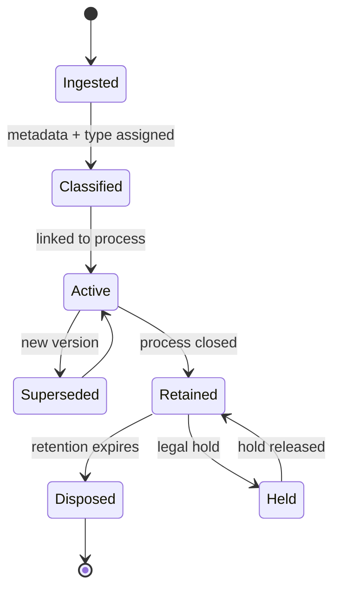

# Volume 05 - Document Management

| Field | Value |
|---|---|
| Document ID | WORLD-VOL05-033 |
| Title | Document Management |
| Version | 1.0 |
| Status | Approved |
| Classification | Internal |
| Founder | Mahesh Choudhary |

## Purpose

Document Management provides the governed lifecycle for every document WORLD's ERP processes produce, consume, or reference. It ensures that contracts, invoices, policies, certificates, and evidence are versioned, classified, retained, and linked to the process instances and records they support, so that the enterprise has a single trustworthy repository of its business documents.

## Scope

This chapter covers document ingestion, classification, versioning, retention and disposition, access control, and process linkage. It does not cover the audit event log (chapter 34) nor the structured transactional data owned by functional modules. It applies to all unstructured and semi-structured documents within the WORLD ERP.

## The Framework as Designed for WORLD

Every document in WORLD is a governed object with metadata, a classification, a retention policy, and a versioned content history. Documents are linked to the process instances, approvals, and business records that reference them, so a signed contract is inseparable from the order it authorizes. The framework enforces access control by classification and role, and applies retention and legal-hold rules automatically.

The AI Business Partner both consumes and produces documents. It extracts structured meaning from incoming documents to inform process execution and generates outbound documents from governed templates. Because documents are linked to process context, the Partner can retrieve exactly the evidence relevant to a decision and cite it to a human approver.

## Business Value

Governed document management eliminates the scattered file shares and version confusion that create compliance risk. Documents are findable, current, access-controlled, and disposed of on schedule, reducing both storage cost and legal exposure.

| Document Concern | Ad Hoc Storage | WORLD Document Management |
|---|---|---|
| Versioning | Filename suffixes | Governed version history |
| Findability | Manual search | Metadata and process links |
| Retention | Manual, inconsistent | Policy-driven disposition |
| Access control | Folder permissions | Classification and role |

## Relationship to the AI Business Partner

Document Management gives the AI Business Partner reliable evidence. When the Partner recommends a decision under Volume 03 Section G, it attaches the governing documents so the human approver decides with full context. The Partner also drafts documents from templates, but final issuance of consequential documents follows the approval controls, keeping humans accountable.

## Relationship to Business Foundation

Document classifications, retention schedules, and control requirements derive from the policies and SOPs in Volume 02 Section C. The Business Foundation states which documents each process must retain and for how long; Document Management enforces those requirements automatically.

## Relationship to Business Intelligence

Document metadata and lifecycle events feed Volume 04, enabling analysis of contract exposure, document turnaround, and retention compliance. The Intelligence layer can surface expiring certificates or contracts approaching renewal for the Partner to act upon proactively.

## Enterprise Implementation Approach

Implementation maps document types to classifications and retention schedules from Business Foundation, configures access policies, and establishes template governance for generated documents. High-value document types such as contracts and regulatory records are onboarded first, with legal-hold procedures validated before broad rollout.

### Example

A supplier contract is ingested, classified as a legal agreement, and linked to the vendor record and procurement process. When a renewal amendment arrives, it is stored as a new version while prior versions remain retrievable. The AI Business Partner flags the approaching expiry, drafts a renewal from the approved template, and routes it for human approval; on execution, the signed document is linked to the renewal process and retained per the seven-year policy.

## Cross-References

- [Approval Engine](/docs/blueprint/volume-05-erp-foundation/section-d-process-foundation/30-approval-engine.md)
- [Audit Trail](/docs/blueprint/volume-05-erp-foundation/section-d-process-foundation/34-audit-trail.md)
- [Business Process Framework](/docs/blueprint/volume-05-erp-foundation/section-d-process-foundation/28-business-process-framework.md)
- [Volume 02 - Business Foundation](/docs/blueprint/volume-02-business-foundation/README.md)

## References

- [Volume 01 - Vision and Philosophy](/docs/blueprint/volume-01-vision-and-philosophy/README.md)
- [Document Standards](/docs/governance/document-standards.md)

## Change Log

| Version | Date | Author | Notes |
|---|---|---|---|
| 1.0 | 2026-07-12 | Lead Software Engineer | Initial approved version. |
