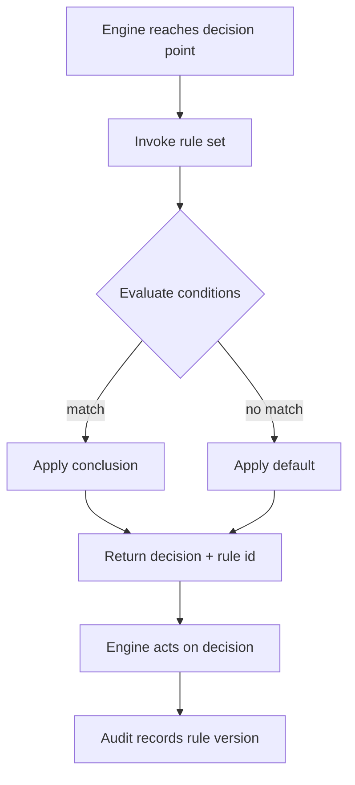

# Volume 05 - Business Rules Engine

| Field | Value |
|---|---|
| Document ID | WORLD-VOL05-035 |
| Title | Business Rules Engine |
| Version | 1.0 |
| Status | Approved |
| Classification | Internal |
| Founder | Mahesh Choudhary |

## Purpose

The Business Rules Engine externalizes the enterprise's operational logic from process definitions and code into a governed, declarative rule base. It exists so that the policies, thresholds, and decision criteria that steer WORLD's processes can be authored, versioned, tested, and changed by the business without re-engineering, while remaining fully auditable and available to the AI Business Partner.

## Scope

This chapter covers rule authoring, rule sets and evaluation, decision tables, versioning and testing, and rule invocation by other engines. It does not cover process orchestration (chapter 31) nor authorization decisions themselves (chapter 30), though it determines when those are required. It applies to all declarative business logic within the WORLD ERP.

## The Framework as Designed for WORLD

A rule in WORLD is a declarative statement binding conditions to conclusions, grouped into versioned rule sets aligned with business domains. The Workflow, Approval, and other engines invoke the Rules Engine at decision points: to determine whether an approval is required, which discount applies, whether a transaction breaches a control, or how an item is classified. Decision tables express complex, multi-condition logic in a form the business can read and validate.

Because logic is declarative and versioned, the AI Business Partner can inspect the exact rule that governed an outcome, explain it to a human, and recommend rule changes grounded in observed performance. Rule changes pass through governance and testing before activation, preventing untested logic from reaching production.

## Business Value

Externalizing logic lets the enterprise adapt policy at business speed rather than release speed. Rules are consistent across every process that references them, changes are testable and reversible, and the reasoning behind each decision is transparent.

| Logic Concern | Hard-Coded Rules | WORLD Rules Engine |
|---|---|---|
| Change speed | Development cycle | Governed authoring |
| Consistency | Duplicated per module | Single rule set |
| Testability | Limited | Versioned test suites |
| Explainability | Opaque | Rule id on every decision |

## Relationship to the AI Business Partner

The Rules Engine is the Partner's shared source of enterprise policy. When the Partner evaluates a situation, it applies the same governed rules that constrain human action, ensuring consistency. In line with Volume 03 Section G, the Partner may recommend rule changes based on measured outcomes, but activation requires human governance approval, keeping policy authority with people.

## Relationship to Business Foundation

Rule sets are the machine-executable expression of the policies, thresholds, and control criteria documented in Volume 02 Section C. A control limit or eligibility policy in the Business Foundation becomes a versioned rule, so business policy and system behavior never diverge.

## Relationship to Business Intelligence

Rule evaluation outcomes stream to Volume 04, revealing which rules fire most, where defaults dominate, and where thresholds cause friction or leakage. The Intelligence layer lets the Partner propose evidence-based refinements, closing the loop between measured performance and policy.

## Enterprise Implementation Approach

Implementation extracts embedded logic into decision tables and rule sets organized by domain, establishes authoring and approval governance, and builds test suites that validate each rule set before activation. Pricing, credit, and compliance rules are prioritized. Every rule set is versioned so decisions can be reconciled against the exact logic in force at the time.

### Example

A sales order triggers pricing evaluation. The Rules Engine applies the customer-tier discount table, checks the credit-limit control, and determines that the order exceeds the auto-approval threshold, so it signals the Workflow Engine to require managerial approval. Each decision returns its rule identifier, and the Audit Trail records the rule-set version applied. When the enterprise later adjusts the tier discounts, the business authors and tests the new rule set and activates it through governance, with no code change.

## Cross-References

- [Business Process Framework](/docs/blueprint/volume-05-erp-foundation/section-d-process-foundation/28-business-process-framework.md)
- [Approval Engine](/docs/blueprint/volume-05-erp-foundation/section-d-process-foundation/30-approval-engine.md)
- [Workflow Engine](/docs/blueprint/volume-05-erp-foundation/section-d-process-foundation/31-workflow-engine.md)
- [Volume 03 - AI Business Partner](/docs/blueprint/volume-03-ai-business-partner/README.md)

## References

- [Volume 01 - Vision and Philosophy](/docs/blueprint/volume-01-vision-and-philosophy/README.md)
- [Document Standards](/docs/governance/document-standards.md)

## Change Log

| Version | Date | Author | Notes |
|---|---|---|---|
| 1.0 | 2026-07-12 | Lead Software Engineer | Initial approved version. |
