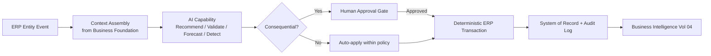

# Volume 05 - AI Inside ERP

| Field | Value |
|---|---|
| Document ID | WORLD-VOL05-036 |
| Title | AI Inside ERP |
| Version | 1.0 |
| Status | Approved |
| Classification | Internal |
| Founder | Mahesh Choudhary |

## Purpose

This chapter establishes the foundational architecture for embedding artificial intelligence directly inside WORLD's ERP layer. It defines what "AI-native" means operationally: not a bolted-on analytics dashboard, but intelligence woven into the transaction, master-data, and process fabric of the ERP itself. It sets the shared vocabulary, boundaries, and governance posture for every subsequent chapter in Section E (Chapters 37 through 43).

## Scope

This document covers the structural pattern by which AI capabilities attach to ERP entities, events, and workflows; the classes of AI capability that operate inside the ERP; the trust boundary between AI suggestion and system-of-record commitment; and the integration seams to the AI Business Partner (Volume 03) and Business Intelligence (Volume 04). It does not cover model training pipelines, infrastructure provisioning, or module-specific transaction schemas, which are addressed in their respective volumes and sections.

## AI as an Embedded Layer, Not an Adjacent Service

In a conventional ERP, data is captured, then later analyzed by a separate system. WORLD inverts this. Every ERP entity - a purchase order, a journal line, a customer record, an inventory movement - emits events onto an internal event stream. AI capabilities subscribe to these events, enrich them with context from the Business Foundation (Volume 02), and return structured signals: recommendations, validations, forecasts, exception flags, and decision-support briefs. Crucially, these signals are advisory artifacts attached to the entity; they never mutate the system of record directly. Commitment to the record always passes through a deterministic ERP transaction and, where consequential, a human-approval gate (Chapter 43).

This produces a consistent "AI-in-the-loop" pattern that every capability in Section E specializes.

## Capability Taxonomy

| Capability | Chapter | ERP Role | Commitment Path |
|---|---|---|---|
| Recommendations | 37 | Suggest next best action or value | Advisory, user-confirmed |
| Automation | 38 | Execute routine, policy-bound steps | Auto within guardrails |
| Validation | 39 | Check integrity before commit | Blocking or advisory |
| Forecasting | 40 | Project future states | Advisory, feeds planning |
| Decision Support | 41 | Synthesize options and trade-offs | Advisory to approver |
| Exception Detection | 42 | Surface anomalies and breaches | Alert plus workflow |
| Human Approval | 43 | Govern consequential actions | Mandatory gate |

## Business Value

Embedding AI inside the ERP compresses the distance between insight and action. Instead of exporting data to analyze elsewhere, WORLD acts on intelligence at the point of transaction, reducing cycle time, error rates, and the manual burden of routine judgment. Because every AI signal is attached to a governed entity and logged, the enterprise gains speed without surrendering control, auditability, or accountability.

## Relationship to the AI Business Partner

The ERP is where the AI Business Partner (Volume 03) acts operationally. Volume 03 defines the Partner's Decision Support, Recommendation, and Automation capabilities and the governance principle that AI augments and never overrides human authority. Section E is the ERP-side realization of those capabilities: the Partner reasons over business context, and the ERP executes within least-privilege boundaries and human-approval gates that Volume 03 mandates.

## Relationship to Business Foundation

The Business Foundation (Volume 02) supplies the context that makes AErson signals meaningful: the organizational model, policies, chart of accounts, entitlements, and business rules. AI capabilities read this foundation to ground every recommendation and validation in the enterprise's own definitions rather than generic assumptions, ensuring signals are correct for this business.

## Relationship to Business Intelligence

Every AI signal and its outcome flow into Business Intelligence (Volume 04) as first-class observations. Volume 04's forecasting, exception-detection, and decision frameworks both consume ERP-generated signals and feed refined models back to the ERP, closing the learning loop while keeping analytical and transactional responsibilities cleanly separated.

## Enterprise Implementation Approach

Implementation proceeds in maturity tiers: first instrument ERP entities to emit events and attach advisory signals in read-only "shadow" mode; second, enable user-confirmed recommendations and blocking validations; third, permit policy-bound automation with guardrails and human-approval gates for consequential actions. Each tier requires audit logging, least-privilege service identities, and rollback paths before promotion. An enterprise example: a mid-market distributor deploys shadow-mode AI on procurement for one quarter, reviews signal accuracy in Volume 04 dashboards, then enables user-confirmed vendor recommendations and duplicate-invoice validation before authorizing any automated posting.

## Cross-References

- [Chapter 37 - AI Recommendations](/docs/blueprint/volume-05-erp-foundation/section-e-ai-integration/37-ai-recommendations.md)
- [Chapter 43 - Human Approval Workflow](/docs/blueprint/volume-05-erp-foundation/section-e-ai-integration/43-human-approval-workflow.md)
- [Volume 03 - AI Business Partner](/docs/blueprint/volume-03-ai-business-partner/README.md)
- [Volume 04 - Business Intelligence](/docs/blueprint/volume-04-business-intelligence/README.md)

## References

- [Volume 01 - Vision and Philosophy](/docs/blueprint/volume-01-vision-and-philosophy/README.md)
- [Document Standards](/docs/governance/document-standards.md)

## Change Log

| Version | Date | Author | Notes |
|---|---|---|---|
| 1.0 | 2026-07-12 | Lead Software Engineer | Initial approved version. |
