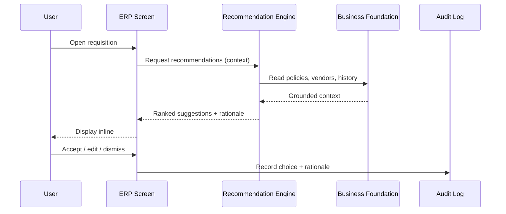

# Volume 05 - AI Recommendations

| Field | Value |
|---|---|
| Document ID | WORLD-VOL05-037 |
| Title | AI Recommendations |
| Version | 1.0 |
| Status | Approved |
| Classification | Internal |
| Founder | Mahesh Choudhary |

## Purpose

This chapter defines how AI-generated recommendations are embedded inside WORLD's ERP so that users receive contextual, next-best-action guidance at the exact point of work. It specifies how recommendations are produced, presented, confirmed, and audited without ever bypassing human authority or the system of record.

## Scope

Covered: the recommendation lifecycle within ERP transactions and master-data screens; ranking and rationale presentation; confirmation and dismissal semantics; and feedback capture. Not covered: automated execution without confirmation (Chapter 38), and the model training that produces ranking signals, which is functional to this document rather than defined here.

## Recommendations Embedded at the Point of Work

A recommendation in WORLD is an advisory artifact attached to an ERP entity that proposes a value, action, or path - for example, a suggested vendor for a purchase requisition, a GL account for an uncategorized expense, or a reorder quantity for a stock item. Each recommendation carries a rationale, a confidence indication, and the context that produced it. The ERP surfaces recommendations inline; the user remains the actor who accepts, edits, or dismisses. Acceptance triggers a normal deterministic transaction, so the system of record is never written by the recommendation itself.

## Ranking and Rationale

| Element | Description | Governance Note |
|---|---|---|
| Candidate set | Eligible values or actions | Bounded by entitlements |
| Ranking signal | Relative suitability | Functional, not exposed as truth |
| Confidence band | High / Medium / Low | Displayed, never auto-forces |
| Rationale | Why this was suggested | Human-readable, auditable |
| Feedback | Accept / edit / dismiss | Captured for Volume 04 |

## Business Value

Recommendations reduce decision latency and error for high-volume, judgment-light tasks, letting staff focus attention where it matters. Because each suggestion is explained and every choice is logged, the enterprise gains consistency and institutional memory while preserving individual accountability.

## Relationship to the AI Business Partner

This chapter operationalizes the Recommendation capability defined in Volume 03. The AI Business Partner determines what to suggest and why; the ERP is where those suggestions meet real transactions. Volume 03's principle that AI augments rather than overrides is enforced here through mandatory human confirmation for every recommendation that changes the record.

## Relationship to Business Foundation

Recommendations are grounded in Volume 02: approved vendor lists, chart of accounts, pricing rules, and entitlements. The candidate set is always bounded by the Business Foundation, ensuring no recommendation proposes an action the user is not permitted to take or a value inconsistent with enterprise policy.

## Relationship to Business Intelligence

Every accepted, edited, or dismissed recommendation becomes a labeled observation for Volume 04. These outcomes refine ranking quality over time and feed decision frameworks that measure recommendation adoption, accuracy, and business impact, closing the loop between action and analytics.

## Enterprise Implementation Approach

Begin with a single high-frequency decision - such as expense categorization - in shadow mode, comparing AI suggestions against human choices to establish accuracy. Promote to inline suggestions with confidence bands once accuracy thresholds are met, always requiring explicit acceptance. Enterprise example: a shared-services finance team enables account-coding recommendations across 40,000 monthly expense lines; the ERP pre-selects the top suggestion but requires a click to confirm, cutting average coding time by more than half while the audit log preserves who accepted what and why.

## Cross-References

- [Chapter 36 - AI Inside ERP](/docs/blueprint/volume-05-erp-foundation/section-e-ai-integration/36-ai-inside-erp.md)
- [Chapter 38 - AI Automation](/docs/blueprint/volume-05-erp-foundation/section-e-ai-integration/38-ai-automation.md)
- [Chapter 41 - AI Decision Support](/docs/blueprint/volume-05-erp-foundation/section-e-ai-integration/41-ai-decision-support.md)
- [Volume 03 - AI Business Partner](/docs/blueprint/volume-03-ai-business-partner/README.md)

## References

- [Volume 01 - Vision and Philosophy](/docs/blueprint/volume-01-vision-and-philosophy/README.md)
- [Document Standards](/docs/governance/document-standards.md)

## Change Log

| Version | Date | Author | Notes |
|---|---|---|---|
| 1.0 | 2026-07-12 | Lead Software Engineer | Initial approved version. |
