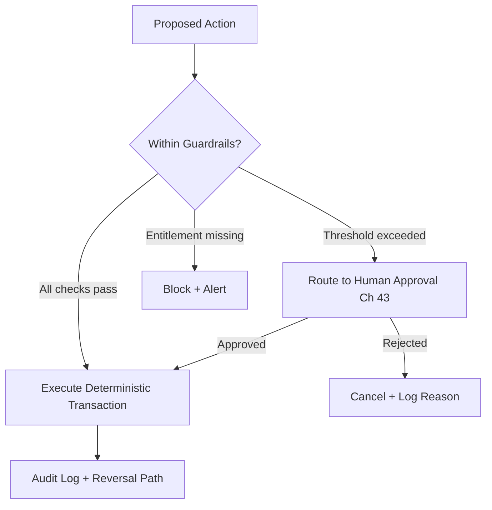

# Volume 05 - AI Automation

| Field | Value |
|---|---|
| Document ID | WORLD-VOL05-038 |
| Title | AI Automation |
| Version | 1.0 |
| Status | Approved |
| Classification | Internal |
| Founder | Mahesh Choudhary |

## Purpose

This chapter defines how AI-driven automation executes routine, policy-bound work inside WORLD's ERP while preserving least privilege, human-approval gates for consequential actions, and full auditability. It draws the line between what the ERP may complete autonomously and what must escalate to a human.

## Scope

Covered: the automation execution model, guardrail definitions, the autonomy-versus-approval boundary, and rollback and audit requirements. Not covered: the suggestion of actions prior to execution (Chapter 37) and the approval mechanics themselves (Chapter 43), which automation invokes but does not define.

## Automation Bound by Guardrails

Automation in WORLD is the autonomous execution of an ERP action that the AI Business Partner has determined and that policy explicitly permits without per-instance human confirmation. Each automated action is bounded by guardrails: entitlement scope, value thresholds, frequency limits, and reversibility. When an action falls inside the guardrails it executes deterministically and is logged; when it exceeds any guardrail it is routed to a human-approval gate rather than executed. This ensures AI augments throughput without ever overriding human authority on consequential matters.

## Guardrail Model

| Guardrail | Example Limit | Breach Behavior |
|---|---|---|
| Entitlement scope | Service identity least privilege | Block and alert |
| Value threshold | Auto-post invoices under set amount | Escalate to approval |
| Frequency limit | Max automated postings per hour | Throttle and queue |
| Reversibility | Only reversible actions auto-run | Escalate if irreversible |
| Confidence floor | Minimum validation confidence | Escalate if below floor |

## Business Value

Automation removes manual effort from repetitive, rule-clear tasks, delivering faster cycle times and lower operating cost while reducing human error. Because guardrails and audit logs bound every automated action, the enterprise captures these gains without exposure to uncontrolled autonomy.

## Relationship to the AI Business Partner

This chapter realizes the Automation capability from Volume 03. The AI Business Partner decides that an action is warranted; the ERP executes it only within guardrails and escalates anything consequential to human approval, honoring Volume 03's non-negotiable rule that AI augments and never overrides. Service identities operate under least privilege as Volume 03 governance requires.

## Relationship to Business Foundation

Guardrails are configured from Volume 02: approval thresholds, delegation of authority, entitlement matrices, and policy rules. Automation reads these definitions to determine what is permissible, so the boundary between autonomous and escalated action reflects the enterprise's own governance, not a generic default.

## Relationship to Business Intelligence

Automated actions, escalations, and reversals are logged as observations for Volume 04, which monitors automation rates, escalation frequency, and error incidence. Volume 04's exception-detection frameworks can flag drift in automation behavior, feeding tuning of guardrails and confidence floors.

## Enterprise Implementation Approach

Automation is enabled last in the maturity sequence and only for reversible, low-value, high-frequency actions with proven validation accuracy. Each automation ships with a defined reversal path and a monitored escalation route. Enterprise example: an accounts-payable team authorizes automated posting of supplier invoices below a configured threshold that have passed three-way match validation (Chapter 39); invoices above the threshold or with any validation exception route to a human approver, and every automated posting carries a one-click reversal and a complete audit entry.

## Cross-References

- [Chapter 37 - AI Recommendations](/docs/blueprint/volume-05-erp-foundation/section-e-ai-integration/37-ai-recommendations.md)
- [Chapter 39 - AI Validation](/docs/blueprint/volume-05-erp-foundation/section-e-ai-integration/39-ai-validation.md)
- [Chapter 43 - Human Approval Workflow](/docs/blueprint/volume-05-erp-foundation/section-e-ai-integration/43-human-approval-workflow.md)
- [Volume 03 - AI Business Partner](/docs/blueprint/volume-03-ai-business-partner/README.md)

## References

- [Volume 01 - Vision and Philosophy](/docs/blueprint/volume-01-vision-and-philosophy/README.md)
- [Document Standards](/docs/governance/document-standards.md)

## Change Log

| Version | Date | Author | Notes |
|---|---|---|---|
| 1.0 | 2026-07-12 | Lead Software Engineer | Initial approved version. |
