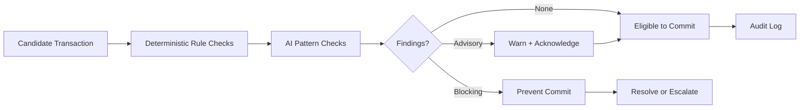

# Volume 05 - AI Validation

| Field | Value |
|---|---|
| Document ID | WORLD-VOL05-039 |
| Title | AI Validation |
| Version | 1.0 |
| Status | Approved |
| Classification | Internal |
| Founder | Mahesh Choudhary |

## Purpose

This chapter defines how AI-assisted validation checks the integrity, consistency, and plausibility of ERP data and transactions before they are committed to the system of record. It specifies blocking versus advisory validation and how validation gates interoperate with automation and approval.

## Scope

Covered: the validation lifecycle at data entry and pre-commit; rule-based and pattern-based checks; severity classification; and how validation outcomes gate downstream automation. Not covered: post-commit anomaly detection (Chapter 42), which operates on committed records rather than pre-commit candidates.

## Validation at the Commit Boundary

Validation in WORLD sits at the boundary between a candidate transaction and the system of record. It combines deterministic business rules from the Business Foundation with AI pattern checks that catch what fixed rules miss - duplicate invoices with altered references, quantities that are statistically implausible for a vendor, or descriptions inconsistent with a chosen account. Each finding carries a severity: blocking findings prevent commit until resolved; advisory findings warn but allow the user to proceed with an acknowledged reason. Validation never silently alters data; it surfaces findings for human or policy-bound resolution.

## Severity Classification

| Severity | Meaning | System Behavior | Example |
|---|---|---|---|
| Blocking | Integrity breach | Commit prevented | Duplicate invoice detected |
| Advisory | Plausibility concern | Warn, allow with reason | Unusual quantity for vendor |
| Informational | Minor inconsistency | Note only | Description atypical for account |

## Business Value

Validation prevents errors at the cheapest point to fix them - before they enter the record - reducing rework, financial leakage, and downstream reconciliation effort. AI pattern checks extend coverage beyond what static rules can express, raising data quality without adding manual review burden.

## Relationship to the AI Business Partner

Validation supports the Decision Support and Automation capabilities of Volume 03 by ensuring the data those capabilities act on is trustworthy. A blocking validation is the mechanism by which the ERP declines to let automation or a user commit a flawed transaction, upholding Volume 03's governance that consequential actions require correctness and, where needed, human review.

## Relationship to Business Foundation

Deterministic validation rules are defined in Volume 02 - mandatory fields, referential constraints, tax rules, and matching policies. AI pattern checks are grounded in the same foundation, so plausibility judgments reflect the enterprise's vendors, accounts, and historical norms rather than generic baselines.

## Relationship to Business Intelligence

Validation findings and their resolutions flow to Volume 04, which analyzes error patterns, false-positive rates, and control effectiveness. Volume 04's frameworks help calibrate AI pattern checks and feed insights that strengthen both pre-commit validation and post-commit exception detection.

## Enterprise Implementation Approach

Deploy deterministic rules first for full coverage, then layer AI pattern checks in advisory mode to measure precision before promoting high-precision checks to blocking. Every blocking check must have a documented resolution or escalation path. Enterprise example: a finance shared-services center adds an AI duplicate-invoice check that compares vendor, amount, and line patterns across altered reference numbers; it runs advisory for one cycle, achieves high precision, and is promoted to blocking, after which it becomes a prerequisite for the automated posting described in Chapter 38.

## Cross-References

- [Chapter 38 - AI Automation](/docs/blueprint/volume-05-erp-foundation/section-e-ai-integration/38-ai-automation.md)
- [Chapter 42 - AI Exception Detection](/docs/blueprint/volume-05-erp-foundation/section-e-ai-integration/42-ai-exception-detection.md)
- [Volume 03 - AI Business Partner](/docs/blueprint/volume-03-ai-business-partner/README.md)
- [Volume 04 - Business Intelligence](/docs/blueprint/volume-04-business-intelligence/README.md)

## References

- [Volume 01 - Vision and Philosophy](/docs/blueprint/volume-01-vision-and-philosophy/README.md)
- [Document Standards](/docs/governance/document-standards.md)

## Change Log

| Version | Date | Author | Notes |
|---|---|---|---|
| 1.0 | 2026-07-12 | Lead Software Engineer | Initial approved version. |
