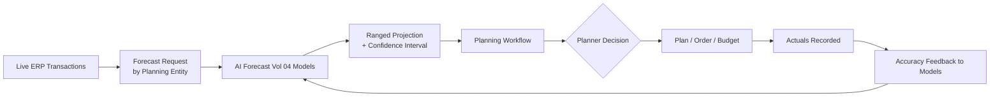

# Volume 05 - AI Forecasting

| Field | Value |
|---|---|
| Document ID | WORLD-VOL05-040 |
| Title | AI Forecasting |
| Version | 1.0 |
| Status | Approved |
| Classification | Internal |
| Founder | Mahesh Choudhary |

## Purpose

This chapter defines how AI forecasting is embedded inside WORLD's ERP to project future operational states - demand, cash, capacity, and lead times - directly against live transactional data, and how those forecasts inform planning without automatically committing the enterprise to any action.

## Scope

Covered: how forecasts are generated from ERP data, presented within planning workflows, ranged with uncertainty, and reconciled to actuals. Not covered: the analytical model architecture in Volume 04, which this chapter consumes functionally, and the automated execution of any action a forecast implies, which remains subject to Chapters 38 and 43.

## Forecasting Against Live ERP Data

Forecasting in WORLD operates on the same governed transactional data the ERP records, so projections are always current. The ERP requests forecasts for planning entities - a stock item's demand, a period's cash position, a resource's utilization - and receives ranged projections with confidence intervals rather than single points. Forecasts are advisory inputs to planning screens; a human planner or a policy-bound process decides what to do with them. Actuals continuously flow back so forecast accuracy is measured and models are recalibrated.

## Forecast Output Structure

| Attribute | Description | Use |
|---|---|---|
| Central estimate | Most likely projected value | Baseline planning |
| Confidence interval | Range around estimate | Risk-adjusted decisions |
| Horizon | Period projected | Aligns to planning cycle |
| Drivers | Key contributing factors | Explainability |
| Accuracy score | Recent forecast-to-actual | Trust calibration |

## Business Value

Forecasting turns the ERP's transactional history into forward visibility, enabling proactive planning of inventory, cash, and capacity instead of reactive correction. Ranged projections let the enterprise make risk-adjusted decisions, reducing both stockouts and overstock, cash surprises, and idle or overcommitted capacity.

## Relationship to the AI Business Partner

Forecasts are core inputs to the Decision Support capability of Volume 03. The AI Business Partner uses projections to frame options and trade-offs, but Volume 03 governance keeps commitment with the human: a forecast may recommend an action, yet ordering, budgeting, or hiring passes through recommendation confirmation or a human-approval gate.

## Relationship to Business Foundation

Forecasts are scoped and constrained by Volume 02: the entities, calendars, units, and organizational structure that define what is being projected. Planning parameters such as safety-stock policy and budgeting periods come from the Business Foundation, ensuring forecasts are expressed in the enterprise's own operating terms.

## Relationship to Business Intelligence

Forecasting is a direct application of Volume 04's forecasting frameworks. Volume 04 owns the analytical models and accuracy measurement; the ERP consumes their outputs at the point of planning and returns actuals that Volume 04 uses to evaluate and improve the models, forming a continuous learning loop.

## Enterprise Implementation Approach

Start with a bounded, measurable forecast such as single-item demand, run it alongside existing planning to validate accuracy, then widen coverage as trust is established. Always present ranges and drivers, never bare point estimates, and gate any action a forecast implies through the appropriate confirmation or approval. Enterprise example: a distributor forecasts weekly demand for its top 500 SKUs; the ERP surfaces central estimates with confidence intervals and suggested reorder quantities in the planning screen, but a planner confirms each purchase order, and forecast-to-actual accuracy is reviewed monthly in Volume 04 dashboards.

## Cross-References

- [Chapter 41 - AI Decision Support](/docs/blueprint/volume-05-erp-foundation/section-e-ai-integration/41-ai-decision-support.md)
- [Chapter 42 - AI Exception Detection](/docs/blueprint/volume-05-erp-foundation/section-e-ai-integration/42-ai-exception-detection.md)
- [Volume 03 - AI Business Partner](/docs/blueprint/volume-03-ai-business-partner/README.md)
- [Volume 04 - Business Intelligence](/docs/blueprint/volume-04-business-intelligence/README.md)

## References

- [Volume 01 - Vision and Philosophy](/docs/blueprint/volume-01-vision-and-philosophy/README.md)
- [Document Standards](/docs/governance/document-standards.md)

## Change Log

| Version | Date | Author | Notes |
|---|---|---|---|
| 1.0 | 2026-07-12 | Lead Software Engineer | Initial approved version. |
