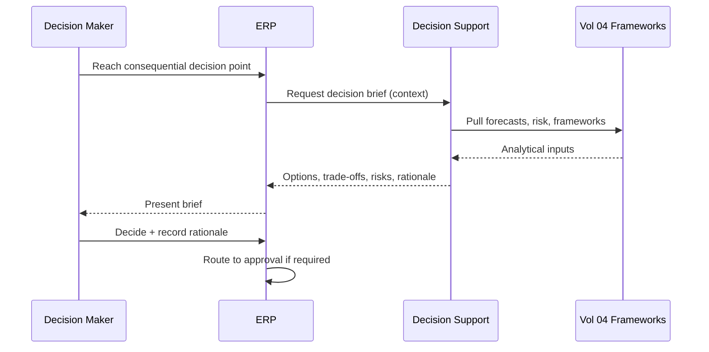

# Volume 05 - AI Decision Support

| Field | Value |
|---|---|
| Document ID | WORLD-VOL05-041 |
| Title | AI Decision Support |
| Version | 1.0 |
| Status | Approved |
| Classification | Internal |
| Founder | Mahesh Choudhary |

## Purpose

This chapter defines how AI decision support is embedded inside WORLD's ERP to help humans make consequential operational decisions - by synthesizing context, framing options, quantifying trade-offs, and presenting a defensible brief - while leaving the decision itself firmly with the human.

## Scope

Covered: how decision-support briefs are assembled from ERP data, forecasts, and policy; how options and trade-offs are presented; and how the resulting decision is captured for accountability. Not covered: the autonomous execution of any chosen option, which is governed by Chapters 38 and 43.

## Decision Support at the Point of Judgment

Decision support in WORLD activates when a user faces a consequential choice inside the ERP - approving a large purchase, selecting a supplier under constraints, or resolving a cash-timing conflict. Rather than a single recommendation, decision support assembles a brief: the relevant facts from the transactional record, forecasts from Chapter 40, applicable policies from the Business Foundation, and a structured comparison of viable options with their trade-offs and risks. The human weighs the brief and decides; the decision and its rationale are recorded. AI structures the judgment but never makes it.

## Decision Brief Contents

| Component | Purpose |
|---|---|
| Situation summary | Frame the decision and constraints |
| Options | Enumerate viable, permitted choices |
| Trade-offs | Cost, risk, timing per option |
| Forecast inputs | Forward impact from Chapter 40 |
| Recommended option | Advisory, with explicit rationale |
| Accountability record | Who decided, when, and why |

## Business Value

Decision support raises the quality and consistency of consequential decisions by ensuring every choice is made with complete context and explicit trade-offs, not partial information or habit. It shortens deliberation while producing an auditable rationale, strengthening both speed and accountability.

## Relationship to the AI Business Partner

This chapter is the ERP realization of the Decision Support capability defined in Volume 03. The AI Business Partner synthesizes and frames; the human decides. Volume 03's governance that AI augments and never overrides is embodied literally here - the brief may recommend, but authority and the recorded decision remain human, with consequential choices routed to the approval workflow.

## Relationship to Business Foundation

Every option in a decision brief is bounded by Volume 02 - authority limits, policies, entitlements, and organizational constraints. The Business Foundation ensures decision support never presents an option the enterprise forbids and that trade-offs are computed against the enterprise's own rules and cost structures.

## Relationship to Business Intelligence

Decision support draws directly on Volume 04's decision frameworks, forecasts, and risk models to quantify trade-offs. Decisions and outcomes flow back to Volume 04, which evaluates decision quality over time and refines the frameworks that future briefs rely on.

## Enterprise Implementation Approach

Introduce decision support first for a well-scoped, recurring consequential decision, presenting briefs in advisory form while humans decide as before, to validate that briefs are complete and trusted. Expand to additional decision types as confidence grows, always recording rationale and routing consequential choices to approval. Enterprise example: a procurement lead selecting between suppliers under a capacity constraint receives a brief comparing landed cost, lead-time risk from Chapter 40 forecasts, and contract-compliance flags; the lead chooses, records the rationale, and the award above threshold routes to the human-approval workflow of Chapter 43.

## Cross-References

- [Chapter 40 - AI Forecasting](/docs/blueprint/volume-05-erp-foundation/section-e-ai-integration/40-ai-forecasting.md)
- [Chapter 43 - Human Approval Workflow](/docs/blueprint/volume-05-erp-foundation/section-e-ai-integration/43-human-approval-workflow.md)
- [Volume 03 - AI Business Partner](/docs/blueprint/volume-03-ai-business-partner/README.md)
- [Volume 04 - Business Intelligence](/docs/blueprint/volume-04-business-intelligence/README.md)

## References

- [Volume 01 - Vision and Philosophy](/docs/blueprint/volume-01-vision-and-philosophy/README.md)
- [Document Standards](/docs/governance/document-standards.md)

## Change Log

| Version | Date | Author | Notes |
|---|---|---|---|
| 1.0 | 2026-07-12 | Lead Software Engineer | Initial approved version. |
