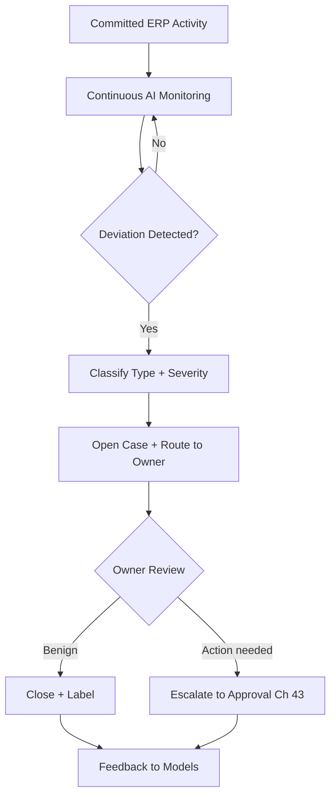

# Volume 05 - AI Exception Detection

| Field | Value |
|---|---|
| Document ID | WORLD-VOL05-042 |
| Title | AI Exception Detection |
| Version | 1.0 |
| Status | Approved |
| Classification | Internal |
| Founder | Mahesh Choudhary |

## Purpose

This chapter defines how AI exception detection continuously monitors committed ERP activity to surface anomalies, control breaches, and emerging risks, then routes them into workflows for human review - extending oversight without automatically reversing or penalizing any transaction.

## Scope

Covered: continuous monitoring of committed records and process metrics; anomaly and breach classification; alerting and case routing; and feedback for tuning. Not covered: pre-commit validation of candidate transactions (Chapter 39), which prevents rather than detects, and the disposition authority of approvers (Chapter 43).

## Detection Across Committed Activity

Where validation guards the commit boundary, exception detection watches what has already entered the system of record and how processes are behaving over time. AI models flag observations that deviate from expected patterns - a payment to a newly created vendor just under an approval threshold, a sudden margin drop on a product line, a process running far slower than its baseline. Each exception is classified by type and severity and opened as a case routed to the accountable owner. Detection informs and alerts; it never silently reverses a transaction. Disposition is a human act, escalated through approval where consequential.

## Exception Classes

| Class | Example | Typical Severity |
|---|---|---|
| Control breach | Split transaction below threshold | High |
| Financial anomaly | Unexpected margin or cost shift | Medium to High |
| Master-data risk | New vendor mirroring an employee | High |
| Process deviation | Cycle time far above baseline | Medium |
| Behavioral outlier | Unusual approval or access pattern | Variable |

## Business Value

Exception detection provides always-on oversight that no manual sampling can match, catching fraud indicators, control failures, and operational drift early. By routing findings into owned, tracked cases, it converts detection into accountable resolution and continuous control improvement.

## Relationship to the AI Business Partner

Exception detection feeds the Decision Support capability of Volume 03 with risk signals and supplies the evidence that consequential dispositions require. Consistent with Volume 03 governance, the ERP surfaces and escalates but does not override: humans decide how to resolve each exception, with least-privilege access to case data.

## Relationship to Business Foundation

Expected patterns and control rules are grounded in Volume 02 - approval thresholds, segregation-of-duties policies, vendor and employee master data, and process baselines. This grounding lets detection distinguish genuine breaches from legitimate variation specific to the enterprise.

## Relationship to Business Intelligence

Exception detection is a direct application of Volume 04's exception-detection frameworks. Volume 04 owns the anomaly models and thresholds; the ERP applies them to live activity and returns dispositions that Volume 04 uses to reduce false positives and sharpen detection over time.

## Enterprise Implementation Approach

Begin with a small set of high-value control checks in alert-only mode to establish precision and avoid alert fatigue, then expand coverage and enable case routing as trust grows. Every exception class needs a defined owner and disposition path. Enterprise example: a controller enables detection for payments to newly onboarded vendors within 30 days at amounts just below the approval threshold; matches open cases routed to AP management, which either clears them with a labeled reason or escalates to the approval workflow, and monthly false-positive rates are reviewed in Volume 04 to tune thresholds.

## Cross-References

- [Chapter 39 - AI Validation](/docs/blueprint/volume-05-erp-foundation/section-e-ai-integration/39-ai-validation.md)
- [Chapter 41 - AI Decision Support](/docs/blueprint/volume-05-erp-foundation/section-e-ai-integration/41-ai-decision-support.md)
- [Chapter 43 - Human Approval Workflow](/docs/blueprint/volume-05-erp-foundation/section-e-ai-integration/43-human-approval-workflow.md)
- [Volume 04 - Business Intelligence](/docs/blueprint/volume-04-business-intelligence/README.md)

## References

- [Volume 01 - Vision and Philosophy](/docs/blueprint/volume-01-vision-and-philosophy/README.md)
- [Document Standards](/docs/governance/document-standards.md)

## Change Log

| Version | Date | Author | Notes |
|---|---|---|---|
| 1.0 | 2026-07-12 | Lead Software Engineer | Initial approved version. |
