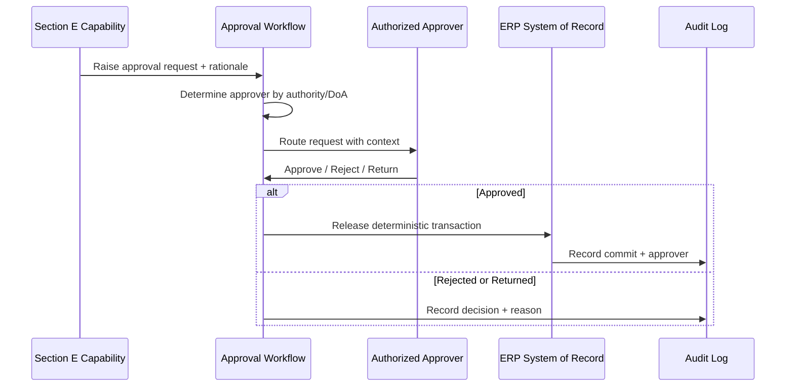

# Volume 05 - Human Approval Workflow

| Field | Value |
|---|---|
| Document ID | WORLD-VOL05-043 |
| Title | Human Approval Workflow |
| Version | 1.0 |
| Status | Approved |
| Classification | Internal |
| Founder | Mahesh Choudhary |

## Purpose

This chapter defines the human-approval workflow that governs every consequential AI-influenced action inside WORLD's ERP. It is the enforcement mechanism for the principle that AI augments and never overrides: no consequential action reaches the system of record without an authorized human decision, recorded and auditable.

## Scope

Covered: what makes an action consequential, how approval requests are raised from any Section E capability, routing by authority and delegation, decision capture, and audit. Not covered: the AI logic that proposes actions (Chapters 37 through 42), which invokes this workflow rather than defining it.

## Approval as the Universal Gate

The human-approval workflow is the shared gate that recommendations, automation, decision support, and exception dispositions all funnel through when an action crosses the consequential boundary defined in the Business Foundation. An approval request carries the proposed action, its AI-provided rationale, supporting context and forecasts, and the guardrail or threshold that triggered escalation. It is routed to the authorized approver by role, value, and delegation of authority. The approver approves, rejects, or returns for revision; only an approval releases the deterministic ERP transaction. Every step is logged with actor, timestamp, and reason, and least privilege bounds who can see and act on each request.

## Routing and Authority

| Trigger | Approver Level | Escalation |
|---|---|---|
| Value above threshold | Line manager or above | Higher tier by amount |
| Irreversible action | Designated authority | Dual approval if required |
| Exception disposition | Control or process owner | Risk committee if severe |
| Policy override | Policy owner | Documented exception |
| Delegation active | Named delegate | Reverts on expiry |

## Business Value

The approval workflow lets the enterprise safely capture the speed of AI while retaining absolute human control over consequential outcomes. By centralizing escalation, routing, and audit, it provides a single, consistent, defensible control point across every AI capability, satisfying governance, compliance, and accountability requirements.

## Relationship to the AI Business Partner

This workflow is the concrete enforcement of Volume 03's foundational governance: AI augments, never overrides; consequential actions require human approval; access follows least privilege; and everything is auditable. Every Section E capability defers to this gate, making the Volume 03 principle operationally binding rather than aspirational.

## Relationship to Business Foundation

The definition of "consequential," the approval thresholds, the delegation-of-authority matrix, and approver roles all come from Volume 02. The workflow reads these to route each request correctly, so the gate reflects the enterprise's own authority structure and adapts as that structure changes.

## Relationship to Business Intelligence

Approval decisions, cycle times, rejection reasons, and escalation patterns flow to Volume 04, which monitors control effectiveness and bottlenecks. Volume 04's decision frameworks help calibrate thresholds - too many trivial escalations or too few consequential ones both signal miscalibration to correct.

## Enterprise Implementation Approach

Implement the approval workflow before enabling any automation, so every consequential path has a gate from day one. Configure thresholds and delegation from the Business Foundation, verify audit completeness, and test escalation and delegation-expiry behavior before go-live. Enterprise example: when automation (Chapter 38) encounters a supplier invoice above the auto-post threshold, it raises an approval request routed by amount to the appropriate manager; the manager reviews the AI validation results and rationale, approves, and the transaction posts - with the approver, timestamp, and reason permanently recorded and available to Volume 04 for control reporting.

## Cross-References

- [Chapter 36 - AI Inside ERP](/docs/blueprint/volume-05-erp-foundation/section-e-ai-integration/36-ai-inside-erp.md)
- [Chapter 38 - AI Automation](/docs/blueprint/volume-05-erp-foundation/section-e-ai-integration/38-ai-automation.md)
- [Chapter 41 - AI Decision Support](/docs/blueprint/volume-05-erp-foundation/section-e-ai-integration/41-ai-decision-support.md)
- [Volume 03 - AI Business Partner](/docs/blueprint/volume-03-ai-business-partner/README.md)

## References

- [Volume 01 - Vision and Philosophy](/docs/blueprint/volume-01-vision-and-philosophy/README.md)
- [Document Standards](/docs/governance/document-standards.md)

## Change Log

| Version | Date | Author | Notes |
|---|---|---|---|
| 1.0 | 2026-07-12 | Lead Software Engineer | Initial approved version. |
