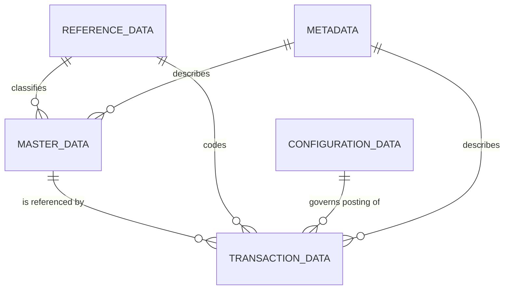

# Volume 05 - ERP Data Model

| Field | Value |
|---|---|
| Document ID | WORLD-VOL05-044 |
| Title | ERP Data Model |
| Version | 1.0 |
| Status | Approved |
| Classification | Internal |
| Founder | Mahesh Choudhary |

## Purpose

This chapter defines the conceptual and logical data model that underpins WORLD's ERP Foundation. It establishes the vocabulary, entity structure, and classification scheme that every subsequent chapter in Section F relies upon. The ERP data model is the shared truth layer that allows the AI Business Partner to reason about a business, the Business Foundation to be operationalized, and Business Intelligence to be computed from a single, consistent source.

## Scope

This document covers the logical structure of ERP data in WORLD: the major data classes, their relationships, ownership, and lifecycle at the conceptual level. It does not define physical storage structures, indexes, partitioning, or column-level schemas; those are specified in Volume 09 (Database). Here we describe what the data means and how it is organized, not how it is persisted on disk.

## The WORLD ERP Data Model

WORLD's ERP data model is organized around a small number of durable, well-bounded data classes. Every record in the operational layer belongs to exactly one class, and each class has distinct governance, mutability, and lifecycle rules. This separation is deliberate: it lets the AI Business Partner apply the correct reasoning and controls to each kind of data without ambiguity.

The five data classes are master data, transaction data, reference data, configuration data, and metadata. Master data represents the persistent business objects a company operates on (customers, products, suppliers, accounts). Transaction data records business events over time (orders, invoices, payments, journal entries). Reference data provides shared, slowly changing code sets (currencies, countries, units of measure, tax codes). Configuration data expresses how the ERP behaves for a given tenant (posting rules, approval thresholds, numbering schemes). Metadata describes the data itself (field definitions, ownership, lineage, classifications).

| Data Class | Nature | Mutability | Typical Owner | Example Entities |
|---|---|---|---|---|
| Master Data | Persistent business objects | Low, controlled | Business domain owner | Customer, Product, Supplier, GL Account |
| Transaction Data | Time-stamped business events | Append-oriented | Operational process | Sales Order, Invoice, Payment |
| Reference Data | Shared code sets | Very low | Data governance | Currency, Country, Tax Code |
| Configuration Data | Behavioral rules | Controlled by change process | Platform / tenant admin | Posting Rule, Approval Threshold |
| Metadata | Data about data | Managed by platform | Data platform team | Field Definition, Lineage, Classification |

This classification aligns with Volume 02 Section G, which distinguishes business data, master data, and transactional data as the raw substance of a business. WORLD's ERP extends that model with the reference, configuration, and metadata classes required to run an operational system at enterprise scale.

### Enterprise Example

Consider a mid-market distributor onboarded to WORLD. Its customer records and product catalog are master data. Each dispatched shipment creates transaction records (sales order, delivery note, invoice). Every line references reference data such as the currency and unit of measure. The rule that invoices post to a specific revenue account is configuration data, and the definition of the `credit_limit` field, including who may change it, is metadata. A single sale therefore touches all five classes, but each is governed independently.

## Business Value

A disciplined data model reduces reconciliation cost, prevents duplicated truth, and makes automation safe. Because each class has explicit ownership and lifecycle, WORLD can grant the AI Business Partner autonomy over transactions while protecting master and configuration data behind controlled change processes.

## Relationship to the AI Business Partner

The AI Business Partner reasons over this model as its world representation. Clear class boundaries let it know which data it may create autonomously (transactions), which it may propose changes to (master, configuration), and which it must treat as authoritative constants (reference). The model is the schema of the Partner's understanding.

## Relationship to Business Foundation

The Business Foundation (Volume 02) defines what a business is; this data model operationalizes those definitions into structured, governed records. Business objects described conceptually in Volume 02 Section G become concrete master and transaction entities here.

## Relationship to Business Intelligence

Business Intelligence (Volume 04) computes metrics and insights directly from these classes. A consistent, well-typed model guarantees that KPIs are derived from a single, trustworthy source rather than reconciled across silos.

## Enterprise Implementation Approach

WORLD implements the data model as a logical contract enforced across services. Each class is realized in the physical schemas of Volume 09 (Database), with metadata-driven validation, ownership registries, and lineage tracking applied uniformly. Class membership is declared at entity design time and cannot be changed implicitly.

## Cross-References

- [Master Data](/docs/blueprint/volume-05-erp-foundation/section-f-data-foundation/45-master-data.md)
- [Transaction Data](/docs/blueprint/volume-05-erp-foundation/section-f-data-foundation/46-transaction-data.md)
- [Data Integrity](/docs/blueprint/volume-05-erp-foundation/section-f-data-foundation/51-data-integrity.md)
- [Volume 02 - Business Foundation](/docs/blueprint/volume-02-business-foundation/README.md)

## References

- [Volume 01 - Vision and Philosophy](/docs/blueprint/volume-01-vision-and-philosophy/README.md)
- [Document Standards](/docs/governance/document-standards.md)

## Change Log

| Version | Date | Author | Notes |
|---|---|---|---|
| 1.0 | 2026-07-12 | Lead Software Engineer | Initial approved version. |
