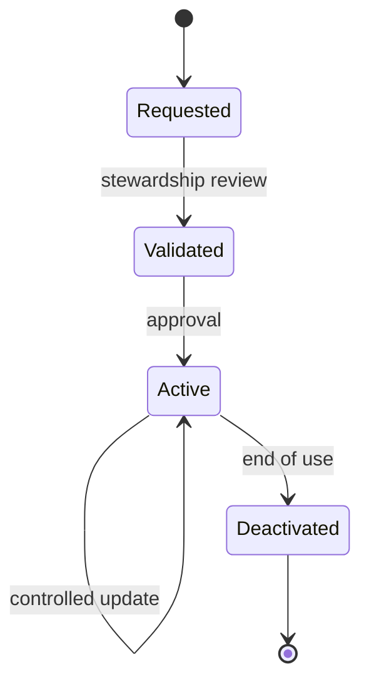

# Volume 05 - Master Data

| Field | Value |
|---|---|
| Document ID | WORLD-VOL05-045 |
| Title | Master Data |
| Version | 1.0 |
| Status | Approved |
| Classification | Internal |
| Founder | Mahesh Choudhary |

## Purpose

This chapter defines master data within WORLD's ERP Foundation: the persistent business objects that a company operates on and that transactions repeatedly reference. Master data is the stable backbone of the operational layer, and its quality directly determines the reliability of everything the AI Business Partner does.

## Scope

This document describes the definition, characteristics, ownership, and lifecycle of master data at the conceptual and logical level. It covers governance and stewardship principles. It does not define physical tables or storage, which are specified in Volume 09 (Database).

## Master Data in WORLD

Master data represents the durable entities that exist independently of any single business event: customers, suppliers, products, materials, employees, general-ledger accounts, cost centers, and locations. These objects are created once, referenced many times, and changed rarely and deliberately. In the WORLD classification (Chapter 44), master data is distinguished from transaction data by its low mutability and long life, and from reference data by being owned and curated within the tenant rather than shared as a universal code set.

Characteristics of master data include: a stable unique identity, controlled change through stewardship, rich attribution, and wide reference by transactions. A customer record, for example, persists across thousands of orders; changing its billing address must be governed because it affects future transactions but never rewrites completed ones.

| Master Entity | Key Identity | Representative Attributes | Steward |
|---|---|---|---|
| Customer | Customer ID | Legal name, billing terms, credit limit | Sales / Finance |
| Product | SKU | Description, category, base price, UoM | Product / Merchandising |
| Supplier | Supplier ID | Legal name, payment terms, tax profile | Procurement |
| GL Account | Account code | Account type, currency, posting rules | Finance |
| Employee | Employee ID | Role, department, cost center | HR |

Master data lifecycle follows a controlled path: request, validate, approve, activate, maintain, and eventually deactivate. Records are seldom deleted; they are deactivated to preserve the integrity of historical transactions that reference them.

### Enterprise Example

A manufacturer adds a new product line in WORLD. A steward creates the product master records, assigns SKUs, sets base prices and units of measure (referencing reference data), and links each product to its revenue account (configuration data). Once approved and activated, thousands of subsequent sales orders reference these product records without recreating them. When a product is discontinued, its master record is deactivated, not deleted, so historical invoices remain valid.

## Business Value

High-quality master data eliminates duplicate customers, inconsistent product definitions, and reconciliation errors. It is the single largest driver of trustworthy reporting and safe automation, because every transaction inherits the correctness of the master records it references.

## Relationship to the AI Business Partner

The AI Business Partner treats master data as authoritative context. It may propose master data creation or updates (for example, suggesting a new supplier from a purchasing pattern), but changes route through stewardship controls. The Partner relies on stable master identity to link and interpret transactions accurately.

## Relationship to Business Foundation

Master data is the operational realization of the business objects defined in Volume 02 Section G. Where the Business Foundation says a business has customers and products, master data gives those concepts governed, referenceable records inside the ERP.

## Relationship to Business Intelligence

Business Intelligence (Volume 04) dimensions almost every metric by master data: revenue by customer, margin by product, spend by supplier. Clean master data is the prerequisite for accurate segmentation and trend analysis.

## Enterprise Implementation Approach

WORLD implements master data with dedicated stewardship workflows, deduplication and matching rules, mandatory-attribute validation, and versioned change history. Each master domain has named owners. Physical persistence, uniqueness constraints, and indexing are defined in Volume 09 (Database); this chapter defines the governance contract those schemas enforce.

## Cross-References

- [ERP Data Model](/docs/blueprint/volume-05-erp-foundation/section-f-data-foundation/44-erp-data-model.md)
- [Transaction Data](/docs/blueprint/volume-05-erp-foundation/section-f-data-foundation/46-transaction-data.md)
- [Reference Data](/docs/blueprint/volume-05-erp-foundation/section-f-data-foundation/47-reference-data.md)
- [Volume 02 - Business Foundation](/docs/blueprint/volume-02-business-foundation/README.md)

## References

- [Volume 01 - Vision and Philosophy](/docs/blueprint/volume-01-vision-and-philosophy/README.md)
- [Document Standards](/docs/governance/document-standards.md)

## Change Log

| Version | Date | Author | Notes |
|---|---|---|---|
| 1.0 | 2026-07-12 | Lead Software Engineer | Initial approved version. |
