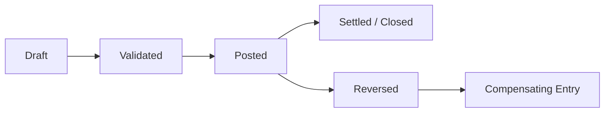

# Volume 05 - Transaction Data

| Field | Value |
|---|---|
| Document ID | WORLD-VOL05-046 |
| Title | Transaction Data |
| Version | 1.0 |
| Status | Approved |
| Classification | Internal |
| Founder | Mahesh Choudhary |

## Purpose

This chapter defines transaction data within WORLD's ERP Foundation: the time-stamped records of business events that flow through the operational layer. Transaction data is the living record of what a business actually does, and it is the primary domain where the AI Business Partner acts with autonomy.

## Scope

This document describes the definition, characteristics, lifecycle, and ownership of transaction data at the conceptual and logical level. Physical storage, partitioning, and retention mechanics are defined in Volume 09 (Database).

## Transaction Data in WORLD

Transaction data records discrete business events as they occur: sales orders, purchase orders, deliveries, invoices, payments, receipts, and journal entries. Each transaction is stamped with a time of occurrence, references the master data it concerns, uses reference data for coding, and is governed by configuration data during posting. In the WORLD classification (Chapter 44), transaction data is distinguished by being append-oriented and high in volume: records accumulate continuously and, once posted, are corrected through compensating entries rather than silent edits.

Key characteristics are: a point-in-time occurrence, immutability after posting, dense references to master and reference data, and a clear document lifecycle. A completed invoice is a historical fact; it is never rewritten, only reversed or credited.

| Transaction Type | References (Master) | References (Reference) | Lifecycle States |
|---|---|---|---|
| Sales Order | Customer, Product | Currency, UoM | Draft, Confirmed, Fulfilled, Closed |
| Purchase Invoice | Supplier, GL Account | Currency, Tax Code | Draft, Approved, Posted, Paid |
| Payment | Customer/Supplier, Bank Account | Currency | Initiated, Cleared, Reconciled |
| Journal Entry | GL Accounts | Currency | Draft, Posted, Reversed |

The lifecycle of a transaction moves deliberately from a mutable draft to an immutable posted state, after which changes occur only through auditable reversals.

### Enterprise Example

A retailer processes an online sale in WORLD. A sales order is created (draft), validated against the customer's credit limit (master data) and stock, then confirmed. On dispatch, a delivery and an invoice are posted, referencing the product SKU and currency. A payment transaction later clears and is reconciled against the invoice. If the customer returns an item, WORLD posts a credit note as a compensating transaction rather than editing the original invoice, preserving a complete and auditable event history.

## Business Value

Transaction data is the raw feedstock of both operations and analytics. Its append-only discipline guarantees auditability, supports accurate financial statements, and gives the business a trustworthy record of every commitment and settlement.

## Relationship to the AI Business Partner

Transaction data is the Partner's primary field of action. Because transactions are append-oriented and governed by configuration rules, the AI Business Partner can create, route, and reconcile them autonomously within policy, while never mutating history. Each transaction it creates is fully attributable to the Partner and auditable.

## Relationship to Business Foundation

Transactions operationalize the business events that Volume 02 Section G identifies as transactional data. Where the Business Foundation describes the flow of value through a business, transaction data is the governed, chronological record of that flow.

## Relationship to Business Intelligence

Business Intelligence (Volume 04) derives most operational and financial metrics from transaction data: revenue, cash flow, throughput, and cycle times. Because transactions are immutable once posted, computed metrics are reproducible and defensible.

## Enterprise Implementation Approach

WORLD implements transaction data with strict posting controls, immutability after posting, compensating-entry patterns for corrections, and dense referential links to master and reference data. High-volume storage, time-based partitioning, and archival are specified in Volume 09 (Database); this chapter defines the behavioral contract those schemas must honor.

## Cross-References

- [ERP Data Model](/docs/blueprint/volume-05-erp-foundation/section-f-data-foundation/44-erp-data-model.md)
- [Master Data](/docs/blueprint/volume-05-erp-foundation/section-f-data-foundation/45-master-data.md)
- [Document Relationships](/docs/blueprint/volume-05-erp-foundation/section-f-data-foundation/50-document-relationships.md)
- [Volume 04 - Business Intelligence](/docs/blueprint/volume-04-business-intelligence/README.md)

## References

- [Volume 01 - Vision and Philosophy](/docs/blueprint/volume-01-vision-and-philosophy/README.md)
- [Document Standards](/docs/governance/document-standards.md)

## Change Log

| Version | Date | Author | Notes |
|---|---|---|---|
| 1.0 | 2026-07-12 | Lead Software Engineer | Initial approved version. |
