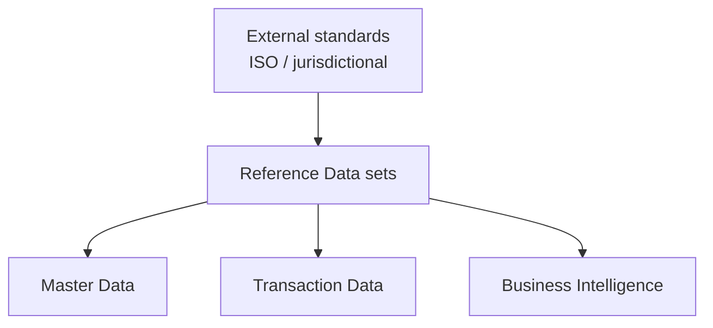

# Volume 05 - Reference Data

| Field | Value |
|---|---|
| Document ID | WORLD-VOL05-047 |
| Title | Reference Data |
| Version | 1.0 |
| Status | Approved |
| Classification | Internal |
| Founder | Mahesh Choudhary |

## Purpose

This chapter defines reference data within WORLD's ERP Foundation: the shared, slowly changing code sets that classify and standardize master and transaction data. Reference data is the common language that lets records from different domains and tenants be interpreted consistently.

## Scope

This document describes the definition, characteristics, sourcing, and governance of reference data at the conceptual and logical level. It distinguishes reference data from master and configuration data. Physical persistence is defined in Volume 09 (Database).

## Reference Data in WORLD

Reference data comprises standardized code sets that are used across the ERP but not owned by any single business process: currencies, countries, units of measure, tax codes, payment terms, industry classifications, and status enumerations. Unlike master data, reference data is typically universal or externally standardized (for example, ISO currency and country codes) rather than curated per tenant. Unlike configuration data, it does not change system behavior; it provides the controlled vocabularies that master and transaction records draw from.

Characteristics of reference data are: a small, bounded value set; very low change frequency; broad reuse; and often an external authoritative source. A currency code such as `USD` is referenced by countless transactions but is defined once and rarely altered.

| Reference Set | Example Values | Source | Change Frequency |
|---|---|---|---|
| Currency | USD, EUR, INR | ISO 4217 | Very low |
| Country | US, DE, IN | ISO 3166 | Very low |
| Unit of Measure | EA, KG, L | Internal / UN-CEFACT | Low |
| Tax Code | STD, RED, ZERO | Jurisdictional | Low to moderate |
| Payment Term | NET30, NET60 | Internal standard | Low |

Where reference data derives from an external standard, WORLD tracks the source and version so changes can be applied deliberately and audited.

### Enterprise Example

A business trading across borders in WORLD relies on the currency reference set for every multi-currency invoice, the country set for shipping and tax determination, and tax codes for compliant invoicing. When a tax authority introduces a new reduced rate, the reference data steward adds the new tax code with an effective date; existing transactions retain their original codes, while new transactions may use the updated set. No master or transaction records are rewritten.

## Business Value

Reference data prevents fragmentation. By standardizing the vocabularies that everything else uses, it enables consistent reporting, correct tax and currency handling, and clean cross-entity comparison. It is a low-volume, high-leverage asset.

## Relationship to the AI Business Partner

The AI Business Partner treats reference data as authoritative constants. It uses these code sets to interpret and code transactions correctly and does not invent values outside the sanctioned sets. When a needed code is missing, the Partner flags a governance request rather than improvising.

## Relationship to Business Foundation

Reference data supplies the shared classifications that Volume 02's business model assumes: currencies, jurisdictions, and units. It gives universal meaning to the business objects and events defined in the Business Foundation.

## Relationship to Business Intelligence

Business Intelligence (Volume 04) uses reference data to normalize and group metrics, for example converting multi-currency revenue to a reporting currency or aggregating sales by country. Consistent reference data is what makes cross-cutting analysis meaningful.

## Enterprise Implementation Approach

WORLD implements reference data as centrally governed, version-controlled code sets with effective-dating and external-source tracking. Values are validated at point of use so that master and transaction records can only reference sanctioned codes. Physical storage and lookup structures are defined in Volume 09 (Database).

## Cross-References

- [ERP Data Model](/docs/blueprint/volume-05-erp-foundation/section-f-data-foundation/44-erp-data-model.md)
- [Master Data](/docs/blueprint/volume-05-erp-foundation/section-f-data-foundation/45-master-data.md)
- [Configuration Data](/docs/blueprint/volume-05-erp-foundation/section-f-data-foundation/48-configuration-data.md)
- [Volume 02 - Business Foundation](/docs/blueprint/volume-02-business-foundation/README.md)

## References

- [Volume 01 - Vision and Philosophy](/docs/blueprint/volume-01-vision-and-philosophy/README.md)
- [Document Standards](/docs/governance/document-standards.md)

## Change Log

| Version | Date | Author | Notes |
|---|---|---|---|
| 1.0 | 2026-07-12 | Lead Software Engineer | Initial approved version. |
