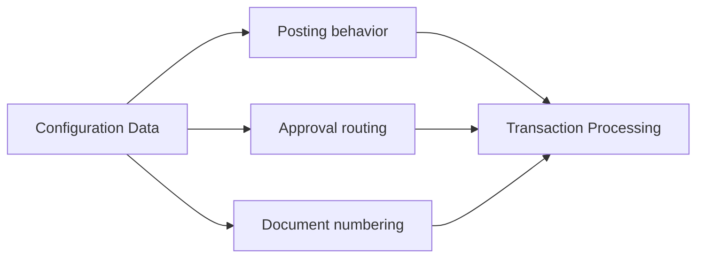

# Volume 05 - Configuration Data

| Field | Value |
|---|---|
| Document ID | WORLD-VOL05-048 |
| Title | Configuration Data |
| Version | 1.0 |
| Status | Approved |
| Classification | Internal |
| Founder | Mahesh Choudhary |

## Purpose

This chapter defines configuration data within WORLD's ERP Foundation: the tenant-specific settings and rules that determine how the ERP behaves. Configuration data is how a single WORLD platform adapts to each business without code changes, and how the AI Business Partner learns the boundaries within which it may act.

## Scope

This document describes the definition, characteristics, ownership, and change control of configuration data at the conceptual and logical level. It distinguishes configuration data from reference and master data. Physical persistence is defined in Volume 09 (Database).

## Configuration Data in WORLD

Configuration data expresses behavior: posting rules, approval thresholds, document numbering schemes, workflow routing, fiscal calendars, pricing and discount policies, and feature toggles. Unlike reference data, which supplies vocabularies, configuration data changes what the system does. Unlike master data, which describes business objects, configuration describes the rules that operate on those objects. It is low in volume but high in impact: a single posting-rule change affects every future transaction of a given type.

Characteristics of configuration data are: tenant scoping, controlled and audited change, often effective-dating, and strong influence on system behavior. Because a misconfiguration can affect financial correctness, configuration changes are treated as governed events, not casual edits.

| Configuration Item | Governs | Scope | Change Control |
|---|---|---|---|
| Posting Rule | Which accounts a document posts to | Tenant / legal entity | Finance approval |
| Approval Threshold | When human sign-off is required | Tenant / department | Governance board |
| Numbering Scheme | Document identifiers | Tenant | Platform admin |
| Fiscal Calendar | Period open/close | Legal entity | Finance |
| Pricing Policy | Discount and margin limits | Tenant / segment | Commercial owner |

### Enterprise Example

A services company operating in WORLD sets an approval threshold requiring human sign-off on any purchase order above a defined amount, and a posting rule mapping consulting revenue to a specific account. When the AI Business Partner drafts a purchase order below the threshold, it proceeds autonomously; above it, WORLD routes the document for human approval. Changing the threshold is itself a governed, audited configuration event with an effective date, ensuring that in-flight transactions are handled predictably.

## Business Value

Configuration data lets WORLD serve diverse businesses from one platform while keeping financial and operational behavior correct and auditable. It converts policy into enforced system behavior, reducing manual oversight and error.

## Relationship to the AI Business Partner

Configuration data defines the Partner's operating envelope. Approval thresholds, autonomy limits, and posting rules tell the AI Business Partner exactly where it may act alone and where it must seek human confirmation. The Partner reads configuration as its rulebook and may propose configuration changes, but those changes always pass through governed approval.

## Relationship to Business Foundation

Configuration data encodes the operating policies implied by Volume 02's Business Foundation into enforceable rules. Where the Business Foundation states how a business chooses to operate, configuration makes those choices executable inside the ERP.

## Relationship to Business Intelligence

Business Intelligence (Volume 04) interprets metrics in light of configuration: fiscal calendars define reporting periods, and posting rules determine how results roll up. Understanding configuration is essential to interpreting the numbers correctly.

## Enterprise Implementation Approach

WORLD implements configuration data with versioning, effective-dating, change approval workflows, and full audit trails. Configuration is separated cleanly from application code so behavior can evolve safely per tenant. Physical storage and versioned change tracking are defined in Volume 09 (Database); this chapter defines the governance contract.

## Cross-References

- [ERP Data Model](/docs/blueprint/volume-05-erp-foundation/section-f-data-foundation/44-erp-data-model.md)
- [Reference Data](/docs/blueprint/volume-05-erp-foundation/section-f-data-foundation/47-reference-data.md)
- [Metadata](/docs/blueprint/volume-05-erp-foundation/section-f-data-foundation/49-metadata.md)
- [Volume 03 - AI Business Partner](/docs/blueprint/volume-03-ai-business-partner/README.md)

## References

- [Volume 01 - Vision and Philosophy](/docs/blueprint/volume-01-vision-and-philosophy/README.md)
- [Document Standards](/docs/governance/document-standards.md)

## Change Log

| Version | Date | Author | Notes |
|---|---|---|---|
| 1.0 | 2026-07-12 | Lead Software Engineer | Initial approved version. |
