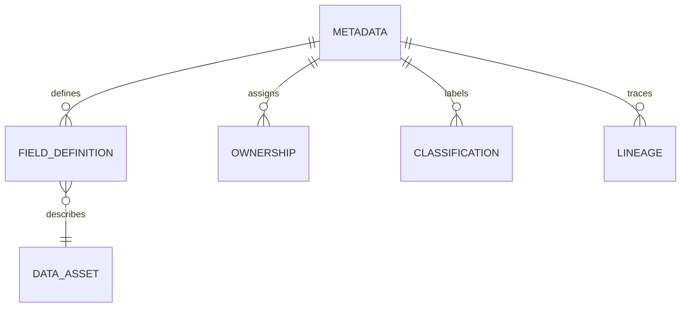

# Volume 05 - Metadata

| Field | Value |
|---|---|
| Document ID | WORLD-VOL05-049 |
| Title | Metadata |
| Version | 1.0 |
| Status | Approved |
| Classification | Internal |
| Founder | Mahesh Choudhary |

## Purpose

This chapter defines metadata within WORLD's ERP Foundation: the data that describes data. Metadata is what makes WORLD's ERP self-describing and machine-understandable, enabling the AI Business Partner to reason about the meaning, ownership, and provenance of every record rather than treating data as opaque.

## Scope

This document describes the definition, categories, and governance of metadata at the conceptual and logical level. Physical catalog storage is defined in Volume 09 (Database).

## Metadata in WORLD

Metadata is descriptive information about the ERP's data assets. It spans several categories: structural metadata (field definitions, data types, relationships), semantic metadata (business meaning, glossary terms), governance metadata (ownership, stewardship, classification, retention), and operational metadata (lineage, timestamps, source, quality scores). Metadata does not represent business objects or events; it represents knowledge about them. In WORLD this class is elevated to first-class status because an AI-native system depends on understanding its own data.

Characteristics of metadata are: it is generated and maintained by the platform, it applies uniformly across data classes, and it is the substrate for automation, governance, and lineage. Every field a business sees has metadata declaring what it means, who owns it, and how sensitive it is.

| Metadata Category | Describes | Example |
|---|---|---|
| Structural | Shape of data | `credit_limit` is a decimal on Customer |
| Semantic | Business meaning | Credit limit = maximum outstanding balance allowed |
| Governance | Ownership and control | Owned by Finance; classification Internal |
| Operational | Lineage and quality | Sourced from onboarding; last verified date |

### Enterprise Example

When a business in WORLD views the `credit_limit` field on a customer, metadata drives the experience: structural metadata specifies its type and range, semantic metadata provides the tooltip explaining its meaning, governance metadata marks it as Finance-owned and Internal, and operational metadata records that it was last changed during a credit review with full lineage. The AI Business Partner uses this same metadata to decide it must not alter the field without Finance approval and to explain the number when asked.

## Business Value

Metadata turns a database into a knowledge asset. It powers data discovery, impact analysis, compliance, and trustworthy automation. Without metadata, automation is brittle and governance is manual; with it, both become systematic.

## Relationship to the AI Business Partner

Metadata is arguably the Partner's most important input. It lets the AI Business Partner understand what a field means, who owns it, how sensitive it is, and where it came from, enabling safe, explainable action. When the Partner justifies a decision or refuses an unsafe change, it draws on metadata to do so.

## Relationship to Business Foundation

Metadata encodes the semantics that Volume 02's Business Foundation defines. The business vocabulary and object definitions from Volume 02 are captured as semantic metadata, giving every ERP field an anchored business meaning.

## Relationship to Business Intelligence

Business Intelligence (Volume 04) depends on metadata for correct metric definitions, lineage, and trust. Knowing the provenance and definition of each measure is what makes an insight defensible and reproducible.

## Enterprise Implementation Approach

WORLD implements metadata as a central, actively maintained data catalog covering structural, semantic, governance, and operational categories, with automated lineage capture and classification enforcement. Metadata is applied uniformly across master, transaction, reference, and configuration data. Physical catalog schemas are defined in Volume 09 (Database).

## Cross-References

- [ERP Data Model](/docs/blueprint/volume-05-erp-foundation/section-f-data-foundation/44-erp-data-model.md)
- [Configuration Data](/docs/blueprint/volume-05-erp-foundation/section-f-data-foundation/48-configuration-data.md)
- [Data Integrity](/docs/blueprint/volume-05-erp-foundation/section-f-data-foundation/51-data-integrity.md)
- [Volume 04 - Business Intelligence](/docs/blueprint/volume-04-business-intelligence/README.md)

## References

- [Volume 01 - Vision and Philosophy](/docs/blueprint/volume-01-vision-and-philosophy/README.md)
- [Document Standards](/docs/governance/document-standards.md)

## Change Log

| Version | Date | Author | Notes |
|---|---|---|---|
| 1.0 | 2026-07-12 | Lead Software Engineer | Initial approved version. |
