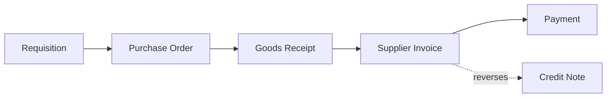

# Volume 05 - Document Relationships

| Field | Value |
|---|---|
| Document ID | WORLD-VOL05-050 |
| Title | Document Relationships |
| Version | 1.0 |
| Status | Approved |
| Classification | Internal |
| Founder | Mahesh Choudhary |

## Purpose

This chapter defines document relationships within WORLD's ERP Foundation: the structured links that connect business documents across their lifecycle. Document relationships turn isolated transactions into coherent, traceable process chains that the AI Business Partner can follow end to end.

## Scope

This document describes the conceptual and logical model of document relationships, including the document flow, link types, and traceability. Physical foreign-key and linking structures are defined in Volume 09 (Database).

## Document Relationships in WORLD

Business processes rarely consist of a single document. A procurement cycle links a requisition to a purchase order, a goods receipt, a supplier invoice, and a payment. WORLD models these connections explicitly as first-class relationships rather than leaving them implicit. Each relationship records the source and target documents, the relationship type (such as fulfills, invoices, pays, reverses, or references), and the direction of flow.

Document relationships primarily connect transaction data (Chapter 46) to one another, while both endpoints reference shared master and reference data. The relationship graph enables full traceability: from any document, WORLD can navigate forward to its consequences and backward to its origins.

| Relationship Type | From Document | To Document | Meaning |
|---|---|---|---|
| Fulfills | Sales Order | Delivery | Delivery satisfies order lines |
| Invoices | Delivery | Invoice | Invoice bills the delivered goods |
| Pays | Invoice | Payment | Payment settles the invoice |
| Reverses | Credit Note | Invoice | Credit note offsets the invoice |
| References | Journal Entry | Invoice | Accounting record links to source |

### Enterprise Example

A wholesaler in WORLD receives a customer order. The sales order is confirmed, a delivery fulfills it, an invoice bills the delivery, and a payment settles the invoice, each link recorded explicitly. When a portion is returned, a credit note is created with a reverses relationship to the original invoice. Months later, during an audit, WORLD reconstructs the entire chain from order to cash in one traversal, and the AI Business Partner can explain exactly how a given payment relates to an original commitment.

## Business Value

Explicit document relationships deliver end-to-end traceability, faster audits, accurate reconciliation, and reliable status tracking. They eliminate guesswork about how transactions connect and make process automation dependable.

## Relationship to the AI Business Partner

The relationship graph is how the AI Business Partner understands processes rather than isolated records. It can follow a chain to answer questions like whether an order has been paid, detect broken or missing links, and progress a process by creating the next document in a flow, all with full context and explainability.

## Relationship to Business Foundation

Document relationships operationalize the value flows described in Volume 02's Business Foundation. Where the Business Foundation describes how value moves through order-to-cash and procure-to-pay, this chapter makes those flows concrete and traceable inside the ERP.

## Relationship to Business Intelligence

Business Intelligence (Volume 04) uses document relationships to compute process metrics such as order-to-cash cycle time, fulfillment rates, and invoice-to-payment lag. These measures are only possible because the connections between documents are explicit.

## Enterprise Implementation Approach

WORLD implements document relationships as an explicit link model with typed, directional edges and referential integrity, maintained automatically as documents progress. The relationship graph supports both forward and backward traversal. Physical linking structures and constraints are defined in Volume 09 (Database); this chapter defines the logical contract.

## Cross-References

- [Transaction Data](/docs/blueprint/volume-05-erp-foundation/section-f-data-foundation/46-transaction-data.md)
- [ERP Data Model](/docs/blueprint/volume-05-erp-foundation/section-f-data-foundation/44-erp-data-model.md)
- [Data Integrity](/docs/blueprint/volume-05-erp-foundation/section-f-data-foundation/51-data-integrity.md)
- [Volume 04 - Business Intelligence](/docs/blueprint/volume-04-business-intelligence/README.md)

## References

- [Volume 01 - Vision and Philosophy](/docs/blueprint/volume-01-vision-and-philosophy/README.md)
- [Document Standards](/docs/governance/document-standards.md)

## Change Log

| Version | Date | Author | Notes |
|---|---|---|---|
| 1.0 | 2026-07-12 | Lead Software Engineer | Initial approved version. |
