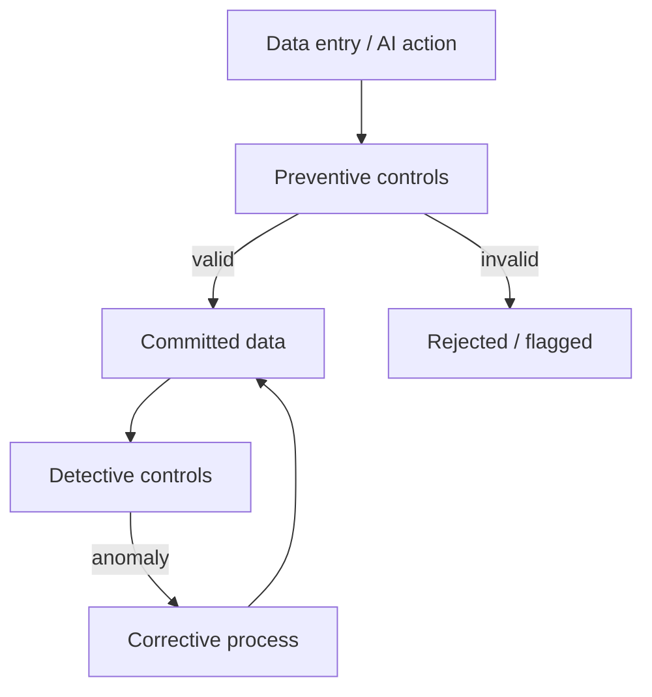

# Volume 05 - Data Integrity

| Field | Value |
|---|---|
| Document ID | WORLD-VOL05-051 |
| Title | Data Integrity |
| Version | 1.0 |
| Status | Approved |
| Classification | Internal |
| Founder | Mahesh Choudhary |

## Purpose

This chapter defines data integrity within WORLD's ERP Foundation: the principles and controls that guarantee ERP data is accurate, consistent, complete, and trustworthy across its lifecycle. Integrity is the precondition for autonomous action; the AI Business Partner can only be trusted to act if the data it acts on is sound.

## Scope

This document describes the conceptual and logical model of data integrity: its dimensions, the classes of controls, and how integrity is enforced across data classes. Physical constraint and transaction-management mechanics are defined in Volume 09 (Database).

## Data Integrity in WORLD

Data integrity in WORLD spans several dimensions: entity integrity (every record is uniquely identifiable), referential integrity (links between records are valid), domain integrity (values fall within allowed sets and types), and consistency (related data agrees and business rules hold). Integrity applies across all five data classes: master identities must be unique, transactions must reference valid masters and codes, reference values must be sanctioned, and configuration must be internally coherent.

WORLD enforces integrity through layered controls: preventive controls stop bad data from entering, detective controls surface anomalies, and corrective controls remediate through governed, auditable processes. Because transaction data is immutable after posting, corrections use compensating entries rather than edits, preserving integrity and audit history simultaneously.

| Integrity Dimension | Guarantee | Primary Control |
|---|---|---|
| Entity | Unique identity per record | Keys and deduplication |
| Referential | Valid links between records | Reference validation |
| Domain | Valid values and types | Type and range validation |
| Consistency | Business rules always hold | Rule and balance checks |
| Temporal | Correct effective-dating | Effective-date controls |

### Enterprise Example

When the AI Business Partner posts an invoice in WORLD, preventive controls confirm the customer master exists, the currency is a sanctioned reference value, and the debits equal the credits before the record is committed. A nightly detective check reconciles subledger balances against the general ledger and flags any variance. If a discrepancy is found, a corrective, fully audited compensating entry is raised rather than editing posted records, so both correctness and history are preserved.

## Business Value

Data integrity is the foundation of trust. It protects financial accuracy, ensures compliance, prevents costly errors, and is the essential enabler of safe automation. Every downstream capability, from reporting to autonomy, rests on it.

## Relationship to the AI Business Partner

Integrity controls are the guardrails that make Partner autonomy safe. Preventive validation ensures the AI Business Partner cannot commit invalid data, detective controls catch anomalies in its actions, and corrective processes keep every remediation auditable. High-integrity data also lets the Partner reason and explain with confidence.

## Relationship to Business Foundation

Data integrity enforces the business rules and constraints defined in Volume 02's Business Foundation. The invariants the Business Foundation asserts about a business become executable integrity controls in the ERP.

## Relationship to Business Intelligence

Business Intelligence (Volume 04) is only as trustworthy as its inputs. Data integrity guarantees that metrics and insights are computed from accurate, consistent, reconciled data, making analytical conclusions defensible.

## Enterprise Implementation Approach

WORLD implements data integrity through layered preventive, detective, and corrective controls, with immutability and compensating entries for transactions, reconciliation routines, and full audit trails. Controls are applied consistently across all data classes. Physical constraints, transactional guarantees, and enforcement mechanics are defined in Volume 09 (Database); this chapter defines the integrity contract those mechanisms uphold.

## Cross-References

- [ERP Data Model](/docs/blueprint/volume-05-erp-foundation/section-f-data-foundation/44-erp-data-model.md)
- [Transaction Data](/docs/blueprint/volume-05-erp-foundation/section-f-data-foundation/46-transaction-data.md)
- [Document Relationships](/docs/blueprint/volume-05-erp-foundation/section-f-data-foundation/50-document-relationships.md)
- [Volume 03 - AI Business Partner](/docs/blueprint/volume-03-ai-business-partner/README.md)

## References

- [Volume 01 - Vision and Philosophy](/docs/blueprint/volume-01-vision-and-philosophy/README.md)
- [Document Standards](/docs/governance/document-standards.md)

## Change Log

| Version | Date | Author | Notes |
|---|---|---|---|
| 1.0 | 2026-07-12 | Lead Software Engineer | Initial approved version. |
