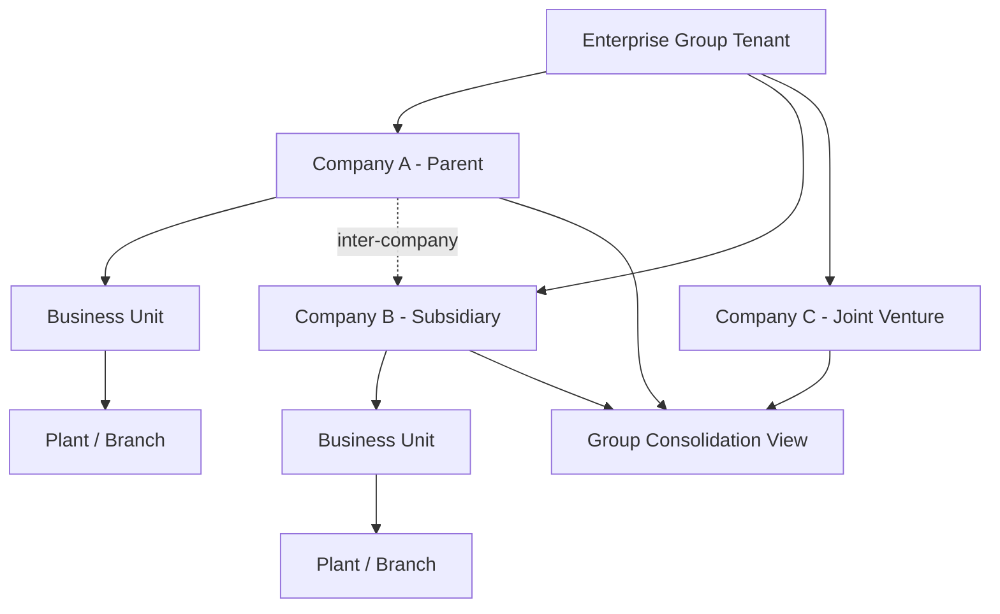

# Volume 05 - Multi-Company

| Field | Value |
|---|---|
| Document ID | WORLD-VOL05-052 |
| Title | Multi-Company |
| Version | 1.0 |
| Status | Approved |
| Classification | Internal |
| Founder | Mahesh Choudhary |

## Purpose

This chapter defines how WORLD's ERP models the **Company** as the top-level legal and financial boundary within an enterprise, enabling a single WORLD deployment to operate an unlimited number of distinct legal entities under one AI-Native Business Operating System. Multi-Company is the outermost dimension of Section G's multi-* enterprise capabilities, establishing the ownership context in which every downstream Business Unit, Plant, Branch and Warehouse operates.

## Scope

The scope covers the company entity model, inter-company relationships, consolidation boundaries, and the data isolation and consistency rules that govern shared versus company-specific master data. It excludes tax jurisdiction rules (Section F) and the physical location hierarchy below the company (Chapters 53-55).

In WORLD, a Company is a legally incorporated entity with its own statutory identity, chart of accounts anchor, base currency and fiscal calendar. Consistent with Section C, the organizational spine is **Company > Business Unit > Plant/Branch > Warehouse**; the Company is the root from which all operational structure descends. A single enterprise tenant may hold many companies -- a parent, its subsidiaries, joint ventures and special-purpose vehicles -- each transacting independently while rolling up into a consolidated group view.

The central design consideration is **isolation with controlled sharing**. Each company owns its transactions, ledgers and statutory outputs in strict isolation, so that no posting in one entity can silently affect another. At the same time, WORLD allows deliberate sharing of selected master data (item catalogs, business partners, unit definitions) and structured **inter-company transactions** where one company sells to, transfers to, or provides services to another. Every inter-company flow generates paired, self-reconciling entries in both entities, preserving consistency across the group ledger.

| Design Aspect | Company-Isolated | Group-Shared |
|---|---|---|
| General ledger and journals | Yes | Consolidation view only |
| Statutory reporting and tax filings | Yes | No |
| Base (functional) currency | Yes | Reporting currency at group |
| Item and partner master data | Optional per policy | Yes, when governed centrally |
| Inter-company transactions | Paired entries | Eliminated on consolidation |

## Business Value

Multi-Company lets an enterprise run its entire legal structure on one platform, eliminating siloed instances and manual cross-entity reconciliation. It compresses period-close through automated inter-company matching, delivers a real-time consolidated group position, and enforces statutory separation without duplicating configuration. Group leadership gains a single source of truth spanning every legal entity while each entity retains full local compliance.

## Relationship to the AI Business Partner

The AI Business Partner (Volume 03) reasons across the company boundary. It answers group-level questions -- "which entities are cash-constrained this quarter?" -- while respecting each company's isolation when advising on entity-specific decisions. Multi-Company gives the AI a precise ownership context so its recommendations are always scoped to the correct legal entity and never leak sensitive data across boundaries.

## Relationship to Business Foundation

The Business Foundation (Volume 02) declares the enterprise's legal structure, ownership graph and governance model. Multi-Company operationalizes that declaration: each entity defined in the Business Foundation instantiates a Company in the ERP, inheriting its statutory identity, base currency and reporting obligations directly from the foundational model.

## Relationship to Business Intelligence

Business Intelligence (Volume 04) consumes company-tagged transactions to produce both entity-level and consolidated analytics. Multi-Company supplies the dimensional key that lets BI slice performance by legal entity, eliminate inter-company effects, and present a defensible consolidated view aligned with the group's reporting currency.

## Enterprise Implementation Approach

Implementation follows four stages. First, model each legal entity as a Company with its statutory attributes. Second, define the ownership graph and consolidation rules, including elimination accounts. Third, configure governed shared master data and inter-company transaction pairs. Fourth, validate that isolation holds and consolidation reconciles.

**Enterprise Example.** A manufacturing group runs *Nord Industries GmbH* (parent, EUR) and *Nord Components Ltd* (subsidiary, GBP) in one WORLD tenant. When the subsidiary ships components to the parent, WORLD posts an inter-company sale in GBP for the subsidiary and a matching purchase in EUR for the parent, converts through defined rates, and flags both for elimination at group close -- producing a clean consolidated statement with zero manual reconciliation.

## Cross-References

- [Multi-Currency](/docs/blueprint/volume-05-erp-foundation/section-g-enterprise-capabilities/56-multi-currency.md)
- [Multi-Plant](/docs/blueprint/volume-05-erp-foundation/section-g-enterprise-capabilities/53-multi-plant.md)
- [Business Foundation](/docs/blueprint/volume-02-business-foundation/README.md)
- [Business Intelligence](/docs/blueprint/volume-04-business-intelligence/README.md)

## References

- [Volume 01 - Vision and Philosophy](/docs/blueprint/volume-01-vision-and-philosophy/README.md)
- [Document Standards](/docs/governance/document-standards.md)

## Change Log

| Version | Date | Author | Summary |
|---|---|---|---|
| 1.0 | 2026-07-12 | Lead Software Engineer | Initial approved version. |
