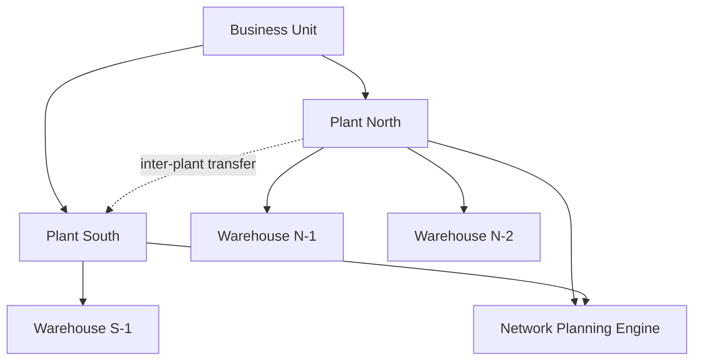

# Volume 05 - Multi-Plant

| Field | Value |
|---|---|
| Document ID | WORLD-VOL05-053 |
| Title | Multi-Plant |
| Version | 1.0 |
| Status | Approved |
| Classification | Internal |
| Founder | Mahesh Choudhary |

## Purpose

This chapter defines how WORLD's ERP models the **Plant** as the primary production and value-creation location within a Business Unit, enabling an enterprise to plan, execute and account for manufacturing and operational activity across many physical sites while preserving a single, coherent operating picture.

## Scope

The scope covers the plant entity, its place in the organizational hierarchy, plant-level planning and costing, and the consistency rules for inventory and production data that originate at a plant. It excludes distribution-oriented branches (Chapter 54) and stock-holding warehouses (Chapter 55), which sit below or alongside the plant.

Within the Section C hierarchy of **Company > Business Unit > Plant/Branch > Warehouse**, a Plant is a location where goods are produced or transformed, or where operations physically occur. A Plant belongs to exactly one Business Unit and therefore to one Company, inheriting its legal and financial context. Each plant carries its own capacity model, production calendar, costing parameters and default warehouses, allowing WORLD to plan supply and demand at the resolution real operations demand.

The key design consideration is **local autonomy within global coherence**. Each plant plans and executes independently -- its own work centers, routings and shift calendars -- yet all plants share governed master data (items, bills of material templates, cost element structures) so that a component is the same component everywhere. Consistency implications center on **inter-plant transfers** and **network planning**: when one plant supplies another, WORLD records a stock transfer with valuation at the sending plant's cost and receipt at the receiving plant, keeping quantities and values reconciled across the network.

| Plant Attribute | Purpose | Consistency Rule |
|---|---|---|
| Production calendar | Capacity and scheduling | Local to plant |
| Work centers / routings | Execution model | Local to plant |
| Item master | Shared definition | Global, governed |
| Plant-specific costing | Standard / actual cost | Local, rolls to Company ledger |
| Inter-plant transfer | Supply between sites | Paired, self-reconciling |

## Business Value

Multi-Plant lets an enterprise operate a distributed manufacturing footprint as one integrated network. It enables load balancing across sites, resilient supply when one plant is constrained, accurate site-level cost visibility, and network-wide planning that optimizes where and when to produce. Leadership sees true per-plant performance while planners orchestrate the whole network from a single system.

## Relationship to the AI Business Partner

The AI Business Partner (Volume 03) uses plant-level capacity, cost and inventory signals to advise on production allocation -- recommending which plant should absorb a surge, flagging a bottleneck before it forms, or proposing an inter-plant transfer to avoid a stockout. Multi-Plant gives the AI the granular, site-aware model it needs to reason about physical operations rather than abstractions.

## Relationship to Business Foundation

The Business Foundation (Volume 02) describes the enterprise's operating model, including where and how it creates value. Multi-Plant realizes the production side of that model: each site the Business Foundation identifies as a value-creation location is instantiated as a Plant with the capacity and process characteristics the foundation specifies.

## Relationship to Business Intelligence

Business Intelligence (Volume 04) consumes plant-tagged production, yield and cost data to benchmark sites, expose efficiency gaps and model network scenarios. Multi-Plant provides the location dimension that lets BI compare like-for-like across plants and attribute outcomes to specific facilities.

## Enterprise Implementation Approach

Implementation proceeds by defining each plant under its Business Unit, configuring calendars, work centers and routings, assigning default warehouses, setting plant costing parameters, and enabling inter-plant transfer relationships. Network planning is then activated so demand can be sourced from the optimal plant.

**Enterprise Example.** An appliance maker operates *Plant North* and *Plant South* under one Business Unit. When North's assembly line is fully loaded, WORLD's network plan sources overflow demand from South, issues an inter-plant transfer of sub-assemblies from South to North valued at South's standard cost, and updates both plants' inventory and capacity in real time -- keeping the promised customer date without manual coordination.

## Cross-References

- [Multi-Warehouse](/docs/blueprint/volume-05-erp-foundation/section-g-enterprise-capabilities/55-multi-warehouse.md)
- [Multi-Company](/docs/blueprint/volume-05-erp-foundation/section-g-enterprise-capabilities/52-multi-company.md)
- [Multi-Branch](/docs/blueprint/volume-05-erp-foundation/section-g-enterprise-capabilities/54-multi-branch.md)
- [Business Foundation](/docs/blueprint/volume-02-business-foundation/README.md)

## References

- [Volume 01 - Vision and Philosophy](/docs/blueprint/volume-01-vision-and-philosophy/README.md)
- [Document Standards](/docs/governance/document-standards.md)

## Change Log

| Version | Date | Author | Summary |
|---|---|---|---|
| 1.0 | 2026-07-12 | Lead Software Engineer | Initial approved version. |
