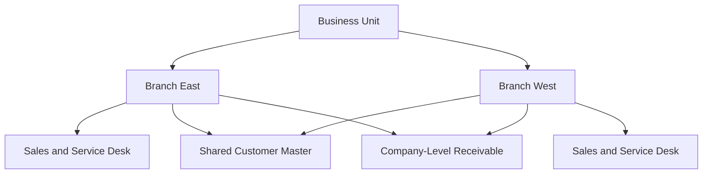

# Volume 05 - Multi-Branch

| Field | Value |
|---|---|
| Document ID | WORLD-VOL05-054 |
| Title | Multi-Branch |
| Version | 1.0 |
| Status | Approved |
| Classification | Internal |
| Founder | Mahesh Choudhary |

## Purpose

This chapter defines how WORLD's ERP models the **Branch** as a customer-facing or service-delivery location within a Business Unit, enabling an enterprise to operate distributed sales, service and regional offices as first-class operating locations under one platform.

## Scope

The scope covers the branch entity, its role in sales and service execution, branch-level performance accounting, and the consistency rules for shared customers and pricing across branches. It complements Multi-Plant (production locations) and precedes Multi-Warehouse (stock locations).

Within the Section C hierarchy of **Company > Business Unit > Plant/Branch > Warehouse**, a Branch sits at the same level as a Plant but represents commercial rather than productive activity -- a sales office, service center, regional depot or point of presence. A Branch belongs to one Business Unit and thus one Company, inheriting legal and financial context. Each branch carries its own address, service territory, local pricing overrides and responsibility for its own bookings, so that revenue and cost can be attributed to the location that generated them.

The central design consideration is **shared commercial data with local execution**. Customers, products and master pricing are governed centrally so a customer is recognized consistently regardless of which branch serves them, while each branch executes its own orders, quotes and service tickets. Consistency implications arise around **branch transfers and shared customer balances**: when a customer transacts with multiple branches, WORLD maintains a single receivable at the Company level while attributing revenue to each originating branch, avoiding double counting.

| Branch Attribute | Purpose | Consistency Rule |
|---|---|---|
| Service territory | Coverage and routing | Local to branch |
| Local price overrides | Regional commercial terms | Local, within governed bands |
| Customer master | Shared identity | Global, governed |
| Revenue attribution | Branch performance | Tagged per branch |
| Receivable balance | Cash collection | Consolidated at Company |

## Business Value

Multi-Branch lets an enterprise scale its commercial reach without fragmenting its data. It delivers accurate branch-level profitability, consistent customer experience across locations, and centralized credit control alongside decentralized selling. Regional managers own their numbers while the enterprise retains one governed view of every customer relationship.

## Relationship to the AI Business Partner

The AI Business Partner (Volume 03) uses branch-level pipeline, service load and profitability signals to advise on staffing, territory coverage and cross-branch opportunities. It can recognize that a customer served by one branch is a growth prospect for another, and recommend action, because Multi-Branch gives it a unified customer view coupled with location-specific performance.

## Relationship to Business Foundation

The Business Foundation (Volume 02) defines the enterprise's go-to-market and service model, including how it reaches customers geographically. Multi-Branch operationalizes that reach: each commercial presence in the foundational model becomes a Branch with the territory and service scope the foundation prescribes.

## Relationship to Business Intelligence

Business Intelligence (Volume 04) consumes branch-tagged sales and service data to compare regional performance, detect underperforming territories and model network coverage. Multi-Branch supplies the commercial location dimension that BI needs to attribute revenue and service outcomes precisely.

## Enterprise Implementation Approach

Implementation defines each branch under its Business Unit, sets service territory and local pricing bands, links branches to the shared customer and product masters, configures revenue attribution tags, and consolidates receivables at Company level for unified credit control.

**Enterprise Example.** A regional distributor runs *Branch East* and *Branch West*. A national account buys from both. WORLD attributes each order's revenue to the serving branch for performance reporting, yet maintains one consolidated receivable and credit limit for the account at Company level -- so credit control sees total exposure while each branch is measured on the business it wrote.

## Cross-References

- [Multi-Plant](/docs/blueprint/volume-05-erp-foundation/section-g-enterprise-capabilities/53-multi-plant.md)
- [Multi-Warehouse](/docs/blueprint/volume-05-erp-foundation/section-g-enterprise-capabilities/55-multi-warehouse.md)
- [Multi-Company](/docs/blueprint/volume-05-erp-foundation/section-g-enterprise-capabilities/52-multi-company.md)
- [Business Intelligence](/docs/blueprint/volume-04-business-intelligence/README.md)

## References

- [Volume 01 - Vision and Philosophy](/docs/blueprint/volume-01-vision-and-philosophy/README.md)
- [Document Standards](/docs/governance/document-standards.md)

## Change Log

| Version | Date | Author | Summary |
|---|---|---|---|
| 1.0 | 2026-07-12 | Lead Software Engineer | Initial approved version. |
