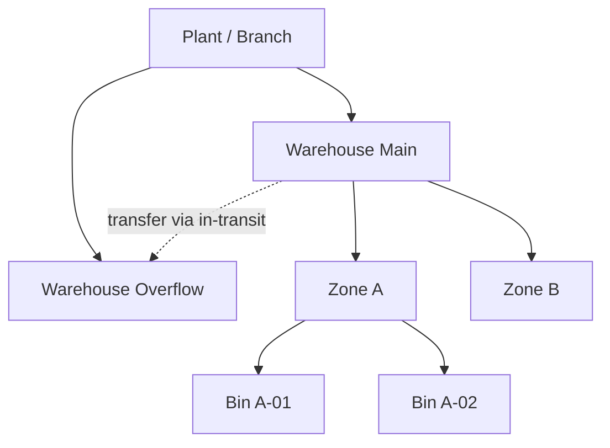

# Volume 05 - Multi-Warehouse

| Field | Value |
|---|---|
| Document ID | WORLD-VOL05-055 |
| Title | Multi-Warehouse |
| Version | 1.0 |
| Status | Approved |
| Classification | Internal |
| Founder | Mahesh Choudhary |

## Purpose

This chapter defines how WORLD's ERP models the **Warehouse** as the atomic stock-holding location, enabling precise, real-time inventory control across many storage sites, zones and bins while maintaining a single, valuation-consistent view of enterprise inventory.

## Scope

The scope covers the warehouse entity, its internal structure, stock movements and valuation, and the consistency rules governing transfers and availability across warehouses. It sits at the base of the location hierarchy, beneath Plants and Branches.

Within the Section C hierarchy of **Company > Business Unit > Plant/Branch > Warehouse**, a Warehouse is the lowest organizational location and the point at which physical stock is actually held, counted and valued. A Warehouse is assigned to a Plant or Branch, inheriting its Business Unit and Company. Each warehouse may be subdivided into zones and bins for fine-grained put-away and picking, and each holds stock that is quantity-tracked and value-tracked at all times.

The central design consideration is **accurate availability with consistent valuation**. WORLD maintains real-time on-hand, reserved and available-to-promise quantities per warehouse, while ensuring every movement -- receipt, issue, adjustment or transfer -- posts a corresponding valuation entry to the Company ledger. Consistency implications concentrate on **inter-warehouse transfers**, which must never create or destroy value: stock leaving one warehouse and arriving in another is a single logical movement with matched debit and credit, optionally passing through an in-transit state for goods physically moving between distant sites.

| Movement Type | Quantity Effect | Valuation Effect |
|---|---|---|
| Goods receipt | + on-hand | + inventory value |
| Goods issue | - on-hand | - inventory value (to COGS) |
| Intra-warehouse move | Bin to bin | None |
| Inter-warehouse transfer | - source / + destination | Value-neutral (via in-transit) |
| Physical count adjustment | +/- to actual | Gain/loss to ledger |

## Business Value

Multi-Warehouse gives an enterprise exact visibility of what stock is where, drives higher fill rates through accurate available-to-promise, reduces working capital by exposing and rebalancing excess, and underpins reliable order promising. Operations gain bin-level control; finance gains inventory valuation that always reconciles to the ledger.

## Relationship to the AI Business Partner

The AI Business Partner (Volume 03) uses per-warehouse availability and movement history to recommend replenishment, propose transfers that resolve imbalances, and warn of stockouts before they impact customers. Multi-Warehouse gives the AI the precise inventory state it needs to turn inventory questions into confident, location-specific actions.

## Relationship to Business Foundation

The Business Foundation (Volume 02) describes how the enterprise stores and moves goods to serve demand. Multi-Warehouse operationalizes that logistics model: each storage site in the foundational model becomes a Warehouse with the zones, handling rules and service role the foundation defines.

## Relationship to Business Intelligence

Business Intelligence (Volume 04) consumes warehouse-tagged stock and movement data to analyze turns, aging, carrying cost and service levels by location. Multi-Warehouse provides the storage-location dimension that lets BI pinpoint where inventory is trapped or underperforming.

## Enterprise Implementation Approach

Implementation assigns each warehouse to its Plant or Branch, defines zones and bins, configures movement types and valuation methods, enables inter-warehouse transfers with an in-transit account, and activates available-to-promise so order promising reflects true availability.

**Enterprise Example.** A retailer's *Warehouse Main* holds fast-moving stock and *Warehouse Overflow* holds seasonal surplus. When Main drops below reorder point, WORLD proposes an inter-warehouse transfer from Overflow, moves the stock through an in-transit state that keeps total inventory value constant, and updates available-to-promise the moment goods are received -- so the storefront can promise accurately throughout.

## Cross-References

- [Multi-Plant](/docs/blueprint/volume-05-erp-foundation/section-g-enterprise-capabilities/53-multi-plant.md)
- [Multi-Branch](/docs/blueprint/volume-05-erp-foundation/section-g-enterprise-capabilities/54-multi-branch.md)
- [Scalability Strategy](/docs/blueprint/volume-05-erp-foundation/section-g-enterprise-capabilities/59-scalability-strategy.md)
- [Business Intelligence](/docs/blueprint/volume-04-business-intelligence/README.md)

## References

- [Volume 01 - Vision and Philosophy](/docs/blueprint/volume-01-vision-and-philosophy/README.md)
- [Document Standards](/docs/governance/document-standards.md)

## Change Log

| Version | Date | Author | Summary |
|---|---|---|---|
| 1.0 | 2026-07-12 | Lead Software Engineer | Initial approved version. |
