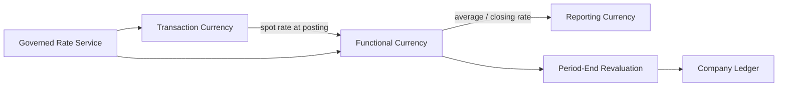

# Volume 05 - Multi-Currency

| Field | Value |
|---|---|
| Document ID | WORLD-VOL05-056 |
| Title | Multi-Currency |
| Version | 1.0 |
| Status | Approved |
| Classification | Internal |
| Founder | Mahesh Choudhary |

## Purpose

This chapter defines how WORLD's ERP handles monetary values across many currencies, enabling an enterprise to transact in any currency, keep books in each entity's functional currency, and report at group level in a single presentation currency -- all with auditable, consistent conversion.

## Scope

The scope covers the three-tier currency model (transaction, functional, reporting), exchange rate management, revaluation, and the consistency rules that keep multi-currency postings balanced. It underpins Multi-Company consolidation and every cross-border flow in the ERP.

WORLD adopts a rigorous **three-currency conceptual model**, applied to every monetary posting:

- **Transaction currency** -- the currency in which a business event actually occurs (the currency on the invoice, receipt or payment). It preserves the economic reality of the deal.
- **Functional currency** -- the base currency of the Company in which the transaction is recorded, used for that entity's statutory books. Every transaction is converted to functional currency at a governed rate at posting time.
- **Reporting (presentation) currency** -- the group currency into which all entities are translated for consolidated reporting, per Multi-Company.

The central design consideration is **fidelity across all three tiers simultaneously**. WORLD stores each amount in transaction, functional and reporting currency, never discarding the original. Consistency implications center on **rate governance and balance preservation**: a single posting must balance in every currency tier, exchange differences must be captured explicitly, and open items must be revalued as rates move so the ledger reflects current value.

| Currency Tier | Purpose | Determined By |
|---|---|---|
| Transaction | Economic reality of the event | The deal / document |
| Functional | Statutory books of the entity | Company base currency |
| Reporting | Consolidated group view | Group presentation currency |

Rate types include daily spot, period-average and closing rates, each applied to the appropriate purpose -- spot for transactions, average for income-statement translation, closing for balance-sheet translation.

## Business Value

Multi-Currency lets an enterprise trade globally without distortion, produce compliant local books and a clean consolidated view, and manage foreign-exchange exposure with visibility into realized and unrealized differences. It removes spreadsheet conversions and the errors they bring, and gives finance a defensible, fully auditable currency trail.

## Relationship to the AI Business Partner

The AI Business Partner (Volume 03) reasons in whichever currency a stakeholder thinks in, translating transparently. It can surface FX exposure, warn when an unhedged position grows, and normalize cross-entity comparisons to a common currency. Multi-Currency gives the AI trustworthy, tier-aware amounts so its financial advice is never confounded by conversion.

## Relationship to Business Foundation

The Business Foundation (Volume 02) declares each entity's base currency and the group's reporting currency as part of the financial model. Multi-Currency operationalizes those declarations, binding each Company to its functional currency and the group to its presentation currency exactly as the foundation specifies.

## Relationship to Business Intelligence

Business Intelligence (Volume 04) consumes amounts in all three tiers to analyze performance in local and group terms and to isolate currency effects from real growth. Multi-Currency supplies the conversion context BI needs to separate operational results from exchange-rate movement.

## Enterprise Implementation Approach

Implementation establishes the governed rate service with defined rate types and sources, assigns functional currencies to each Company and the group reporting currency, enables three-tier storage on all postings, and schedules period-end revaluation of open foreign-currency items.

**Enterprise Example.** A US-based group's French entity (functional EUR) sells to a UK customer in GBP. WORLD records the invoice in GBP (transaction), converts to EUR at the day's spot rate for the French books (functional), and translates to USD at period rates for the group (reporting). At close, the still-open GBP receivable is revalued to current rate, posting the unrealized FX difference -- so every tier stays balanced and the exposure is visible.

## Cross-References

- [Multi-Company](/docs/blueprint/volume-05-erp-foundation/section-g-enterprise-capabilities/52-multi-company.md)
- [Multi-Time Zone](/docs/blueprint/volume-05-erp-foundation/section-g-enterprise-capabilities/58-multi-time-zone.md)
- [Business Foundation](/docs/blueprint/volume-02-business-foundation/README.md)
- [Business Intelligence](/docs/blueprint/volume-04-business-intelligence/README.md)

## References

- [Volume 01 - Vision and Philosophy](/docs/blueprint/volume-01-vision-and-philosophy/README.md)
- [Document Standards](/docs/governance/document-standards.md)

## Change Log

| Version | Date | Author | Summary |
|---|---|---|---|
| 1.0 | 2026-07-12 | Lead Software Engineer | Initial approved version. |
