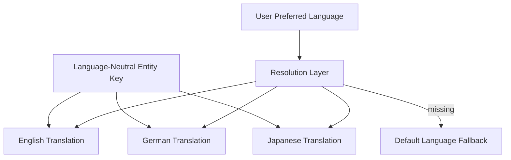

# Volume 05 - Multi-Language

| Field | Value |
|---|---|
| Document ID | WORLD-VOL05-057 |
| Title | Multi-Language |
| Version | 1.0 |
| Status | Approved |
| Classification | Internal |
| Founder | Mahesh Choudhary |

## Purpose

This chapter defines how WORLD's ERP supports many languages, enabling every user, document and interaction to appear in the reader's preferred language while a single, language-neutral data model preserves one authoritative version of the truth.

## Scope

The scope covers language handling for the user interface, master data descriptions, transactional documents and AI interaction, together with the consistency rules that separate stable identifiers from translatable text. It excludes currency and time-zone localization, covered in Chapters 56 and 58.

WORLD's guiding principle is the **separation of identity from presentation**. Every entity -- an item, an account, a partner, a status -- is keyed by a stable, language-neutral identifier that never changes across locales. Human-readable text (names, descriptions, labels, document templates) is stored as a set of **translations** attached to that identifier. When a user views a record, WORLD resolves the description in their preferred language, falling back to a defined default when a translation is absent, but the underlying key and all relationships remain constant.

The central design consideration is **one truth, many presentations**. A purchase order is a single object; it can be rendered in German for a supplier and in English for an internal reviewer without duplicating the transaction. Consistency implications concentrate on **referential stability and fallback**: reports, integrations and the AI must always resolve to the same underlying entity regardless of display language, and missing translations must degrade gracefully rather than break a document.

| Data Element | Language-Neutral | Translatable |
|---|---|---|
| Entity identifier / key | Yes | No |
| Item / account code | Yes | No |
| Description and label | No | Yes |
| Document template text | No | Yes |
| Transaction amounts and dates | Yes | No |
| User preferred language | N/A | Per user setting |

## Business Value

Multi-Language lets a global workforce and customer base use the system in their own language, improving accuracy, adoption and compliance where local-language documents are mandated. It removes parallel localized systems, keeps one clean data model, and lets the enterprise enter new markets by adding a language pack rather than a new deployment.

## Relationship to the AI Business Partner

The AI Business Partner (Volume 03) converses in each user's language while operating on the language-neutral model beneath. A question asked in Spanish and one asked in Japanese resolve to the same entities and return equivalent answers rendered appropriately. Multi-Language lets the AI be genuinely global without fragmenting meaning across languages.

## Relationship to Business Foundation

The Business Foundation (Volume 02) defines the enterprise's markets, workforce geography and communication requirements. Multi-Language operationalizes those requirements, supplying the language coverage and default-language policy the foundational model calls for in each region of operation.

## Relationship to Business Intelligence

Business Intelligence (Volume 04) aggregates on language-neutral keys, so a metric is computed once and consistently regardless of how any contributing record is displayed. Multi-Language ensures that translation never distorts analytics: labels localize on presentation while the underlying dimensions stay unified.

## Enterprise Implementation Approach

Implementation defines the set of supported languages and a default, attaches translation tables to every translatable attribute and document template, sets a per-user language preference, and configures the resolution layer with graceful fallback so no document ever renders blank.

**Enterprise Example.** A multinational raises one purchase order for item key `ITM-4471`. The German supplier receives the PDF with German descriptions; the internal buyer in Singapore reviews the same order in English; consolidated spend analytics group both under the single item key. Adding a French subsidiary later requires only a French translation pack -- no change to transactions or reports.

## Cross-References

- [Multi-Time Zone](/docs/blueprint/volume-05-erp-foundation/section-g-enterprise-capabilities/58-multi-time-zone.md)
- [Multi-Currency](/docs/blueprint/volume-05-erp-foundation/section-g-enterprise-capabilities/56-multi-currency.md)
- [Business Foundation](/docs/blueprint/volume-02-business-foundation/README.md)
- [Business Intelligence](/docs/blueprint/volume-04-business-intelligence/README.md)

## References

- [Volume 01 - Vision and Philosophy](/docs/blueprint/volume-01-vision-and-philosophy/README.md)
- [Document Standards](/docs/governance/document-standards.md)

## Change Log

| Version | Date | Author | Summary |
|---|---|---|---|
| 1.0 | 2026-07-12 | Lead Software Engineer | Initial approved version. |
