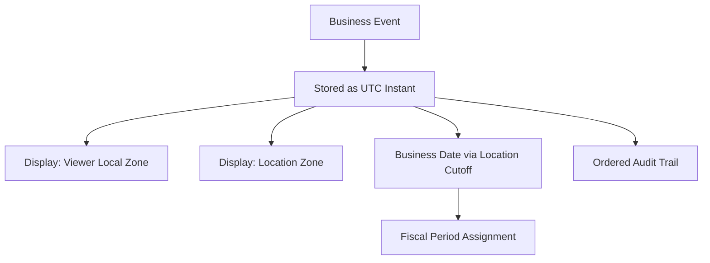

# Volume 05 - Multi-Time Zone

| Field | Value |
|---|---|
| Document ID | WORLD-VOL05-058 |
| Title | Multi-Time Zone |
| Version | 1.0 |
| Status | Approved |
| Classification | Internal |
| Founder | Mahesh Choudhary |

## Purpose

This chapter defines how WORLD's ERP handles time across many geographies, enabling globally distributed operations to record events on one authoritative timeline while each user, plant and report sees times in the local zone that matters to them.

## Scope

The scope covers the internal time model, local-time presentation, business-date determination and the consistency rules governing cutoffs and period boundaries across zones. It excludes calendar and shift definitions, which are plant-level operational data.

WORLD's principle is **store in one universal time, present in local time**. Every event is stamped internally in Coordinated Universal Time (UTC), giving a single, unambiguous, monotonic timeline for the whole enterprise. On display, WORLD converts each timestamp to the relevant zone -- the user's preference, or the location's zone for operational context -- applying daylight-saving rules correctly for the date in question.

The central design consideration is the distinction between an **instant** and a **business date**. An instant is an absolute moment (UTC); a business date is the operational day to which an event is assigned for accounting and reporting, which depends on the responsible location's zone and its defined day cutoff. Consistency implications concentrate on **period boundaries and cross-zone ordering**: a transaction near midnight must fall in the correct fiscal period for its owning entity, and events from different zones must be orderable on the shared UTC timeline without ambiguity.

| Concept | Representation | Purpose |
|---|---|---|
| Event instant | UTC timestamp | Absolute ordering, audit |
| User display time | Local zone of viewer | Readability |
| Operational time | Local zone of location | Execution context |
| Business date | Derived from location zone + cutoff | Period assignment |
| Daylight saving | Zone rules by date | Correct local conversion |

## Business Value

Multi-Time Zone lets a global enterprise operate around the clock with one coherent record. It ensures accurate period cutoffs regardless of where a transaction originates, removes disputes over "which day" an event belongs to, enables reliable follow-the-sun operations, and gives auditors an unambiguous sequence of events across the world.

## Relationship to the AI Business Partner

The AI Business Partner (Volume 03) presents times in the user's zone and reasons about deadlines, SLAs and cutoffs correctly across geographies. It can tell a London user when a Tokyo plant's shift closes in local terms, and schedule actions against the right business date. Multi-Time Zone gives the AI a precise, zone-aware sense of "when" so its time-sensitive guidance is trustworthy.

## Relationship to Business Foundation

The Business Foundation (Volume 02) describes where the enterprise operates and the fiscal calendars it follows. Multi-Time Zone operationalizes that geography, binding each location to its zone and each entity to the day-cutoff and period rules the foundational model defines.

## Relationship to Business Intelligence

Business Intelligence (Volume 04) aggregates events by business date derived consistently from the UTC timeline, so daily, monthly and period metrics are stable regardless of viewer location. Multi-Time Zone ensures analytics never double-count or mis-date an event because of zone differences.

## Enterprise Implementation Approach

Implementation stamps all events in UTC, assigns a zone to each location and a preferred zone to each user, defines the day cutoff per entity for business-date derivation, and applies daylight-saving-aware conversion on every presentation and period assignment.

**Enterprise Example.** A sale is completed at 23:40 in New York on 30 June; WORLD stores the UTC instant. For the US entity (day cutoff at local midnight) the business date is 30 June, placing it in Q2. A colleague in Frankfurt viewing the same record sees it at 05:40 on 1 July in her local display, yet the transaction remains dated 30 June for the owning entity -- so the period close is correct everywhere.

## Cross-References

- [Multi-Currency](/docs/blueprint/volume-05-erp-foundation/section-g-enterprise-capabilities/56-multi-currency.md)
- [Multi-Language](/docs/blueprint/volume-05-erp-foundation/section-g-enterprise-capabilities/57-multi-language.md)
- [Scalability Strategy](/docs/blueprint/volume-05-erp-foundation/section-g-enterprise-capabilities/59-scalability-strategy.md)
- [Business Intelligence](/docs/blueprint/volume-04-business-intelligence/README.md)

## References

- [Volume 01 - Vision and Philosophy](/docs/blueprint/volume-01-vision-and-philosophy/README.md)
- [Document Standards](/docs/governance/document-standards.md)

## Change Log

| Version | Date | Author | Summary |
|---|---|---|---|
| 1.0 | 2026-07-12 | Lead Software Engineer | Initial approved version. |
