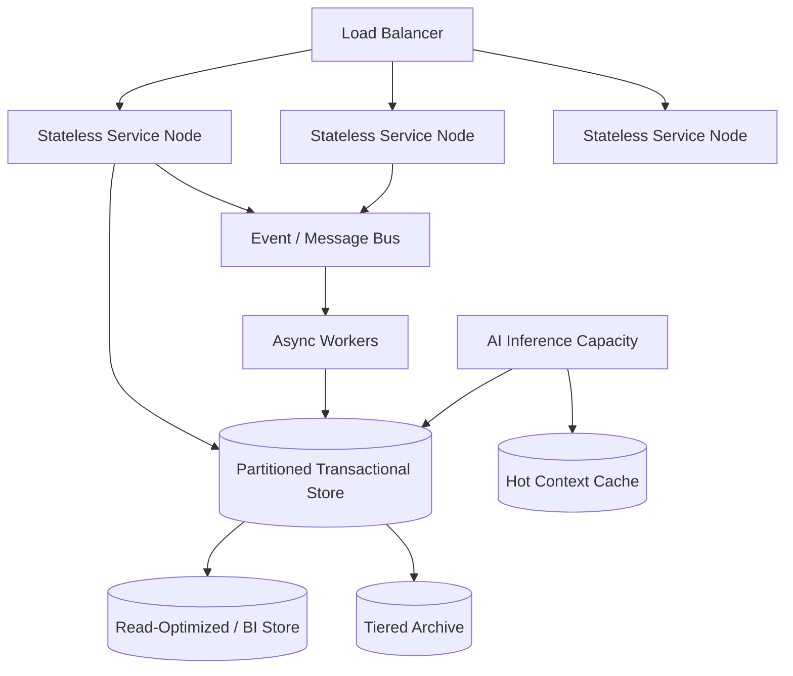

# Volume 05 - Scalability Strategy

| Field | Value |
|---|---|
| Document ID | WORLD-VOL05-059 |
| Title | Scalability Strategy |
| Version | 1.0 |
| Status | Approved |
| Classification | Internal |
| Founder | Mahesh Choudhary |

## Purpose

This chapter defines the scalability strategy for WORLD's ERP: the architectural principles that let a single deployment grow from one small company to a global enterprise of many companies, plants, branches and warehouses -- across currencies, languages and time zones -- without redesign, and while sustaining the responsiveness the AI Business Partner requires.

## Scope

The scope covers the dimensions of scale WORLD must absorb, the architectural mechanisms that deliver it, and the consistency and performance guarantees maintained as load grows. It synthesizes the multi-* capabilities of Chapters 52-58 into a coherent growth model. It excludes physical infrastructure procurement.

Scalability in WORLD is treated as a **first-class design property, not an afterthought**. The multi-* dimensions of Section G are themselves scale dimensions: adding a company, plant, branch, warehouse, currency, language or zone is a configuration act, never a re-architecture. Beyond structural scale, WORLD must scale in **transaction volume, data size, concurrent users and AI reasoning load** simultaneously.

The strategy rests on several principles. **Horizontal scalability** lets capacity grow by adding nodes rather than enlarging a single machine. **Multi-tenancy with strong isolation** allows many entities to share infrastructure while data boundaries (per Multi-Company) remain absolute. **Stateless services with partitioned data** enable independent scaling of compute and storage. **Asynchronous, event-driven processing** absorbs bursts without blocking users. **Eventual consistency where safe, strong consistency where required** -- financial postings remain strongly consistent, while analytics and read-heavy views may lag briefly to preserve throughput.

| Scale Dimension | Growth Trigger | Scaling Mechanism |
|---|---|---|
| Structural (multi-*) | New entity / location | Configuration, not redesign |
| Transaction volume | More business activity | Horizontal compute, partitioning |
| Data size | Accumulated history | Sharding, tiered storage, archival |
| Concurrent users | Workforce growth | Stateless services, load balancing |
| AI reasoning load | Deeper AI usage | Dedicated inference capacity, caching |

## Business Value

The scalability strategy protects the enterprise's investment: WORLD grows with the business instead of being outgrown by it. It removes costly re-platforming, sustains predictable performance under peak load, and lets the enterprise expand into new entities, markets and geographies at the speed of opportunity. Cost scales with actual usage rather than provisioned worst case.

## Relationship to the AI Business Partner

The AI Business Partner (Volume 03) is the most demanding consumer of scale: it reasons continuously over the full breadth of enterprise data. The scalability strategy provisions dedicated inference capacity, caches hot context, and guarantees the low-latency access the AI needs to remain responsive as data and usage grow -- so advice quality does not degrade as the enterprise scales.

## Relationship to Business Foundation

The Business Foundation (Volume 02) sets the enterprise's growth ambitions and operating footprint. The scalability strategy ensures the ERP can absorb that trajectory, translating planned expansion -- new entities, regions and volumes -- into elastic capacity rather than architectural risk.

## Relationship to Business Intelligence

Business Intelligence (Volume 04) grows with the data it analyzes. The scalability strategy provides partitioned, tiered storage and read-optimized views so BI queries stay fast over ever-larger histories, and so analytics workloads never contend with transactional performance.

## Enterprise Implementation Approach

Implementation deploys stateless services behind a load balancer, partitions the transactional store by tenant and time, routes bursty work through an event bus to async workers, separates read-optimized and archival tiers, and provisions elastic AI inference with a hot-context cache. Capacity is monitored and scaled horizontally against observed load.

**Enterprise Example.** A group launches a promotion that multiplies daily order volume tenfold for a week. WORLD's load balancer spreads traffic across added service nodes, order confirmations flow through the event bus to async workers so users never wait, financial postings stay strongly consistent, and BI dashboards read from the read-optimized tier -- after the peak, the extra nodes are released, and cost returns to baseline with no code change.

## Cross-References

- [Multi-Company](/docs/blueprint/volume-05-erp-foundation/section-g-enterprise-capabilities/52-multi-company.md)
- [Multi-Warehouse](/docs/blueprint/volume-05-erp-foundation/section-g-enterprise-capabilities/55-multi-warehouse.md)
- [AI Business Partner](/docs/blueprint/volume-03-ai-business-partner/README.md)
- [Business Intelligence](/docs/blueprint/volume-04-business-intelligence/README.md)

## References

- [Volume 01 - Vision and Philosophy](/docs/blueprint/volume-01-vision-and-philosophy/README.md)
- [Document Standards](/docs/governance/document-standards.md)

## Change Log

| Version | Date | Author | Summary |
|---|---|---|---|
| 1.0 | 2026-07-12 | Lead Software Engineer | Initial approved version. |
