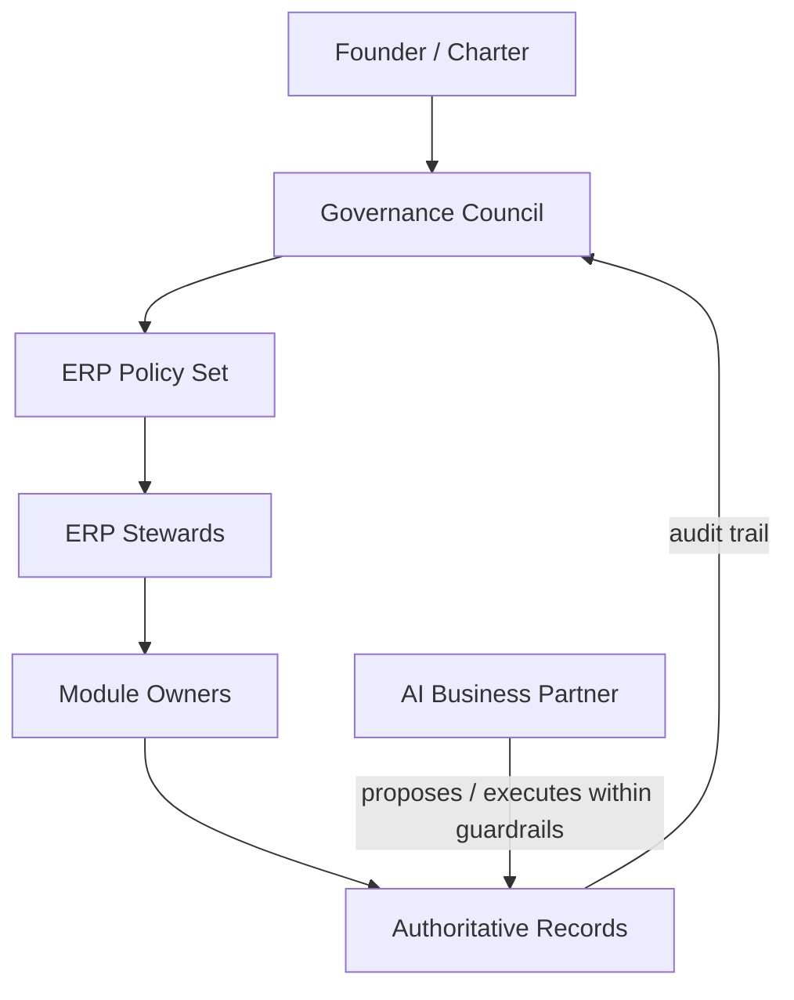

# Volume 05 - ERP Governance

| Field | Value |
|---|---|
| Document ID | WORLD-VOL05-060 |
| Title | ERP Governance |
| Version | 1.0 |
| Status | Approved |
| Classification | Internal |
| Founder | Mahesh Choudhary |

## Purpose

This chapter defines the governance framework for WORLD's ERP Foundation: the decision rights, accountability structures, and control mechanisms that keep the operational layer trustworthy as it grows. ERP governance in WORLD is not a bureaucratic overlay. It is the disciplined agreement about who decides what, on what evidence, and with what accountability, so that the AI Business Partner can act inside the business with confidence and every action remains explainable.

## Scope

Governance covers the ERP's data model, transactional records, module boundaries, master data, configuration authority, and the policies that constrain automated action. It applies to all ERP modules across Section A through Section G, to human operators, and to the AI Business Partner acting through the ERP. It excludes application feature design (Volume 06+) and the philosophical charter (Volume 01), which it inherits rather than restates.

## Governance Design for WORLD

WORLD's ERP governance rests on three principles. First, **single source of truth**: each business fact has exactly one authoritative record, and governance protects that authority. Second, **explainable authority**: every change carries who, what, why, and when, so that the ledger of business reality is auditable end to end. Third, **graduated autonomy**: the AI Business Partner operates within explicit guardrails, escalating to human approval when a decision crosses a materiality, risk, or novelty threshold.

Decision rights are organized in a RACI structure spanning founder, governance council, ERP stewards, module owners, and the AI Business Partner as an accountable actor under supervision.

| Decision Domain | Founder | Governance Council | ERP Steward | Module Owner | AI Business Partner |
|---|---|---|---|---|---|
| Data model changes | A | C | R | C | I |
| Master data policy | C | A | R | C | I |
| Automated action limits | A | R | C | C | I |
| Module configuration | I | C | A | R | I |
| Routine transactions | I | I | I | A | R |

## Business Value

Governance converts a fast operational system into a trustworthy one. It reduces the risk of silent data corruption, conflicting records, and unaccountable automation. For a growing enterprise, clear decision rights shorten the time from question to authoritative answer, prevent duplicated master data, and make the ERP defensible in audit, diligence, and dispute. Governance is what allows WORLD to delegate real operational authority to software without losing control.

## Relationship to the AI Business Partner

The AI Business Partner is a first-class governed actor, aligned with Volume 03 §G on permissions, auditability, and human approval. Governance defines the guardrails inside which it may read, propose, and execute ERP transactions, and the escalation points where a human must approve. Every autonomous action is attributable to the Partner as an accountable identity, logged with intent and outcome, so supervision remains continuous rather than retrospective.

## Relationship to Business Foundation

ERP governance operationalizes the governance charter of Volume 02 Section F. The Business Foundation defines the enterprise's values, roles, and policy intent; ERP governance encodes those intentions into enforceable decision rights over operational records. Where Volume 02 states that certain commitments require dual control, ERP governance implements that as an approval rule on the relevant transaction class.

## Relationship to Business Intelligence

Governance guarantees that the data feeding Volume 04 is authoritative, lineage-tracked, and consistent. Business Intelligence trusts ERP records because governance enforces their integrity at the point of capture. In turn, intelligence surfaces governance signals - anomalous approvals, drift in master data quality - that feed back into policy refinement.

## Enterprise Implementation Approach

Implementation begins by ratifying the RACI and policy set with the governance council, then instrumenting the ERP so that every write carries actor, intent, and approval state. A governance council reviews policy exceptions on a fixed cadence. Guardrails for the AI Business Partner start conservative and widen as evidence of reliability accumulates.

**Enterprise example.** A mid-market services firm running WORLD sets an automated-action limit of 5,000 currency units for supplier credits. The AI Business Partner detects a duplicate supplier invoice and proposes a 12,000-unit credit reversal. Because the amount exceeds the guardrail, governance routes the proposal to the ERP steward for approval. The steward approves; the reversal executes; the full chain - detection, proposal, approval, execution - is recorded as one auditable narrative.

## Cross-References

- [Security Model](/docs/blueprint/volume-05-erp-foundation/section-h-erp-governance/61-security-model.md)
- [Compliance Framework](/docs/blueprint/volume-05-erp-foundation/section-h-erp-governance/62-compliance-framework.md)
- [Volume 02 - Business Foundation, Section F Governance](/docs/blueprint/volume-02-business-foundation/README.md)
- [Volume 03 - AI Business Partner](/docs/blueprint/volume-03-ai-business-partner/README.md)

## References

- [Volume 01 - Vision and Philosophy](/docs/blueprint/volume-01-vision-and-philosophy/README.md)
- [Document Standards](/docs/governance/document-standards.md)

## Change Log

| Version | Date | Author | Notes |
|---|---|---|---|
| 1.0 | 2026-07-12 | Lead Software Engineer | Initial approved version. |
