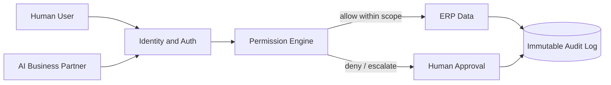

# Volume 05 - Security Model

| Field | Value |
|---|---|
| Document ID | WORLD-VOL05-061 |
| Title | Security Model |
| Version | 1.0 |
| Status | Approved |
| Classification | Internal |
| Founder | Mahesh Choudhary |

## Purpose

This chapter defines the security model for WORLD's ERP Foundation: how identity, permission, isolation, and auditability combine to protect the operational record. The model exists so that both human operators and the AI Business Partner can act on business data with least privilege, full attribution, and demonstrable control, in direct alignment with Volume 03 §G.

## Scope

Covers authentication, authorization, tenant and data isolation, encryption posture, permission granularity, and the audit substrate for all ERP modules. It governs access by humans, services, and the AI Business Partner. It excludes physical infrastructure hardening and network topology, which are handled at the platform layer and referenced rather than specified here.

## Security Design for WORLD

WORLD's ERP applies defense in depth across four tiers, each with its own controls and blast-radius limits. Authorization is role-based and attribute-aware: a permission is a function of who the actor is, what record class they touch, and the context of the action. The AI Business Partner authenticates as a distinct, non-human identity so its access is independently scoped, revocable, and auditable.

| Tier | Protected Asset | Primary Control | Access Principle |
|---|---|---|---|
| T1 Perimeter | ERP entry points | Strong auth, MFA, session policy | Verified identity |
| T2 Authorization | Records and actions | Role and attribute permissions | Least privilege |
| T3 Data | Stored business data | Encryption at rest and in transit | Need to know |
| T4 Audit | Action history | Immutable, append-only log | Full attribution |

## Business Value

A rigorous security model protects the enterprise's most valuable asset - the integrity and confidentiality of its operational record. It limits breach impact through isolation, prevents privilege creep through least-privilege defaults, and provides the audit evidence needed for customer trust, insurance, and regulatory posture. Security is the precondition for delegating operational authority to automation safely.

## Relationship to the AI Business Partner

The security model implements the permission and human-approval requirements of Volume 03 §G. The AI Business Partner receives a scoped, revocable credential; its permissions are narrower than any human administrator by default. Sensitive or high-materiality actions require an explicit human approval step before execution, and every Partner action is written to the immutable audit log with intent, inputs, and result.

## Relationship to Business Foundation

The security model enforces the trust and confidentiality commitments articulated in Volume 02 Section F. Where the Business Foundation designates certain data as restricted or certain actions as requiring separation of duties, the permission engine encodes those rules so they are enforced automatically rather than relying on operator discipline.

## Relationship to Business Intelligence

Security ensures that data flowing into Volume 04 is access-controlled and lineage-preserving. Analytical consumers inherit row and column scoping so intelligence never leaks data beyond an actor's authorization. The audit log itself becomes an intelligence source for detecting anomalous access patterns.

## Enterprise Implementation Approach

Implementation starts from a deny-by-default posture, grants roles mapped to actual job functions, and reviews entitlements on a recurring cadence. The AI Business Partner is onboarded with the minimum permission set required for its current guardrails and expanded only with evidence. Encryption, session policy, and immutable logging are enabled from day one, not retrofitted.

**Enterprise example.** A finance analyst requests read access to the payroll ledger. The permission engine grants column-scoped read that masks individual compensation while exposing aggregate totals, satisfying the analyst's reporting need without violating confidentiality. When the AI Business Partner later drafts a headcount-cost report, it operates under the same masking rule, and the access is logged against its identity.

## Cross-References

- [ERP Governance](/docs/blueprint/volume-05-erp-foundation/section-h-erp-governance/60-erp-governance.md)
- [Compliance Framework](/docs/blueprint/volume-05-erp-foundation/section-h-erp-governance/62-compliance-framework.md)
- [Volume 03 - AI Business Partner, Section G](/docs/blueprint/volume-03-ai-business-partner/README.md)
- [Volume 04 - Business Intelligence](/docs/blueprint/volume-04-business-intelligence/README.md)

## References

- [Volume 01 - Vision and Philosophy](/docs/blueprint/volume-01-vision-and-philosophy/README.md)
- [Document Standards](/docs/governance/document-standards.md)

## Change Log

| Version | Date | Author | Notes |
|---|---|---|---|
| 1.0 | 2026-07-12 | Lead Software Engineer | Initial approved version. |
