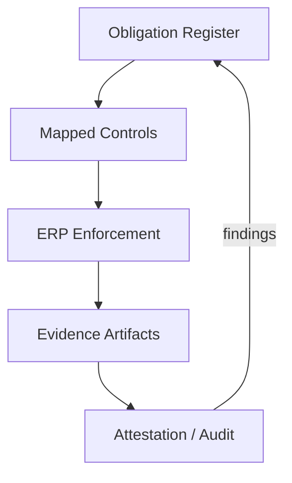

# Volume 05 - Compliance Framework

| Field | Value |
|---|---|
| Document ID | WORLD-VOL05-062 |
| Title | Compliance Framework |
| Version | 1.0 |
| Status | Approved |
| Classification | Internal |
| Founder | Mahesh Choudhary |

## Purpose

This chapter defines the compliance framework for WORLD's ERP Foundation: how the operational layer maintains conformance with regulatory, contractual, and internal obligations, and produces the evidence to prove it. Compliance in WORLD is designed as a byproduct of well-governed operations rather than a separate reporting exercise.

## Scope

Covers financial recordkeeping obligations, data protection and privacy handling, retention and disposal, separation of duties, and evidence generation across all ERP modules. It applies to human and automated actors, including the AI Business Partner. Jurisdiction-specific statutory mappings are maintained as policy configuration and referenced here rather than enumerated.

## Compliance Design for WORLD

WORLD treats compliance as a set of controls attached to record classes and action types. Each control has an owner, an enforcement mechanism, and an evidence artifact. Because the ERP captures who-what-why-when on every write, most compliance evidence is generated automatically. The framework classifies obligations and maps each to a control and an evidence source.

| Obligation Class | Example Requirement | Control Mechanism | Evidence Artifact |
|---|---|---|---|
| Financial integrity | Immutable transaction history | Append-only ledger | Audit trail export |
| Data protection | Lawful basis and consent | Access scoping, consent flags | Access and consent log |
| Retention | Time-bound data lifecycle | Retention policy engine | Disposal certificate |
| Separation of duties | Dual control on payments | Approval rules | Approval chain record |

## Business Value

Embedded compliance lowers the cost and risk of audits, accelerates enterprise sales that depend on trust assurances, and reduces the likelihood of penalties. Because evidence is generated continuously, the enterprise moves from scrambling before an audit to producing proof on demand. Compliance becomes a competitive asset rather than a drag on velocity.

## Relationship to the AI Business Partner

The compliance framework constrains the AI Business Partner to act only within lawful and policy-permitted bounds, consistent with Volume 03 §G. Actions touching regulated data or requiring separation of duties trigger the corresponding control - including mandatory human approval - before the Partner may proceed. Each such action produces evidence automatically, so the Partner's compliance posture is provable, not assumed.

## Relationship to Business Foundation

Compliance operationalizes the obligations declared in Volume 02 Section F. The Business Foundation names the commitments the enterprise has made to regulators, customers, and staff; the compliance framework translates each into an enforceable ERP control and a defined evidence artifact.

## Relationship to Business Intelligence

Compliance evidence is a structured dataset that Volume 04 can analyze for control effectiveness, exception frequency, and emerging risk. Intelligence highlights where controls are frequently bypassed or where evidence gaps appear, informing framework refinement and pre-empting audit findings.

## Enterprise Implementation Approach

Implementation begins by building an obligation register, mapping each obligation to an ERP control, and confirming that each control emits an evidence artifact. Controls are tested on a cadence, and gaps are remediated through configuration rather than manual process. Retention and disposal run as automated lifecycle policies.

**Enterprise example.** A customer contract requires personal data to be deleted 30 days after account closure. The retention policy engine flags eligible records, the AI Business Partner proposes the disposal batch, an ERP steward approves it, and the system issues a disposal certificate. When the customer's auditor later requests proof, the certificate and its approval chain are exported in minutes.

## Cross-References

- [ERP Governance](/docs/blueprint/volume-05-erp-foundation/section-h-erp-governance/60-erp-governance.md)
- [Security Model](/docs/blueprint/volume-05-erp-foundation/section-h-erp-governance/61-security-model.md)
- [Quality Standards](/docs/blueprint/volume-05-erp-foundation/section-h-erp-governance/64-quality-standards.md)
- [Volume 02 - Business Foundation, Section F Governance](/docs/blueprint/volume-02-business-foundation/README.md)

## References

- [Volume 01 - Vision and Philosophy](/docs/blueprint/volume-01-vision-and-philosophy/README.md)
- [Document Standards](/docs/governance/document-standards.md)

## Change Log

| Version | Date | Author | Notes |
|---|---|---|---|
| 1.0 | 2026-07-12 | Lead Software Engineer | Initial approved version. |
