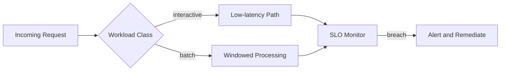

# Volume 05 - Performance Standards

| Field | Value |
|---|---|
| Document ID | WORLD-VOL05-063 |
| Title | Performance Standards |
| Version | 1.0 |
| Status | Approved |
| Classification | Internal |
| Founder | Mahesh Choudhary |

## Purpose

This chapter defines the performance standards for WORLD's ERP Foundation: the service levels, responsiveness targets, and scalability expectations that keep the operational layer fast and dependable as transaction volume grows. Performance is treated as a governed commitment, not an emergent property.

## Scope

Covers latency, throughput, availability, and scalability targets for ERP transactions, queries, and the interfaces the AI Business Partner uses to read and act. It defines service-level objectives and the measurement approach. It excludes low-level infrastructure tuning, which is an implementation concern that must meet, but is not defined by, these standards.

## Performance Design for WORLD

WORLD sets tiered service-level objectives by workload class, because an interactive record update and a large analytical extract have different acceptable envelopes. Standards are expressed as objectives with defined measurement windows so performance is observable and enforceable.

| Workload Class | Target Latency (p95) | Availability | Scale Expectation |
|---|---|---|---|
| Interactive write | Under 500 ms | 99.9% | Linear with users |
| Interactive read | Under 300 ms | 99.9% | Linear with users |
| Batch processing | Within defined window | 99.5% | Volume elastic |
| AI Partner query | Under 1 s | 99.9% | Concurrency elastic |

## Business Value

Predictable performance protects operational continuity and user trust. Slow or unreliable ERP responses erode adoption and stall decision-making. By committing to explicit service levels and measuring against them, the enterprise can plan capacity, detect degradation early, and ensure the operational layer scales with the business rather than becoming its bottleneck.

## Relationship to the AI Business Partner

The AI Business Partner depends on timely ERP responses to reason and act in near real time. Performance standards guarantee the read and action latencies the Partner needs to remain useful during live conversations and automated workflows. When the Partner drives high concurrency, the concurrency-elastic targets ensure human users are not starved of responsiveness.

## Relationship to Business Foundation

Performance standards give measurable form to the reliability expectations set in Volume 02 Section F. Where the Business Foundation commits the enterprise to responsive service, these standards translate that commitment into enforceable service-level objectives on the operational layer that delivers it.

## Relationship to Business Intelligence

Performance telemetry is itself a dataset for Volume 04. Intelligence analyzes latency and throughput trends to forecast capacity needs, correlate slowdowns with business events, and recommend scaling actions before objectives are breached. This closes the loop between measured performance and proactive governance.

## Enterprise Implementation Approach

Implementation instruments every workload class with latency and availability measurement, publishes objectives, and wires breach alerts to a remediation path. Capacity is reviewed against growth forecasts on a cadence. New modules must demonstrate conformance to the relevant workload targets before promotion.

**Enterprise example.** During a seasonal sales peak, interactive write latency at the 95th percentile drifts from 380 ms toward the 500 ms objective. The SLO monitor raises an early alert, the AI Business Partner surfaces the trend with a capacity recommendation, and additional processing capacity is provisioned before any user experiences a breach. Performance stays within objective through the peak.

## Cross-References

- [Quality Standards](/docs/blueprint/volume-05-erp-foundation/section-h-erp-governance/64-quality-standards.md)
- [ERP Governance](/docs/blueprint/volume-05-erp-foundation/section-h-erp-governance/60-erp-governance.md)
- [Volume 04 - Business Intelligence](/docs/blueprint/volume-04-business-intelligence/README.md)
- [Volume 03 - AI Business Partner](/docs/blueprint/volume-03-ai-business-partner/README.md)

## References

- [Volume 01 - Vision and Philosophy](/docs/blueprint/volume-01-vision-and-philosophy/README.md)
- [Document Standards](/docs/governance/document-standards.md)

## Change Log

| Version | Date | Author | Notes |
|---|---|---|---|
| 1.0 | 2026-07-12 | Lead Software Engineer | Initial approved version. |
