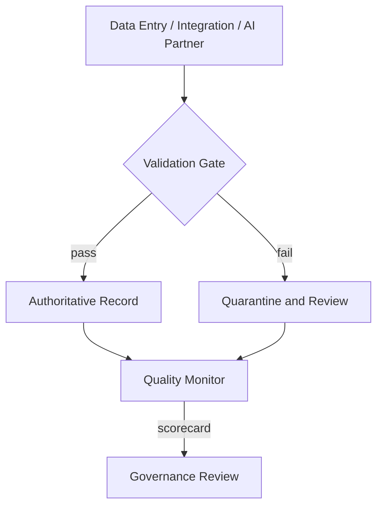

# Volume 05 - Quality Standards

| Field | Value |
|---|---|
| Document ID | WORLD-VOL05-064 |
| Title | Quality Standards |
| Version | 1.0 |
| Status | Approved |
| Classification | Internal |
| Founder | Mahesh Choudhary |

## Purpose

This chapter defines the quality standards for WORLD's ERP Foundation: the criteria and controls that keep operational data accurate, complete, consistent, and timely. Because the AI Business Partner and Business Intelligence both reason directly on ERP records, data quality is a first-order requirement, not an aspiration.

## Scope

Covers data quality dimensions, validation controls, master data hygiene, and quality measurement for all ERP records. It applies to data created by humans, integrations, and the AI Business Partner. It excludes code quality and testing practices for the platform itself, which are engineering standards outside the ERP governance charter.

## Quality Design for WORLD

WORLD measures quality across defined dimensions, each with an owner, a validation control, and a target threshold. Quality is enforced at the point of capture wherever possible, so bad data is prevented rather than corrected later. Records that cannot pass validation are quarantined for review rather than silently admitted.

| Quality Dimension | Definition | Control | Target |
|---|---|---|---|
| Accuracy | Values reflect reality | Validation rules, referential checks | High conformance |
| Completeness | Required fields present | Mandatory-field enforcement | Near total |
| Consistency | No conflicting records | Single source of truth, dedup | No conflicts |
| Timeliness | Data current when used | Freshness monitoring | Within window |

## Business Value

High data quality is what makes every downstream decision trustworthy. Poor quality compounds: a duplicated customer record distorts revenue reporting, misroutes communication, and misleads automation. By enforcing quality at capture and measuring it continuously, the enterprise protects the reliability of every report, forecast, and automated action built on ERP data.

## Relationship to the AI Business Partner

The AI Business Partner is only as reliable as the data it reads. Quality standards guarantee that the Partner reasons on accurate, complete, and current records, reducing the risk of confidently wrong action. When the Partner itself writes data, it passes the same validation gate as any actor, and quality failures route to human review consistent with Volume 03 §G.

## Relationship to Business Foundation

Quality standards realize the accuracy and integrity expectations of Volume 02 Section F. Where the Business Foundation commits the enterprise to acting on truthful records, these standards define what truthful means operationally and enforce it at the data layer.

## Relationship to Business Intelligence

Quality is the foundation of trustworthy intelligence. Volume 04 inherits quality-scored data and can weight or flag analyses by the quality of their inputs. Intelligence also monitors quality trends, detecting degradation in a source system before it corrupts reporting, and feeds findings back to governance.

## Enterprise Implementation Approach

Implementation defines validation rules per record class, enforces them at capture, and publishes a quality scorecard to the governance review. Master data undergoes periodic deduplication and stewardship. Quarantined records have a defined resolution workflow so exceptions are cleared, not accumulated.

**Enterprise example.** An integration imports supplier records, two of which describe the same legal entity under slightly different names. The consistency control detects the near-duplicate, quarantines the second record, and the AI Business Partner proposes a merge with the canonical entity. An ERP steward confirms, the records unify, and downstream spend analysis in Volume 04 now reflects a single accurate supplier.

## Cross-References

- [Compliance Framework](/docs/blueprint/volume-05-erp-foundation/section-h-erp-governance/62-compliance-framework.md)
- [Performance Standards](/docs/blueprint/volume-05-erp-foundation/section-h-erp-governance/63-performance-standards.md)
- [Volume 04 - Business Intelligence](/docs/blueprint/volume-04-business-intelligence/README.md)
- [Volume 02 - Business Foundation, Section F Governance](/docs/blueprint/volume-02-business-foundation/README.md)

## References

- [Volume 01 - Vision and Philosophy](/docs/blueprint/volume-01-vision-and-philosophy/README.md)
- [Document Standards](/docs/governance/document-standards.md)

## Change Log

| Version | Date | Author | Notes |
|---|---|---|---|
| 1.0 | 2026-07-12 | Lead Software Engineer | Initial approved version. |
