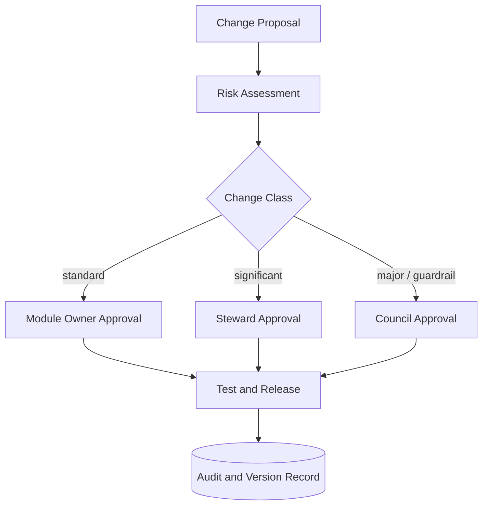

# Volume 05 - Change Management

| Field | Value |
|---|---|
| Document ID | WORLD-VOL05-065 |
| Title | Change Management |
| Version | 1.0 |
| Status | Approved |
| Classification | Internal |
| Founder | Mahesh Choudhary |

## Purpose

This chapter defines change management for WORLD's ERP Foundation: how changes to the data model, configuration, controls, and AI Business Partner guardrails are proposed, assessed, approved, and released without destabilizing the operational layer. Change management protects continuity while allowing the ERP to evolve.

## Scope

Covers changes to schema, master data policy, module configuration, permission and control rules, and automation guardrails. It applies to changes initiated by humans and by the AI Business Partner. It excludes routine transactional data entry, which is governed by quality and security controls rather than the change process.

## Change Design for WORLD

WORLD classifies changes by risk and routes each class through a proportionate approval path. Low-risk, reversible changes move quickly; high-risk, structural changes require broader review and a rollback plan. Every change is versioned, tested against the quality and performance standards, and recorded in the audit trail.

| Change Class | Example | Approval Path | Rollback |
|---|---|---|---|
| Standard | Add optional field | Module owner | Automatic |
| Significant | New validation rule | ERP steward | Planned |
| Major | Schema or control change | Governance council | Mandatory plan |
| Guardrail | AI action limit change | Founder / council | Mandatory plan |

## Business Value

Disciplined change management prevents the two failure modes of evolving systems: paralysis, where nothing changes for fear of breakage, and chaos, where uncontrolled changes cause outages and data corruption. By matching rigor to risk, the enterprise keeps the ERP both stable and adaptable, preserving trust while continuing to improve.

## Relationship to the AI Business Partner

Changes to the AI Business Partner's guardrails - its action limits, permitted record classes, and approval thresholds - are governed as a distinct, high-scrutiny change class, consistent with Volume 03 §G. This ensures autonomy expands deliberately and reversibly. The Partner may also propose changes, but its proposals enter the same assessment and approval pipeline as any other actor's.

## Relationship to Business Foundation

Change management enforces the controlled-evolution principle of Volume 02 Section F. Where the Business Foundation requires that material operational changes carry accountability and reversibility, the change process implements that as risk-tiered approval and mandatory rollback planning for major changes.

## Relationship to Business Intelligence

Change records are a dataset Volume 04 uses to correlate changes with shifts in performance, quality, or business outcomes. When a metric moves, intelligence can trace it to the change that caused it, shortening diagnosis and informing whether to keep or roll back a change.

## Enterprise Implementation Approach

Implementation establishes a change register, defines the risk classes and their approval paths, and requires every change to reference a test result and, where applicable, a rollback plan before release. A change advisory cadence reviews significant and major changes. Guardrail changes are logged with explicit before-and-after states.

**Enterprise example.** The governance council decides to raise the AI Business Partner's automated supplier-credit limit from 5,000 to 10,000 currency units after a quarter of clean approvals. The proposal is classified as a guardrail change, assessed for risk, approved by the founder and council, released with a rollback plan, and recorded with its prior and new values. If exception rates rise, the change can be reverted in one step.

## Cross-References

- [ERP Governance](/docs/blueprint/volume-05-erp-foundation/section-h-erp-governance/60-erp-governance.md)
- [Quality Standards](/docs/blueprint/volume-05-erp-foundation/section-h-erp-governance/64-quality-standards.md)
- [ERP Roadmap](/docs/blueprint/volume-05-erp-foundation/section-h-erp-governance/66-erp-roadmap.md)
- [Volume 03 - AI Business Partner, Section G](/docs/blueprint/volume-03-ai-business-partner/README.md)

## References

- [Volume 01 - Vision and Philosophy](/docs/blueprint/volume-01-vision-and-philosophy/README.md)
- [Document Standards](/docs/governance/document-standards.md)

## Change Log

| Version | Date | Author | Notes |
|---|---|---|---|
| 1.0 | 2026-07-12 | Lead Software Engineer | Initial approved version. |
