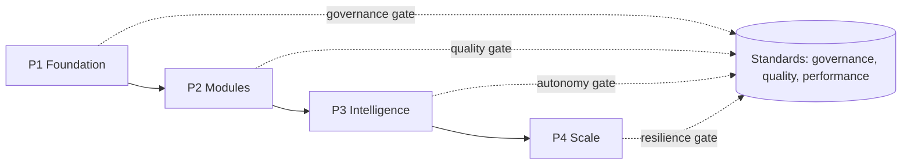

# Volume 05 - ERP Roadmap

| Field | Value |
|---|---|
| Document ID | WORLD-VOL05-066 |
| Title | ERP Roadmap |
| Version | 1.0 |
| Status | Approved |
| Classification | Internal |
| Founder | Mahesh Choudhary |

## Purpose

This chapter defines the conceptual roadmap for WORLD's ERP Foundation: the ordered phases through which the operational layer matures, from foundational integrity to intelligent, scaled operation. It expresses sequence and intent, not dates, and deliberately avoids committing specifics reserved for later volumes.

## Scope

Covers the maturity phases of the ERP as a whole and the capabilities that characterize each. It provides direction for prioritization and governance of evolution. It excludes calendar commitments, resourcing plans, and Volume 06+ application specifics, which are governed elsewhere and must not be pre-empted here.

## Roadmap Design for WORLD

WORLD's ERP matures through four conceptual phases. Each phase builds on the trustworthiness established by the prior one: intelligence is only added once data quality and governance are sound, and scale is pursued only once modules and intelligence are proven. Phases are directional, and a capability advances only when it meets the governance, quality, and performance standards defined in this section.

| Phase | Focus | Characteristic Capability | Entry Condition |
|---|---|---|---|
| P1 Foundation | Integrity and governance | Single source of truth, audit trail | Governance and security ratified |
| P2 Modules | Operational coverage | Core ERP modules operating | Foundation stable and measured |
| P3 Intelligence | Insight and autonomy | AI Partner acting within guardrails | Data quality proven |
| P4 Scale | Growth and resilience | Elastic, multi-context operation | Intelligence proven and trusted |

## Business Value

A phased roadmap prevents premature complexity. By establishing integrity before adding modules, and proving data quality before granting autonomy, the enterprise avoids building intelligence on unreliable foundations. The roadmap gives leadership a shared, defensible sequence for investment and a clear set of gates that each phase must pass before the next begins.

## Relationship to the AI Business Partner

The AI Business Partner's operational role expands with the roadmap. In the foundation phase it observes and assists; as data quality is proven, it advances into the intelligence phase where it acts within guardrails under human approval, consistent with Volume 03 §G. Its autonomy widens only as evidence accumulates, never ahead of the governance gates.

## Relationship to Business Foundation

The roadmap sequences the realization of the operational commitments in Volume 02 Section F. Each phase delivers a maturing capability that fulfills a portion of the Business Foundation's intent, ensuring the ERP evolves toward the enterprise's declared purpose rather than by technical convenience.

## Relationship to Business Intelligence

The intelligence phase is where the ERP begins feeding Volume 04 with the depth and reliability that advanced analytics require. As the roadmap progresses to scale, intelligence expands across more contexts, and its findings help govern which capabilities are ready to advance to the next phase.

## Enterprise Implementation Approach

Implementation treats each phase gate as a governance decision backed by evidence against the standards in this section. Advancement is earned, not scheduled: a phase proceeds only when its entry condition is demonstrably met. The roadmap is reviewed on a cadence, and reordering within a phase is permitted, but skipping gates is not.

**Enterprise example.** An enterprise completes P1 with governance and security ratified and an immutable audit trail in place. Before entering P3, its data quality scorecard shows unresolved duplication in supplier master data. The governance council holds the intelligence phase, directs remediation under the quality standards, and only opens the autonomy gate once the scorecard meets target - ensuring the AI Business Partner acts on trustworthy data from the outset.

## Cross-References

- [ERP Governance](/docs/blueprint/volume-05-erp-foundation/section-h-erp-governance/60-erp-governance.md)
- [Change Management](/docs/blueprint/volume-05-erp-foundation/section-h-erp-governance/65-change-management.md)
- [Volume 03 - AI Business Partner, Section G](/docs/blueprint/volume-03-ai-business-partner/README.md)
- [Volume 04 - Business Intelligence](/docs/blueprint/volume-04-business-intelligence/README.md)

## References

- [Volume 01 - Vision and Philosophy](/docs/blueprint/volume-01-vision-and-philosophy/README.md)
- [Document Standards](/docs/governance/document-standards.md)

## Change Log

| Version | Date | Author | Notes |
|---|---|---|---|
| 1.0 | 2026-07-12 | Lead Software Engineer | Initial approved version. |
