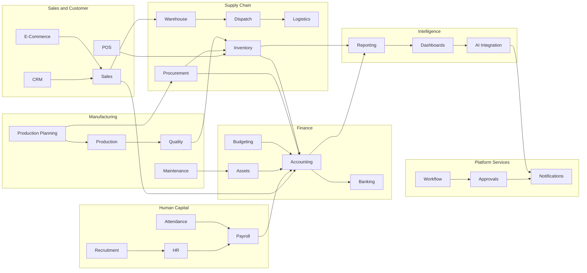

# Volume 06 - Integration Map

| Field | Value |
|---|---|
| Document ID | WORLD-VOL06-A6 |
| Title | Integration Map |
| Version | 1.0 |
| Status | Approved |
| Classification | Internal |
| Founder | Mahesh Choudhary |

## Purpose

This appendix maps how WORLD's 32 business modules depend on and exchange information with one another. It provides a visual integration diagram of the principal data and event flows across the eight domain sections, together with a structured table of the most significant module-to-module integrations. The map helps architects and module owners understand coupling, plan changes safely, and preserve the single-system-of-record principle.

## Scope

The map covers the primary cross-module integration and dependency relationships within Volume 06. It shows the direction and nature of each flow (data or event) and identifies the source and target modules. It is representative rather than exhaustive; it does not specify transport mechanisms, payload schemas, or API contracts, which belong to the platform architecture (Volume 08) and database (Volume 09) volumes.

## Integration Overview Diagram

The diagram groups modules by domain section and shows the dominant flows between domains.

## Key Module-to-Module Flows

| Source Module | Target Module | Flow Type | Description |
|---|---|---|---|
| CRM | Sales | Data | Won opportunities convert into sales orders. |
| Sales | Warehouse | Event | Confirmed orders trigger pick-and-pack. |
| Warehouse | Dispatch | Event | Packed shipments are released for dispatch. |
| Dispatch | Logistics | Data | Dispatched loads are handed to carrier planning. |
| Sales | Accounting | Event | Invoiced orders post revenue and receivables. |
| POS | Inventory | Event | Retail sales decrement stock in real time. |
| E-Commerce | Sales | Data | Online orders create sales orders for fulfilment. |
| Procurement | Inventory | Event | Goods receipts increase on-hand stock. |
| Procurement | Accounting | Event | Vendor invoices post payables. |
| Inventory | Accounting | Event | Stock movements post inventory valuation. |
| Production Planning | Procurement | Data | MRP shortfalls raise purchase requisitions. |
| Production Planning | Production | Data | Approved plans release production orders. |
| Production | Quality | Event | Produced units are routed for inspection. |
| Quality | Inventory | Event | Passed units are received into stock. |
| Maintenance | Assets | Data | Maintenance history updates asset records. |
| Recruitment | HR | Data | Accepted candidates become employee records. |
| HR | Payroll | Data | Employee master data drives pay calculation. |
| Attendance | Payroll | Data | Attended time feeds earnings and deductions. |
| Payroll | Accounting | Event | Payroll runs post salary and statutory entries. |
| Assets | Accounting | Event | Depreciation posts periodic expense entries. |
| Budgeting | Accounting | Data | Approved budgets provide variance baselines. |
| Accounting | Banking | Event | Approved payments are executed through banks. |
| Workflow | Approvals | Event | Process steps invoke approval gates. |
| Approvals | Notifications | Event | Approval decisions raise stakeholder alerts. |
| Accounting | Reporting | Data | Ledger balances feed financial reports. |
| Inventory | Reporting | Data | Stock positions feed operational reports. |
| Reporting | Dashboards | Data | Report datasets populate visual analytics. |
| Dashboards | AI Integration | Data | Metrics provide context for AI reasoning. |
| AI Integration | Notifications | Event | AI insights trigger proactive alerts. |

## Dependency Principles

| Principle | Description |
|---|---|
| Single system of record | Each entity and document has exactly one owning module. |
| Event-first coupling | Modules integrate through domain events rather than shared writes where possible. |
| Directional clarity | Every integration declares an explicit source and target. |
| Backward compatibility | Producers evolve events without breaking existing consumers. |
| Observability | Every cross-module flow emits traceable events for analytics and AI. |

## Cross-References

- [Workflow Templates](/docs/blueprint/volume-06-business-modules/appendices/workflow-templates.md)
- [Module Terminology](/docs/blueprint/volume-06-business-modules/appendices/module-terminology.md)
- [KPI Catalog](/docs/blueprint/volume-06-business-modules/appendices/kpi-catalog.md)

## References

- [Volume 01 - Vision and Philosophy](/docs/blueprint/volume-01-vision-and-philosophy/README.md)
- [Document Standards](/docs/governance/document-standards.md)

## Change Log

| Version | Date | Author | Summary |
|---|---|---|---|
| 1.0 | 2026-07-12 | Lead Software Engineer | Initial approved version. |
