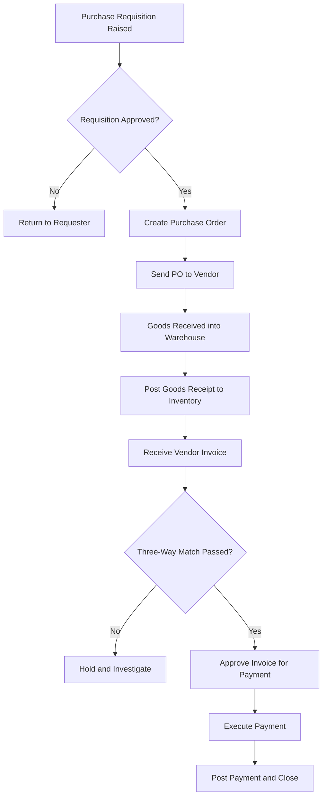
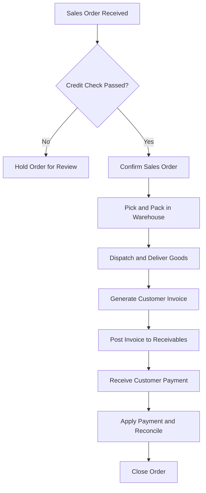
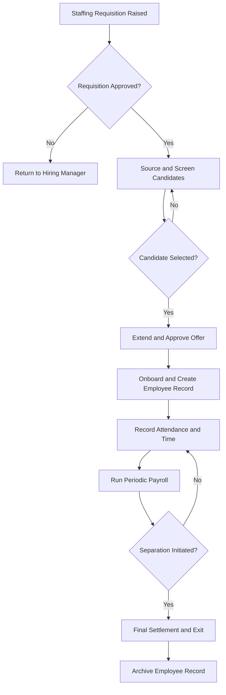
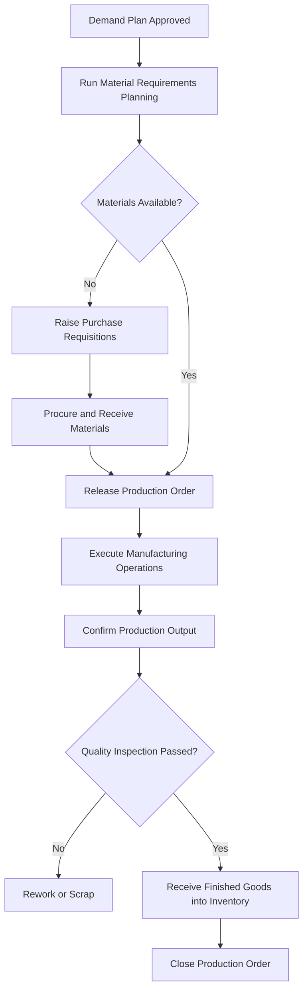

# Volume 06 - Workflow Templates

| Field | Value |
|---|---|
| Document ID | WORLD-VOL06-A5 |
| Title | Workflow Templates |
| Version | 1.0 |
| Status | Approved |
| Classification | Internal |
| Founder | Mahesh Choudhary |

## Purpose

This appendix provides reusable, cross-module workflow templates for WORLD's most important end-to-end business processes. Each template names the participating modules and roles, the ordered steps, the control points, and the terminal outcome, together with a validated Mermaid flow. Teams adopt and adapt these templates rather than designing enterprise processes from scratch, ensuring the 32 modules cooperate consistently.

## Scope

The templates cover the four defining cross-module value streams: Procure-to-Pay, Order-to-Cash, Hire-to-Retire, and Plan-to-Produce. Each includes a Mermaid flow diagram and a structured attribute table. Module-internal workflows are documented in the respective module chapters; approval-matrix mechanics are governed by the Approvals module (WORLD-VOL06-028). These templates are starting points; tenant-specific variations are configured through the governed workflow model.

## Template Structure

| Attribute | Description |
|---|---|
| Workflow ID | Stable identifier for the template. |
| Trigger | The event or request that starts the workflow. |
| Modules | The business modules that participate. |
| Roles | Participants and their responsibilities. |
| Controls | Approvals, validations, and segregation-of-duties points. |
| Outcome | The terminal business result and documents produced. |

## 1. Procure-to-Pay (P2P)

| Attribute | Value |
|---|---|
| Workflow ID | WF06-P2P-01 |
| Trigger | Identified need for goods or services |
| Modules | Procurement, Inventory, Warehouse, Accounting, Banking |
| Roles | Requester, Buyer, Approver, Receiver, Accounts Payable |
| Controls | Requisition approval, three-way match, payment authorization |
| Outcome | Vendor paid; posted invoice and payment documents |

## 2. Order-to-Cash (O2C)

| Attribute | Value |
|---|---|
| Workflow ID | WF06-O2C-01 |
| Trigger | Confirmed customer order |
| Modules | CRM, Sales, Warehouse, Dispatch, Accounting, Banking |
| Roles | Sales Representative, Credit Controller, Warehouse Operator, Billing Clerk, Accounts Receivable |
| Controls | Credit check, delivery confirmation, invoice approval |
| Outcome | Cash collected; posted invoice and receipt documents |

## 3. Hire-to-Retire (H2R)

| Attribute | Value |
|---|---|
| Workflow ID | WF06-H2R-01 |
| Trigger | Approved staffing requisition |
| Modules | Recruitment, HR, Attendance, Payroll |
| Roles | Hiring Manager, Recruiter, HR Administrator, Payroll Officer |
| Controls | Requisition approval, offer approval, onboarding verification, final settlement approval |
| Outcome | Employee hired, paid through tenure, and cleanly separated |

## 4. Plan-to-Produce (P2Prod)

| Attribute | Value |
|---|---|
| Workflow ID | WF06-P2P-02 |
| Trigger | Approved demand or production plan |
| Modules | Production Planning, Procurement, Manufacturing, Production, Quality, Inventory |
| Roles | Planner, Buyer, Production Supervisor, Machine Operator, Quality Inspector |
| Controls | Plan approval, material availability check, quality inspection gate |
| Outcome | Finished goods produced, inspected, and received into inventory |

## Reuse Guidance

| Guideline | Description |
|---|---|
| Adopt before adapt | Start from the closest template; document any deviation. |
| Preserve control points | Never remove approval, credit-check, or quality gates without governance sign-off. |
| Single system of record | Keep each document owned by its canonical module to avoid duplication. |
| Human-approval gates | Retain explicit human approval where financial, contractual, or employment commitment occurs, even under AI assistance. |
| Instrument every step | Emit domain events at each transition to support tracing, analytics, and AI reasoning. |

## Cross-References

- [Integration Map](/docs/blueprint/volume-06-business-modules/appendices/integration-map.md)
- [Module Terminology](/docs/blueprint/volume-06-business-modules/appendices/module-terminology.md)
- [Roles & Permissions Matrix](/docs/blueprint/volume-06-business-modules/appendices/roles-and-permissions-matrix.md)

## References

- [Volume 01 - Vision and Philosophy](/docs/blueprint/volume-01-vision-and-philosophy/README.md)
- [Document Standards](/docs/governance/document-standards.md)

## Change Log

| Version | Date | Author | Summary |
|---|---|---|---|
| 1.0 | 2026-07-12 | Lead Software Engineer | Initial approved version. |
