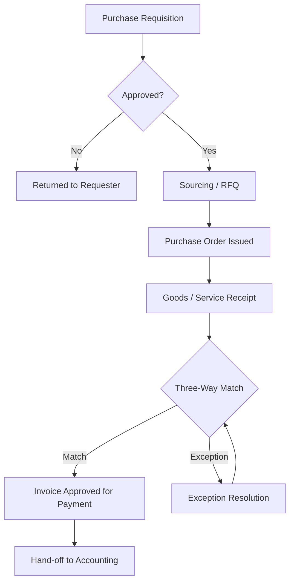

# Volume 06 - Procurement

| Field | Value |
|---|---|
| Document ID | WORLD-VOL06-001 |
| Title | Procurement |
| Version | 1.0 |
| Status | Approved |
| Classification | Internal |
| Founder | Mahesh Choudhary |

## Purpose

The Procurement module governs how WORLD acquires goods and services from external suppliers. It converts validated demand into purchase commitments, executes those commitments through governed documents, and records every event as an auditable fact in the ERP Foundation (Volume 05). Procurement is the enterprise's contractual and financial gateway to the supply market, and the operational surface through which the AI Business Partner (Volume 03) can propose, negotiate, and execute buying decisions.

## Scope

Scope covers source-to-pay execution: requisitioning, supplier and price management, request-for-quotation, purchase order lifecycle, goods and service receipt matching, and invoice reconciliation up to hand-off to Accounting. It excludes physical stock custody (Inventory, Chapter 02), physical receiving operations (Warehouse, Chapter 03), and detailed physical database schemas (Volume 09).

## Business Value

Procurement is where margin is protected before a product is ever sold. Disciplined sourcing lowers unit cost, consolidates spend, enforces contract compliance, and reduces maverick buying. By making every commitment a governed transaction on a single data model, WORLD eliminates reconciliation between disconnected purchasing spreadsheets and finance ledgers, shortens cycle time, and gives leadership a defensible view of committed and actual spend.

## Objectives

- Convert approved demand into accurate, on-time purchase commitments.
- Maximize value through competitive sourcing and contract adherence.
- Guarantee three-way match integrity between order, receipt, and invoice.
- Maintain a complete, auditable trail of every buying decision.
- Expose buying operations to the AI Business Partner for automation.

## Responsibilities

Procurement owns supplier master governance, sourcing events, purchase order accuracy, commitment control, and receipt-to-invoice matching. It is accountable for spend policy enforcement and for the timely, correct hand-off of matched liabilities to Accounting (Chapter 16).

## Business Process

The end-to-end flow is source-to-pay. Demand originates from Inventory replenishment, Production Planning, or a manual requisition. The requisition is validated against budget and policy, sourced (either from a contracted supplier or via RFQ), and released as a purchase order. Goods or services are received, matched, and the resulting liability is posted for payment.

## Master Data

| Entity | Description | Owner |
|---|---|---|
| Supplier | Legal vendor identity, terms, banking, compliance status | Procurement |
| Purchase Item / Service | Buyable catalog entry linked to item master | Procurement |
| Price List / Contract | Negotiated price, validity, quantity breaks | Procurement |
| Payment Terms | Net terms, discounts, currency | Finance |
| Supplier Category | Classification for sourcing and reporting | Procurement |

## Transactions

Core transaction documents are the Purchase Requisition, Request for Quotation, Supplier Quotation, Purchase Order, Goods Receipt Note, and Purchase Invoice. Each is a governed document type in the ERP Foundation with defined statuses, posting rules, and immutable audit history.

## Business Rules

- A purchase order cannot exceed the approved requisition value without re-approval.
- Invoices post only when quantity and price fall within tolerance of the order and receipt (three-way match).
- Suppliers must hold active compliance status before an order is issued.
- Spend against a contract cannot exceed contracted ceilings.
- Currency and payment terms inherit from the supplier master unless overridden with authorization.

## Workflow

Procurement workflows run on the Volume 05 Workflow and Approval engines. Requisition approval, PO release, and invoice exception handling are configurable, role-based, threshold-driven flows. Approval limits derive from the organizational structure defined in the Business Foundation (Volume 02).

## Inputs

Replenishment signals from Inventory, material demand from Production Planning, manual requisitions, supplier catalogs, contract terms, and budget allocations from Finance.

## Outputs

Purchase orders to suppliers, goods receipt confirmations to Warehouse and Inventory, matched liabilities to Accounting, committed-spend data to Business Intelligence (Volume 04), and supplier performance records.

## Dependencies

Procurement depends on the ERP Foundation (Volume 05) document, posting, and workflow engines; on Inventory for item master and stock levels; on Finance for budget and payment terms; and on the Business Foundation (Volume 02) for entity, role, and policy definitions. It feeds Warehouse, Accounting, and Business Intelligence.

## KPIs

| KPI | Definition | Target |
|---|---|---|
| Purchase Order Cycle Time | Requisition approval to PO issue | < 24 hours |
| On-Time Supplier Delivery | Receipts on or before promised date | > 95% |
| Three-Way Match Rate | Invoices matched without manual touch | > 90% |
| Cost Savings Realized | Negotiated vs. baseline price | Tracked monthly |
| Maverick Spend | Non-contracted purchases | < 5% |

## Reports

Spend analysis by category and supplier, open purchase order report, goods-received-not-invoiced report, supplier performance scorecard, and price variance report.

## Dashboards

A procurement operations dashboard surfacing open commitments, exceptions awaiting resolution, cycle-time trends, and top-supplier spend, with drill-down to individual documents.

## Roles

| Role | Responsibility |
|---|---|
| Requester | Raises purchase requisitions |
| Buyer | Sources suppliers and issues orders |
| Procurement Manager | Approves high-value orders, owns policy |
| Accounts Payable Clerk | Resolves invoice exceptions |

## Permissions

Permissions are granted on the Volume 05 role-based access model. Requesters create requisitions; buyers create and release orders within limits; managers approve above threshold; and only Accounting posts final payment. Segregation of duties prevents the same user from both approving a requisition and releasing its order.

## AI Features

The AI Business Partner (Volume 03) reasons over procurement data to recommend optimal suppliers, predict late deliveries, detect price anomalies, and auto-draft purchase orders from replenishment signals. **Enterprise example:** when Inventory forecasts a stockout of a fast-moving SKU, the partner selects the best-value contracted supplier, drafts a compliant purchase order, and routes it for one-click buyer approval, compressing a multi-day cycle into minutes.

## Future Expansion

Supplier collaboration portals, ESG and sustainability scoring, autonomous negotiation agents, and multi-tier supply risk modeling.

## Cross-References

- [Inventory](/docs/blueprint/volume-06-business-modules/section-a-supply-chain-and-procurement/02-inventory.md)
- [Warehouse](/docs/blueprint/volume-06-business-modules/section-a-supply-chain-and-procurement/03-warehouse.md)
- [Volume 05 - ERP Foundation](/docs/blueprint/volume-05-erp-foundation/README.md)
- [Volume 03 - AI Business Partner](/docs/blueprint/volume-03-ai-business-partner/README.md)

## References

- [Volume 01 - Vision and Philosophy](/docs/blueprint/volume-01-vision-and-philosophy/README.md)
- [Document Standards](/docs/governance/document-standards.md)

## Change Log

| Version | Date | Author | Notes |
|---|---|---|---|
| 1.0 | 2026-07-12 | Lead Software Engineer | Initial approved version. |
