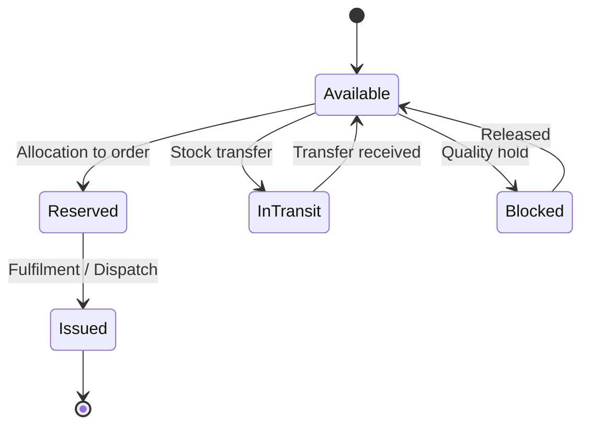

# Volume 06 - Inventory

| Field | Value |
|---|---|
| Document ID | WORLD-VOL06-002 |
| Title | Inventory |
| Version | 1.0 |
| Status | Approved |
| Classification | Internal |
| Founder | Mahesh Choudhary |

## Purpose

The Inventory module is WORLD's authoritative record of what the enterprise owns, where it is, and what it is worth. It tracks stock quantities and valuations across companies, locations, and lots, and provides the trusted position that every downstream module and the AI Business Partner (Volume 03) relies on to make fulfilment, purchasing, and financial decisions.

## Scope

Scope covers item master governance, stock ledger maintenance, valuation, replenishment planning, stock movements, and reconciliation. It excludes physical bin-level operations (Warehouse, Chapter 03), purchase execution (Procurement, Chapter 01), and physical database schemas (Volume 09).

## Business Value

Inventory is typically the largest current asset a business holds and a primary source of both cost and risk. Accurate, real-time stock position prevents costly stockouts and lost sales while avoiding the working-capital drain of overstocking. A single governed stock ledger removes reconciliation between operational and financial views and gives the business defensible valuation for reporting.

## Objectives

- Maintain a real-time, accurate quantity and value for every item.
- Balance service level against carrying cost through intelligent replenishment.
- Guarantee that operational stock and financial valuation always agree.
- Provide full traceability of every stock movement.
- Serve reliable stock position to fulfilment, planning, and the AI partner.

## Responsibilities

Inventory owns the item master, the perpetual stock ledger, valuation method, reorder policy, and periodic reconciliation. It is accountable for the integrity of stock quantities and their financial equivalent posted to Accounting (Chapter 16).

## Business Process

Stock enters through receipts, moves through internal transfers and adjustments, is reserved against demand, and leaves through issues and dispatch. Every movement updates the perpetual ledger and, where value changes, generates a financial posting.

## Master Data

| Entity | Description | Owner |
|---|---|---|
| Item | Stock-keeping unit with attributes and UoM | Inventory |
| Item Category | Classification for policy and reporting | Inventory |
| Warehouse / Location | Logical stocking point | Inventory |
| Batch / Lot / Serial | Traceability identifier | Inventory |
| Valuation Method | FIFO, weighted average, or standard cost | Finance |

## Transactions

Stock Receipt, Stock Issue, Stock Transfer, Stock Adjustment, Stock Reservation, and Stock Reconciliation. Each is a governed document with posting rules that keep quantity and value synchronized in the ERP Foundation (Volume 05).

## Business Rules

- Every quantity change must produce a corresponding ledger entry.
- Negative stock is prohibited unless explicitly permitted per item policy.
- Valuation follows the configured method consistently within a company.
- Reserved stock cannot be issued against a different demand.
- Batch and serial items require full traceability on every movement.

## Workflow

Inventory adjustments, write-offs, and reconciliations run on the Volume 05 Approval engine with threshold-based authorization. Replenishment proposals are generated by the planning logic and routed to Procurement (Chapter 01) as requisitions.

## Inputs

Goods receipts from Procurement and Warehouse, demand and allocations from Sales and Production, transfer requests, and cycle-count results.

## Outputs

Real-time stock position, replenishment signals to Procurement, valuation postings to Accounting, availability data to Sales and Dispatch, and stock analytics to Business Intelligence (Volume 04).

## Dependencies

Depends on the ERP Foundation (Volume 05) stock ledger and posting engines and on the Business Foundation (Volume 02) for location and policy definitions. It feeds Procurement, Warehouse, Dispatch, Sales, and Accounting.

## KPIs

| KPI | Definition | Target |
|---|---|---|
| Inventory Accuracy | Counted vs. recorded quantity | > 99% |
| Inventory Turnover | Cost of goods sold / average stock | Category-specific |
| Stockout Rate | Demand unmet from stock | < 2% |
| Days of Inventory | Average stock / daily usage | Optimized per item |
| Carrying Cost | Cost of holding stock | Minimized |

## Reports

Stock position report, aging and slow-moving analysis, valuation report, movement history, and reconciliation variance report.

## Dashboards

An inventory health dashboard showing stock value, coverage days, items below reorder point, and aging distribution, with drill-down to item and location.

## Roles

| Role | Responsibility |
|---|---|
| Inventory Controller | Owns accuracy and reconciliation |
| Stock Analyst | Sets reorder policy and monitors coverage |
| Warehouse Operator | Executes physical movements |
| Finance Controller | Owns valuation policy |

## Permissions

Granted on the Volume 05 role-based access model. Operators record movements; controllers approve adjustments; only Finance changes valuation method. Segregation ensures the user counting stock does not also approve the write-off.

## AI Features

The AI Business Partner (Volume 03) forecasts demand, computes dynamic reorder points, flags obsolete and slow-moving stock, and proposes redistribution across locations. **Enterprise example:** the partner detects that a seasonal item is overstocked in one region while stocking out in another, and proposes a stock transfer with quantified savings, executed through the standard transfer transaction.

## Future Expansion

Multi-echelon inventory optimization, IoT-driven real-time stock sensing, automated cycle-count scheduling, and predictive shrinkage detection.

## Cross-References

- [Procurement](/docs/blueprint/volume-06-business-modules/section-a-supply-chain-and-procurement/01-procurement.md)
- [Warehouse](/docs/blueprint/volume-06-business-modules/section-a-supply-chain-and-procurement/03-warehouse.md)
- [Dispatch](/docs/blueprint/volume-06-business-modules/section-a-supply-chain-and-procurement/05-dispatch.md)
- [Volume 04 - Business Intelligence & Decision Science](/docs/blueprint/volume-04-business-intelligence-and-decision-science/README.md)

## References

- [Volume 01 - Vision and Philosophy](/docs/blueprint/volume-01-vision-and-philosophy/README.md)
- [Document Standards](/docs/governance/document-standards.md)

## Change Log

| Version | Date | Author | Notes |
|---|---|---|---|
| 1.0 | 2026-07-12 | Lead Software Engineer | Initial approved version. |
