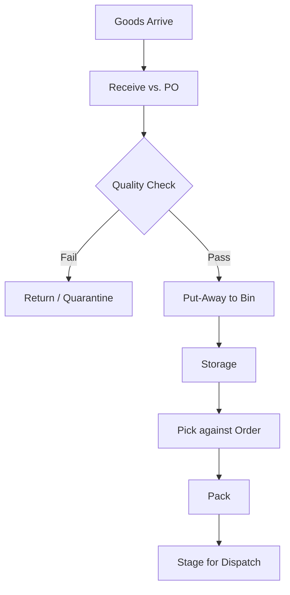

# Volume 06 - Warehouse

| Field | Value |
|---|---|
| Document ID | WORLD-VOL06-003 |
| Title | Warehouse |
| Version | 1.0 |
| Status | Approved |
| Classification | Internal |
| Founder | Mahesh Choudhary |

## Purpose

The Warehouse module manages the physical custody and movement of goods within a storage facility. Where Inventory (Chapter 02) records what the enterprise owns and its value, Warehouse governs where each unit physically sits and how it is received, put away, picked, and shipped. It translates logical stock positions into precise, bin-level physical operations.

## Scope

Scope covers facility and bin structure, inbound receiving and put-away, storage optimization, picking and packing, internal movements, and stock-take execution. It excludes purchasing (Procurement, Chapter 01), inter-facility transport (Logistics, Chapter 04), and physical schemas (Volume 09).

## Business Value

Warehouse efficiency directly determines fulfilment speed, labor cost, and order accuracy. Optimized put-away and picking reduce travel time and errors, while accurate bin-level tracking eliminates lost stock and mis-shipments. As the physical execution layer beneath Inventory, it protects the integrity of the stock ledger by ensuring physical reality matches the recorded position.

## Objectives

- Maximize storage density and picking efficiency within the facility.
- Guarantee that physical location data is accurate to the bin.
- Minimize handling time, damage, and picking errors.
- Synchronize every physical movement with the Inventory ledger.
- Enable labor and space optimization through the AI partner.

## Responsibilities

Warehouse owns facility layout, bin master, put-away and picking strategy, task assignment, and physical stock counts. It is accountable for the accuracy of physical location and condition of goods handed to Dispatch (Chapter 05).

## Business Process

Inbound goods are received against a purchase order, quality-checked, and put away to optimal bins. On demand, stock is picked, packed, and staged for dispatch. Internal replenishment and cycle counts keep locations optimized and accurate.

## Master Data

| Entity | Description | Owner |
|---|---|---|
| Facility | Physical warehouse building | Warehouse |
| Zone / Aisle / Bin | Hierarchical storage location | Warehouse |
| Handling Unit | Pallet, carton, or container | Warehouse |
| Put-Away Rule | Logic assigning bins to items | Warehouse |
| Pick Strategy | FIFO, FEFO, zone, or wave logic | Warehouse |

## Transactions

Goods Receipt, Put-Away Task, Pick Task, Pack Confirmation, Internal Move, and Cycle Count. Each is a governed document that updates the Inventory ledger in the ERP Foundation (Volume 05) upon confirmation.

## Business Rules

- Goods cannot be put away before quality clearance where required.
- Bin capacity and compatibility constraints must be respected.
- Perishable and batch items follow FEFO picking.
- Every physical move confirms against a system task; blind moves are prohibited.
- Cycle-count variances above tolerance trigger reconciliation.

## Workflow

Task generation and assignment run on the Volume 05 Workflow engine. Receiving discrepancies and count variances route through the Approval engine for controlled resolution, with authorization limits inherited from the Business Foundation (Volume 02).

## Inputs

Purchase orders and advance shipping notices from Procurement, pick demand from Sales and Dispatch, and cycle-count schedules.

## Outputs

Confirmed receipts and location updates to Inventory, packed and staged units to Dispatch, labor and throughput data to Business Intelligence (Volume 04), and exception records.

## Dependencies

Depends on the ERP Foundation (Volume 05) task and posting engines and on Inventory for item and stock data. It receives from Procurement and feeds Dispatch and Logistics. Facility definitions derive from the Business Foundation (Volume 02).

## KPIs

| KPI | Definition | Target |
|---|---|---|
| Order Picking Accuracy | Correct picks vs. total | > 99.5% |
| Put-Away Cycle Time | Receipt to storage | Minimized |
| Space Utilization | Occupied vs. available capacity | Optimized |
| Lines Picked per Hour | Labor throughput | Tracked |
| Perfect Order Rate | Orders shipped complete and undamaged | > 98% |

## Reports

Bin occupancy report, receiving and put-away performance, picking productivity, cycle-count accuracy, and damage and quarantine report.

## Dashboards

A warehouse operations dashboard showing open tasks by type, labor throughput, dock activity, and space utilization heatmap, with drill-down to task and operator.

## Roles

| Role | Responsibility |
|---|---|
| Warehouse Manager | Owns layout, staffing, and performance |
| Receiving Clerk | Executes inbound receipt and put-away |
| Picker / Packer | Executes outbound picking and packing |
| Inventory Controller | Reconciles physical to system stock |

## Permissions

Granted on the Volume 05 role-based access model. Clerks and pickers confirm assigned tasks only; managers assign tasks and approve variances; controllers reconcile. Segregation prevents the same operator from both counting and adjusting the same bin.

## AI Features

The AI Business Partner (Volume 03) optimizes slotting, batches and sequences pick paths, forecasts labor demand, and predicts dock congestion. **Enterprise example:** ahead of a promotional spike, the partner re-slots high-velocity SKUs closer to dispatch staging and proposes a wave-picking plan, cutting average pick travel distance and shift labor cost.

## Future Expansion

Robotics and automated storage integration, computer-vision receiving, digital-twin facility simulation, and voice-directed picking.

## Cross-References

- [Inventory](/docs/blueprint/volume-06-business-modules/section-a-supply-chain-and-procurement/02-inventory.md)
- [Logistics](/docs/blueprint/volume-06-business-modules/section-a-supply-chain-and-procurement/04-logistics.md)
- [Dispatch](/docs/blueprint/volume-06-business-modules/section-a-supply-chain-and-procurement/05-dispatch.md)
- [Volume 05 - ERP Foundation](/docs/blueprint/volume-05-erp-foundation/README.md)

## References

- [Volume 01 - Vision and Philosophy](/docs/blueprint/volume-01-vision-and-philosophy/README.md)
- [Document Standards](/docs/governance/document-standards.md)

## Change Log

| Version | Date | Author | Notes |
|---|---|---|---|
| 1.0 | 2026-07-12 | Lead Software Engineer | Initial approved version. |
