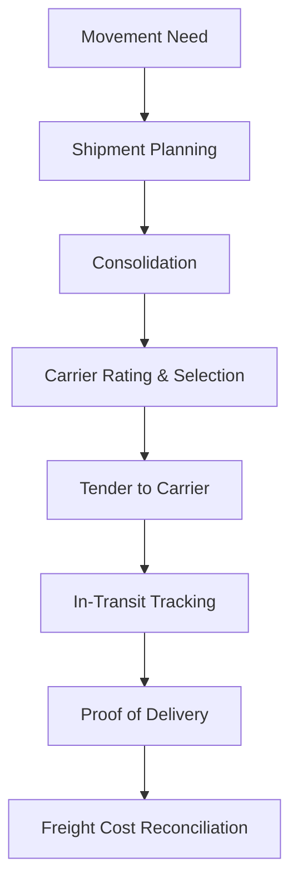

# Volume 06 - Logistics

| Field | Value |
|---|---|
| Document ID | WORLD-VOL06-004 |
| Title | Logistics |
| Version | 1.0 |
| Status | Approved |
| Classification | Internal |
| Founder | Mahesh Choudhary |

## Purpose

The Logistics module plans and manages the movement of goods between locations - from suppliers to warehouses, between facilities, and from warehouses to customers. It governs carriers, routes, shipments, and freight cost, ensuring goods move reliably and economically while every movement remains a tracked, auditable event in the ERP Foundation (Volume 05).

## Scope

Scope covers carrier and route management, shipment planning and consolidation, freight rating and cost allocation, in-transit tracking, and proof of delivery. It excludes in-facility handling (Warehouse, Chapter 03), the final release of goods to a specific customer order (Dispatch, Chapter 05), and physical schemas (Volume 09).

## Business Value

Transportation is a major, highly variable cost and a primary driver of customer satisfaction. Effective logistics reduces freight spend through consolidation and carrier optimization, improves delivery reliability, and provides end-to-end visibility. Managing logistics on the same governed platform links freight cost directly to orders and financial postings, removing hidden cost leakage.

## Objectives

- Move goods at the lowest total cost consistent with service commitments.
- Maximize load consolidation and route efficiency.
- Provide accurate, real-time in-transit visibility.
- Allocate freight cost correctly to orders and shipments.
- Enable predictive routing through the AI partner.

## Responsibilities

Logistics owns the carrier master, rate contracts, shipment planning, route optimization, freight cost capture, and delivery confirmation. It is accountable for on-time, cost-controlled movement and for feeding accurate freight cost to Accounting (Chapter 16).

## Business Process

Demand for movement arises from dispatch releases, stock transfers, or inbound purchases. Shipments are planned, consolidated, and tendered to carriers; goods move and are tracked in transit; and delivery is confirmed with proof and cost reconciliation.

## Master Data

| Entity | Description | Owner |
|---|---|---|
| Carrier | Transport provider and service levels | Logistics |
| Freight Rate / Contract | Lane pricing and terms | Logistics |
| Route / Lane | Origin-destination path | Logistics |
| Shipment Mode | Road, rail, air, or sea | Logistics |
| Vehicle / Equipment | Transport asset or type | Logistics |

## Transactions

Shipment, Freight Tender, Load Plan, In-Transit Event, Proof of Delivery, and Freight Invoice. Each is a governed document with posting rules that capture freight cost against the correct order in the ERP Foundation (Volume 05).

## Business Rules

- Shipments must be tendered only to carriers with active rate contracts.
- Load weight and volume cannot exceed vehicle constraints.
- Freight cost must allocate to the originating order or transfer.
- Delivery is closed only on captured proof of delivery.
- Rate variances beyond tolerance trigger freight audit.

## Workflow

Carrier selection, tendering, and freight-invoice approval run on the Volume 05 Workflow and Approval engines. Exception events - delays, damage, or rate disputes - route to responsible roles with authorization limits from the Business Foundation (Volume 02).

## Inputs

Dispatch releases and stock-transfer requests, inbound shipping notices from Procurement, carrier rates, and real-time tracking events.

## Outputs

Tendered shipments to carriers, in-transit status to Sales and customers, freight cost postings to Accounting, delivery confirmations to Dispatch, and logistics analytics to Business Intelligence (Volume 04).

## Dependencies

Depends on the ERP Foundation (Volume 05) document and posting engines, on Dispatch and Warehouse for shipment-ready goods, and on Procurement for inbound movements. It feeds Accounting and Business Intelligence. Location and entity structure derive from the Business Foundation (Volume 02).

## KPIs

| KPI | Definition | Target |
|---|---|---|
| On-Time Delivery | Deliveries within promised window | > 96% |
| Freight Cost per Unit | Total freight / units shipped | Minimized |
| Load Utilization | Used vs. available capacity | > 85% |
| Transit Time Variance | Actual vs. planned transit | Minimized |
| Freight Invoice Accuracy | Invoices matching tendered rate | > 98% |

## Reports

Freight spend by lane and carrier, on-time delivery report, load utilization analysis, in-transit exception report, and freight audit variance report.

## Dashboards

A logistics control-tower dashboard showing active shipments on a map, exceptions and delays, freight spend trend, and carrier performance, with drill-down to shipment.

## Roles

| Role | Responsibility |
|---|---|
| Logistics Manager | Owns carrier strategy and cost |
| Transport Planner | Plans and consolidates shipments |
| Dispatch Coordinator | Coordinates release and tendering |
| Freight Auditor | Verifies and approves freight invoices |

## Permissions

Granted on the Volume 05 role-based access model. Planners create and tender shipments; managers approve carrier contracts; auditors approve freight invoices. Segregation prevents the planner who tenders a shipment from also approving its freight invoice.

## AI Features

The AI Business Partner (Volume 03) optimizes multi-stop routes, predicts delivery delays from live conditions, recommends least-cost carrier and mode, and automatically consolidates orders into efficient loads. **Enterprise example:** the partner detects a weather disruption on a primary lane, reroutes affected shipments to an alternate carrier, and proactively notifies affected customers of revised delivery windows before any commitment is missed.

## Future Expansion

Autonomous fleet integration, carbon-optimized routing, real-time dynamic re-routing, and predictive last-mile orchestration.

## Cross-References

- [Warehouse](/docs/blueprint/volume-06-business-modules/section-a-supply-chain-and-procurement/03-warehouse.md)
- [Dispatch](/docs/blueprint/volume-06-business-modules/section-a-supply-chain-and-procurement/05-dispatch.md)
- [Volume 04 - Business Intelligence & Decision Science](/docs/blueprint/volume-04-business-intelligence-and-decision-science/README.md)
- [Volume 05 - ERP Foundation](/docs/blueprint/volume-05-erp-foundation/README.md)

## References

- [Volume 01 - Vision and Philosophy](/docs/blueprint/volume-01-vision-and-philosophy/README.md)
- [Document Standards](/docs/governance/document-standards.md)

## Change Log

| Version | Date | Author | Notes |
|---|---|---|---|
| 1.0 | 2026-07-12 | Lead Software Engineer | Initial approved version. |
