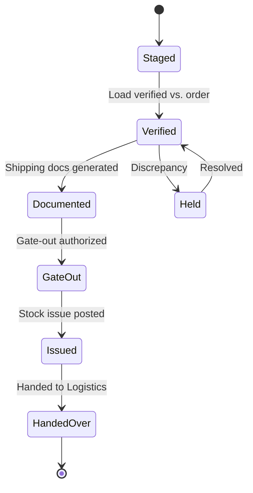

# Volume 06 - Dispatch

| Field | Value |
|---|---|
| Document ID | WORLD-VOL06-005 |
| Title | Dispatch |
| Version | 1.0 |
| Status | Approved |
| Classification | Internal |
| Founder | Mahesh Choudhary |

## Purpose

The Dispatch module governs the final release of goods against a fulfilled order - the controlled handover from the enterprise's custody to transportation. It confirms that the correct goods, in the correct quantity and condition, leave the facility against an authorized order, generating the shipping documents and stock issues that close the fulfilment cycle in the ERP Foundation (Volume 05).

## Scope

Scope covers dispatch order creation, load verification, gate-out control, shipping documentation, and stock issue posting. It excludes physical picking and packing (Warehouse, Chapter 03), transport execution between locations (Logistics, Chapter 04), and physical schemas (Volume 09).

## Business Value

Dispatch is the last control point before goods and the revenue they represent leave the business. Rigorous dispatch control prevents mis-shipment, unauthorized release, and revenue leakage, while accurate, timely shipping documentation accelerates customer receipt and invoicing. As the moment stock legally and financially leaves inventory, disciplined dispatch protects both the stock ledger and revenue recognition.

## Objectives

- Release only correct, complete, and authorized shipments.
- Generate accurate shipping and compliance documentation.
- Post stock issues and trigger invoicing without delay.
- Provide a verifiable audit trail of every goods handover.
- Enable automated dispatch scheduling through the AI partner.

## Responsibilities

Dispatch owns dispatch order verification, load confirmation, gate-out authorization, and shipping documentation. It is accountable for the accuracy of the goods released and the timely stock issue and hand-off to Logistics (Chapter 04) and Accounting (Chapter 16).

## Business Process

A fulfilled, staged order becomes a dispatch order. The load is verified against the order, shipping documents are produced, gate-out is authorized, stock is issued, and the shipment is handed to Logistics with invoicing triggered.

## Master Data

| Entity | Description | Owner |
|---|---|---|
| Dispatch Point | Gate or dock for goods release | Dispatch |
| Shipping Document Type | Delivery note, waybill, invoice set | Dispatch |
| Packaging Specification | Pack and label standards | Dispatch |
| Dispatch Schedule | Time-slotted release plan | Dispatch |
| Compliance Document | Export, hazmat, or regulatory paper | Dispatch |

## Transactions

Dispatch Order, Delivery Note, Load Confirmation, Gate Pass, Stock Issue, and Shipment Handover. Each is a governed document whose confirmation posts the stock issue and triggers invoicing in the ERP Foundation (Volume 05).

## Business Rules

- Goods may release only against an authorized, fulfilled order.
- Dispatched quantity cannot exceed the ordered and allocated quantity.
- A gate pass must exist before goods physically leave the facility.
- Stock issue posts at the moment of confirmed dispatch.
- Regulated goods require valid compliance documentation before release.

## Workflow

Dispatch authorization and discrepancy holds run on the Volume 05 Workflow and Approval engines. High-value or regulated shipments require additional approval, with authorization limits inherited from the Business Foundation (Volume 02). Confirmed dispatch automatically invokes the posting and invoicing flow.

## Inputs

Staged and packed orders from Warehouse, sales order authorization from Sales, transport plans from Logistics, and compliance requirements.

## Outputs

Delivery notes and shipping documents to customers, stock issues to Inventory, invoice triggers to Accounting, shipment handover to Logistics, and dispatch analytics to Business Intelligence (Volume 04).

## Dependencies

Depends on the ERP Foundation (Volume 05) document, posting, and workflow engines, on Warehouse for staged goods, on Sales for order authorization, and on Logistics for onward transport. It feeds Inventory, Accounting, and Business Intelligence. Entity and gate structure derive from the Business Foundation (Volume 02).

## KPIs

| KPI | Definition | Target |
|---|---|---|
| On-Time Dispatch | Dispatches within scheduled slot | > 97% |
| Dispatch Accuracy | Correct goods and quantity released | > 99.5% |
| Dock-to-Gate Time | Staging to gate-out duration | Minimized |
| Documentation Accuracy | Error-free shipping documents | > 99% |
| Order-to-Dispatch Cycle | Order ready to goods released | Minimized |

## Reports

Daily dispatch log, dispatch accuracy report, gate-out and hold report, documentation exception report, and dispatch cycle-time analysis.

## Dashboards

A dispatch operations dashboard showing scheduled versus completed dispatches, orders on hold, dock activity, and cycle-time trend, with drill-down to dispatch order.

## Roles

| Role | Responsibility |
|---|---|
| Dispatch Manager | Owns schedule and release policy |
| Dispatch Clerk | Verifies loads and generates documents |
| Gate Officer | Authorizes and records gate-out |
| Compliance Officer | Verifies regulatory documentation |

## Permissions

Granted on the Volume 05 role-based access model. Clerks verify and document; gate officers authorize gate-out; managers approve exceptions. Segregation ensures the clerk who verifies a load does not also authorize its gate-out, preserving a two-person control at release.

## AI Features

The AI Business Partner (Volume 03) sequences dispatch schedules to balance dock load, predicts and pre-empts documentation errors, validates compliance completeness, and consolidates dispatches to align with logistics loads. **Enterprise example:** the partner reorders the day's dispatch queue so that shipments sharing a delivery lane leave together, aligning with the consolidated load Logistics has planned and reducing both dock congestion and freight cost.

## Future Expansion

Automated gate control with license-plate recognition, paperless digital dispatch, real-time customer dispatch notifications, and autonomous yard management.

## Cross-References

- [Warehouse](/docs/blueprint/volume-06-business-modules/section-a-supply-chain-and-procurement/03-warehouse.md)
- [Logistics](/docs/blueprint/volume-06-business-modules/section-a-supply-chain-and-procurement/04-logistics.md)
- [Inventory](/docs/blueprint/volume-06-business-modules/section-a-supply-chain-and-procurement/02-inventory.md)
- [Volume 03 - AI Business Partner](/docs/blueprint/volume-03-ai-business-partner/README.md)

## References

- [Volume 01 - Vision and Philosophy](/docs/blueprint/volume-01-vision-and-philosophy/README.md)
- [Document Standards](/docs/governance/document-standards.md)

## Change Log

| Version | Date | Author | Notes |
|---|---|---|---|
| 1.0 | 2026-07-12 | Lead Software Engineer | Initial approved version. |
